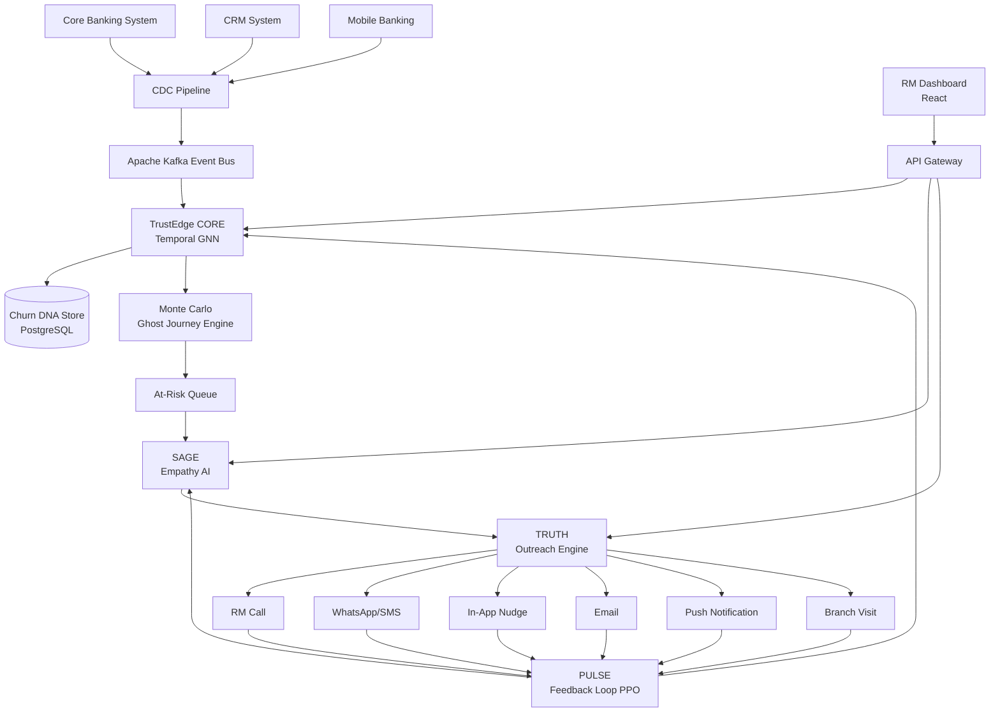
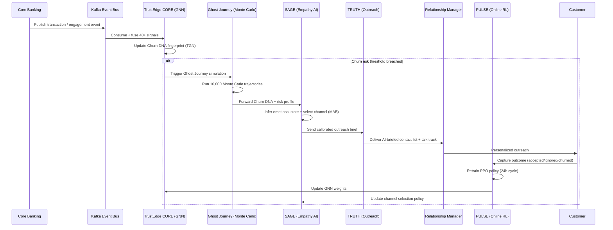
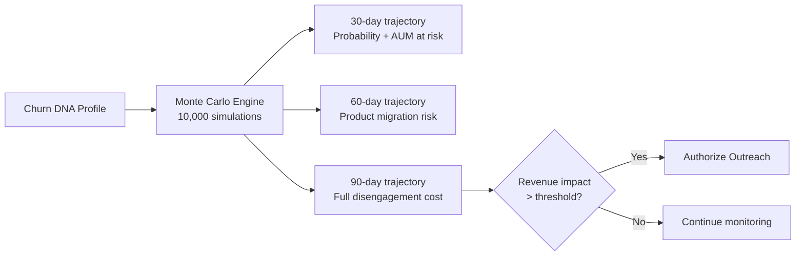

# TRUSTEDGE: Human Intelligence Banking Platform
## Comprehensive Updated Project Report
### PSBs Hackathon Series 2026 — Team: Tech Bugs!!

---

> **Report Version:** 2.0 (Updated from TrustEdge v1.0)
> **Problem Statement:** Predictive Customer Outreach for Connection and Retention
> **Team Members:** V S Saidatta (Cyber Security) · P Lakshmi Sahasra (AIML) · Likitha K (AIML)

---

## PART A: DETAILED COMPARISON REPORT

### A.1 System Overview Comparison

| Dimension | TRUSTEDGE (Old System) | TRUSTEDGE (New System) |
|---|---|---|
| **Core Problem** | Financial stress + employee burnout | Predictive customer churn in PSBs |
| **Primary User** | Distressed customers + bank employees | At-risk customers (via RM intervention) |
| **Intervention Trigger** | Reactive: anomaly detected post-event | Proactive: 90 days before attrition |
| **AI Paradigm** | Rule-based anomaly detection + RAG | Temporal GNN + Monte Carlo + Online RL |
| **Signal Sources** | Transaction stream only | 40+ signals: transactions, digital, complaints, life events, competitive |
| **Key Output** | Stress score + human handoff | Churn DNA profile + Ghost Journey + calibrated outreach |
| **Employee Module** | SHIELD (burnout protection) | Removed; replaced by PULSE (feedback loop) |
| **Business Model** | Undefined | SaaS licensing to PSBs (tiered) |
| **Target Market** | Generic banking | 12 PSBs + 43 RRBs + NBFCs in India → SE Asia + MENA |
| **Regulatory Frame** | SOC2/GDPR | RBI data localization + DPDP Act 2023 |
| **Deployment** | Cloud (AWS/EKS) | On-premise / Private VPC |
| **Predicted Accuracy** | Not quantified | 74% at launch → 94% by Month 12 (online RL) |

---

### A.2 Module-Level Comparison

#### A.2.1 TRUSTEDGE CORE → TRUSTEDGE CORE

| Aspect | TRUSTEDGE CORE | TRUSTEDGE CORE |
|---|---|---|
| **Purpose** | Early financial stress detection | Churn DNA fingerprinting + Ghost Journey simulation |
| **Input Signals** | Transaction stream (debit/credit) | 40+ signals across 5 categories |
| **Algorithm** | Isolation Forest / Autoencoder | Temporal Graph Neural Network (PyTorch + DGL) |
| **Output** | Stress level: LOW / MODERATE / HIGH | Churn DNA profile + 90-day trajectory |
| **Simulation** | None | Monte Carlo (10,000 Ghost Journey samples per customer) |
| **Trigger Horizon** | Reactive (post-event) | 47–90 days before disengagement |
| **Features Engineered** | Income_Volatility, Essential_to_Discretionary_Ratio, Overdraft_Frequency | Behavioral velocity, network contagion patterns, life-event signals |

**Status: COMPLETE REWRITE REQUIRED**

---

#### A.2.2 SHIELD → PULSE

| Aspect | SHIELD | PULSE |
|---|---|---|
| **Purpose** | Employee emotional well-being | Outreach outcome capture + model retraining |
| **Target User** | Bank employees (RMs, support) | System itself (automated feedback) |
| **Technology** | AES-256 encrypted shift logs | Online RL — Ray RLlib PPO |
| **Output** | Anonymous routing to peer support | Retrained prediction + channel-selection policies |
| **Retraining Cycle** | N/A | Every 24 hours |
| **Accuracy Trajectory** | N/A | 74% (launch) → 94% (Month 12) |

**Status: REMOVE SHIELD. ADD PULSE as new module.**

---

#### A.2.3 SAGE (Repurposed)

| Aspect | SAGE (Old) | SAGE (New) |
|---|---|---|
| **Purpose** | Financial literacy educator | Empathy Calibration Engine |
| **Input** | User chat queries | Churn DNA + complaint sentiment + life events |
| **Output** | Jargon-free educational responses | Optimal channel + calibrated tone + send timing |
| **Core Tech** | LLM + RAG (Vector DB) | RLHF fine-tuned LLM + multi-armed bandit (channel) |
| **User Facing?** | Yes — customer chat interface | Partially — generates RM talk tracks and offer copy |
| **Personalization** | Context-aware responses | Per-customer tone framing based on Churn DNA reason |

**Status: REPURPOSE — retain LLM backbone, redesign input/output pipeline and purpose.**

---

#### A.2.4 TRUTH (Repurposed)

| Aspect | TRUTH (Old) | TRUTH (New) |
|---|---|---|
| **Purpose** | Unbiased financial product analysis | Personalized outreach execution engine |
| **Input** | Product ID / description | Churn DNA profile + SAGE channel selection |
| **Output** | Pros/cons/hidden fees breakdown | Personalized offer + A/B variant across 6 channels |
| **Channels** | None (text output only) | RM call, branch, WhatsApp/SMS, in-app, email, push |
| **Honesty Frame** | Product transparency | Transparent, non-upselling offers per customer tier |
| **A/B Management** | None | Built-in variant management |

**Status: REPURPOSE — retain honest-framing principle, redesign as multi-channel outreach engine.**

---

### A.3 Technical Stack Comparison

| Layer | TRUSTEDGE (Old) | TRUSTEDGE (New) |
|---|---|---|
| **Frontend Web** | React.js + Tailwind CSS | React.js + Tailwind CSS (retained) |
| **Frontend Mobile** | React Native | React Native (retained) |
| **Backend Core** | Node.js + NestJS | Node.js + NestJS (retained) |
| **AI Microservices** | Python + FastAPI | Python + FastAPI (retained) |
| **Primary DB** | PostgreSQL | PostgreSQL (retained) |
| **Cache** | Redis | Redis (retained) |
| **Vector DB** | Pinecone / Milvus (for RAG) | Pinecone / Milvus (retained, reduced scope) |
| **Event Bus** | Apache Kafka | Apache Kafka + CDC pipeline (normalized) |
| **Graph ML** | NOT PRESENT | PyTorch + DGL (Temporal GNN) — NEW |
| **Simulation** | NOT PRESENT | Monte Carlo Engine (10,000 samples) — NEW |
| **Online RL** | NOT PRESENT | Ray RLlib PPO — NEW |
| **Multi-armed Bandit** | NOT PRESENT | Channel selection (SAGE) — NEW |
| **LLM** | OpenAI / Claude (RAG) | RLHF fine-tuned LLM (banking empathy) — UPGRADED |
| **Financial Aggregation** | Plaid / MX | CBS + CRM + Mobile CDC pipeline |
| **Auth** | Auth0 / Okta | Auth0 / Okta (retained) |
| **Comms** | Twilio (SMS/WhatsApp) | Twilio + 6-channel orchestrator — EXPANDED |
| **Deployment** | AWS EKS (cloud-native) | On-premise / Private VPC (RBI compliance) |
| **Federated Learning** | NOT PRESENT | Consortium model (McMahan et al.) — NEW |

---

### A.4 Architecture Differences

| Aspect | TRUSTEDGE | TRUSTEDGE |
|---|---|---|
| **Entry Point** | API Gateway → Services | CDC pipeline → Kafka → TRUSTEDGE CORE |
| **Core Intelligence** | Kafka consumer + rule engine | Temporal GNN processing 40+ signal streams |
| **Simulation Layer** | None | Monte Carlo Ghost Journey per at-risk customer |
| **RL Feedback Loop** | None | PULSE: 24-hour PPO retraining cycle |
| **Channel Execution** | Twilio (1 channel) | 6-channel orchestrator with frequency capping |
| **Privacy Architecture** | TLS + AES-256 at rest | On-premise VPC + DPDP Act compliant opt-out |
| **Consortium Layer** | None | Federated learning across PSBs |

---

### A.5 What Sections from the Old Report Remain Relevant

**Retain with modifications:**
- Section 3.1–3.2: Frontend + Backend tech stack (mostly unchanged)
- Section 3.3: Database choices (PostgreSQL, Redis retained; Vector DB scope changes)
- Section 5: Data handling philosophy (synthetic datasets, preprocessing, normalization)
- Section 7.3: CI/CD + Docker + Kubernetes deployment workflow
- Section 10.1: Auth, JWT, MFA, TLS, AES-256 security implementations
- Section 13.1: Folder structure (expand to include new services)

**Remove entirely:**
- Section 4.2: SHIELD module (employee protection) — no longer part of TrustEdge
- Section 8.2: Employee Dashboard (SHIELD UI)
- Section 4.3 (Old SAGE): Educational chat — purpose completely changed
- Section 4.4 (Old TRUTH): Product analysis — purpose completely changed

**Complete rewrite required:**
- Section 1: Problem statement, objectives, motivation (PSB-specific framing)
- Section 2: Architecture + workflow (new 4-module pipeline)
- Section 4: All module descriptions
- Section 5.3: Feature engineering (Churn DNA features)
- Section 6: Algorithms (GNN, Monte Carlo, PPO)
- Section 9: Performance metrics (quantified targets from hackathon proposal)
- Section 11: Future enhancements (federated learning, voice, open banking)

---

## PART B: UPDATED PROJECT REPORT

### 1. Project Introduction

#### 1.1 Project Title
**TrustEdge: Human Intelligence Banking Platform**

#### 1.2 Problem Statement
India's Public Sector Banks face a silent crisis: customers disengage and attrite to private banks and fintechs without ever complaining. By the time a Relationship Manager notices, the customer has already shifted salary accounts, cancelled SIPs, or moved their FD. Generic retention campaigns fire too late and too broadly, wasting ₹82L/year in incentives on customers who were never at risk, while the truly at-risk customers receive no outreach until it is too late.

Simultaneously, RMs lack the intelligence to prioritize their 300-customer portfolios — they cannot identify which 23 customers are most likely to leave this month, or why.

#### 1.3 Objectives
- To build an AI-powered predictive outreach platform that identifies customer churn risk 90 days before it occurs.
- To construct a "Churn DNA" fingerprint per customer from 40+ behavioral, transactional, and life-event signals.
- To calibrate outreach tone and channel selection per customer using an empathy AI engine.
- To execute personalized, transparent offers across 6 channels (RM call, branch, WhatsApp/SMS, in-app, email, push notification).
- To continuously improve prediction accuracy via a 24-hour online Reinforcement Learning feedback loop.
- To embed five human values into every AI decision: Empathy, Trust, Empowerment, Inclusion, Forgiveness.

#### 1.4 Innovation and Uniqueness
**Ghost Journey Simulation:** Monte Carlo engine projects each customer's 90-day disengagement trajectory if no action is taken — projecting revenue impact before any outreach is authorized.

**Empathy Calibration Engine (SAGE):** The first system to infer customer emotional state from complaint sentiment and life-event context, calibrating tone and offer framing per individual customer — not per segment.

**Self-Improving Accuracy:** PULSE's online RL (PPO) retrains the prediction and channel-selection policies every 24 hours from live outreach outcomes — accuracy compounds from 74% at launch to 94% by Month 12.

#### 1.5 Motivation
India has 12 PSBs managing 500M+ customer accounts. A 1% improvement in customer retention at an average AUM of ₹18L translates to ₹4.2 Cr in annual revenue protected per 1,000-customer base. TrustEdge exists to make this protection systematic, ethical, and measurably effective — while preserving the human relationship at the centre of banking.

#### 1.6 Scope
The platform covers: (a) a signal ingestion and Churn DNA computation layer, (b) an empathy AI layer for channel and tone selection, (c) a multi-channel outreach execution engine, and (d) a self-improving feedback loop via online RL. It integrates with existing CBS, CRM, and mobile banking systems via a CDC pipeline. Deployment is on-premise or in a private VPC to satisfy RBI data localization requirements.

---

### 2. System Architecture & Workflow

#### 2.1 End-to-End Workflow

1. The **CDC Pipeline** (Change Data Capture) continuously normalizes data from CBS, CRM, and mobile banking systems and publishes events to Kafka.
2. **TRUSTEDGE CORE** consumes these events, fuses 40+ signals using a Temporal Graph Neural Network to build a Churn DNA fingerprint for every customer.
3. For customers whose Churn DNA crosses a risk threshold, the **Monte Carlo Ghost Journey** engine runs 10,000 trajectory simulations to project 90-day revenue impact.
4. **SAGE (Empathy AI)** receives the Churn DNA and infers the customer's emotional state from complaint history and life events. A multi-armed bandit policy selects the optimal outreach channel and tone.
5. **TRUTH (Outreach Engine)** constructs a personalized, transparent offer and executes it across the selected channel(s) with A/B variant management. Frequency capping prevents customer fatigue.
6. **PULSE (Feedback Loop)** captures granular outreach outcomes (accepted, ignored, complained, churned) and retrains the GNN and channel-selection policies every 24 hours via online RL (PPO).

#### 2.2 System Pipeline (Mermaid)



#### 2.3 Data Flow Diagram (Mermaid)



#### 2.4 Ghost Journey Simulation Flow



---

### 3. Technical Stack

#### 3.1 Frontend Technologies
- **RM Dashboard (Web):** React.js + Tailwind CSS — AI-briefed priority contact lists, Churn DNA visualizations, outreach history.
- **Mobile App:** React Native — field RM access to customer briefs and outreach triggers.

#### 3.2 Backend Technologies
- **API Gateway:** Node.js + NestJS — REST/GraphQL endpoints for dashboard consumption.
- **TRUSTEDGE CORE:** Python + FastAPI — Temporal GNN inference, CDC event processing.
- **SAGE Service:** Python + FastAPI — Empathy inference, multi-armed bandit channel selection.
- **TRUTH Service:** Python + FastAPI — Offer construction, 6-channel orchestration, A/B management.
- **PULSE Service:** Python + Ray RLlib — Online PPO retraining on outreach outcomes.

#### 3.3 Databases
- **PostgreSQL:** Churn DNA profiles, outreach history, customer risk scores (ACID-compliant, financial-grade).
- **Redis:** API rate limiting, caching Churn DNA profiles for real-time RM dashboard queries.
- **Vector DB (Pinecone/Milvus):** LLM context for SAGE — complaint embeddings, life-event context.
- **Time-Series Store (optional):** InfluxDB or TimescaleDB for 40+ signal stream storage at high velocity.

#### 3.4 AI/ML Core Stack

| Component | Technology | Purpose |
|---|---|---|
| Churn DNA Engine | PyTorch + DGL (Temporal GNN) | 40+ signal fusion, behavioral velocity, network contagion |
| Ghost Journey | SciPy Monte Carlo / custom engine | 10,000 trajectory simulations per at-risk customer |
| SAGE LLM | RLHF fine-tuned LLM (banking empathy domain) | Emotional state inference, talk track generation |
| Channel Selection | Multi-armed bandit (Thompson Sampling) | Optimal outreach channel per customer |
| PULSE | Ray RLlib PPO (online RL) | 24-hour policy retraining on live outcome data |
| Federated Learning | McMahan et al. FL framework | Consortium model across PSBs (privacy-preserving) |

#### 3.5 Integrations
- **Data Ingestion:** Debezium CDC pipeline (CBS + CRM + Mobile normalization).
- **Outreach Channels:** Twilio (SMS/WhatsApp), FCM/APNs (push), in-app via WebSocket, email via SendGrid, RM CRM integration.
- **Auth:** Auth0 / Okta with MFA and role-based access (RM vs Admin vs Analyst).
- **Compliance Audit:** Immutable audit log (AWS WORM / on-prem equivalent) for RBI inspection.

#### 3.6 Deployment
- **On-premise / Private VPC** — RBI data localization compliance (no customer data leaves bank infrastructure).
- **Containerization:** Docker + Kubernetes (private cluster).
- **CI/CD:** GitHub Actions — automated testing, Docker build, Helm chart deployment.
- **Model Registry:** MLflow for GNN and PPO model versioning and rollback.

---

### 4. Project Modules (Detailed)

#### 4.1 TRUSTEDGE CORE (Signal Engine)

**Purpose:** The intelligence backbone. Continuously processes 40+ behavioral signals to build a Churn DNA fingerprint per customer, then simulates 90-day disengagement trajectories.

**Input Signals (5 Categories):**
1. Transactional signals: salary credit patterns, SIP deductions, FD renewals, credit card repayment trends.
2. Digital engagement signals: mobile banking login frequency, feature usage decay, app session duration.
3. Complaint history: NLP-scored sentiment trajectory from complaint logs and call transcripts.
4. Life events: marriage, home purchase, job change, retirement — inferred from transaction pattern shifts.
5. Competitive signals: external transfer patterns suggesting multi-banking behavior.

**Algorithm — Temporal Graph Neural Network (TGN):**
- Nodes: individual customers.
- Edges: relationship graph (joint accounts, referral networks, branch co-location).
- Temporal encoding: 24-month historical window with recency weighting.
- Output per customer: Churn DNA vector (embedding) + churn probability score + primary churn reason.

**Ghost Journey Simulation (Monte Carlo):**
- For each customer breaching the risk threshold, run 10,000 Monte Carlo trajectory samples.
- Output: P(churn at Day 30), P(churn at Day 60), P(churn at Day 90), expected AUM at risk (₹), revenue impact distribution.
- Outreach is authorized only when expected revenue impact exceeds cost-of-intervention threshold.

**API Contract:**
```json
GET /api/v1/core/churn-dna/{customer_id}
{
  "churnProbability": 0.82,
  "daysToAttrition": 47,
  "primaryReason": "salary_account_migration_risk",
  "aum_at_risk_inr": 1840000,
  "ghostJourney": {
    "p_churn_30d": 0.41,
    "p_churn_60d": 0.68,
    "p_churn_90d": 0.82,
    "expected_revenue_loss_inr": 164000
  },
  "outreachAuthorized": true
}
```

---

#### 4.2 SAGE (Empathy AI)

**Purpose:** Infers customer emotional state from life-event context and complaint sentiment. Selects the optimal outreach channel using multi-armed bandit logic. Generates calibrated RM talk tracks and offer copy.

**Internal Working:**
1. Receives Churn DNA vector + churn reason from TRUSTEDGE CORE.
2. Queries complaint embedding store (Vector DB) for sentiment trajectory — is the customer frustrated, neutral, or anxious?
3. Overlays life-event context — a customer who recently lost a job needs a "financial resilience" tone, not an upsell.
4. Multi-armed bandit (Thompson Sampling) selects the outreach channel with the highest expected response rate for this customer's profile, based on historical outcome data from PULSE.
5. RLHF-tuned LLM generates: (a) RM talk track in plain language, (b) personalized offer copy calibrated to tone and channel.

**Fatigue Prevention:** SAGE enforces per-customer frequency capping and fatigue scoring — no customer receives simultaneous multi-channel triggers.

**API Contract:**
```json
POST /api/v1/sage/calibrate
{
  "churnDNA": { ... },
  "emotionalState": "anxious_financial",
  "selectedChannel": "rm_call",
  "sendTiming": "Tuesday 10:00 AM",
  "talkTrack": "Hi Ravi, I noticed your investments have been paused — would you like us to review your plan together?",
  "offerCopy": "Waived processing fee + 0.25% rate benefit on FD renewal"
}
```

---

#### 4.3 TRUTH (Outreach Engine)

**Purpose:** Constructs personalized, transparent offers and executes them across 6 outreach channels with A/B variant management. Embodies the "Trust" and "Empowerment" human values — no upselling, only best-fit advice.

**Internal Working:**
1. Receives calibrated outreach brief from SAGE.
2. Constructs offer content: transparent terms, no hidden clauses, competitor-benchmarked value (e.g. "This rate is 0.3% above SBI's current offer").
3. Applies A/B variant management: two offer framings tested per customer cohort.
4. Executes across selected channel(s): RM CRM (call brief), Twilio (SMS/WhatsApp), FCM/APNs (push), WebSocket (in-app nudge), SendGrid (email), branch scheduling system (visit appointment).
5. Records delivery metadata (sent timestamp, channel, variant) to PULSE event store.

**6-Channel Execution Matrix:**

| Channel | Technology | Use Case |
|---|---|---|
| RM Call | CRM integration + AI brief | High-value, complex churn reasons |
| Branch Visit | Branch scheduling API | Senior customers, relationship-heavy |
| WhatsApp/SMS | Twilio API | High open rates, quick decisions |
| In-App Nudge | WebSocket push | Digitally active customers |
| Email | SendGrid | Detailed offer + terms |
| Push Notification | FCM / APNs | Re-engagement trigger |

---

#### 4.4 PULSE (Feedback Loop)

**Purpose:** The self-improving engine. Captures every outreach outcome and retrains prediction + channel-selection policies every 24 hours using online Reinforcement Learning (PPO).

**Internal Working:**
1. Captures granular outcomes per outreach event: accepted offer, ignored, complained, partially engaged, churned despite outreach.
2. Computes reward signal: accepted = +1.0, ignored = -0.1, complained = -0.5, churned = -1.0.
3. Ray RLlib PPO updates two policies every 24 hours: (a) churn prediction weights in TGN, (b) channel selection policy in SAGE's multi-armed bandit.
4. Automated drift detection: if validation accuracy drops >3% from rolling baseline, re-calibration is triggered before performance erodes.
5. Model registry (MLflow) maintains versioned snapshots — rollback available within 5 minutes.

**Accuracy Trajectory:**

| Deployment Month | Model Accuracy | Reduction in False Positives |
|---|---|---|
| Launch (Month 0) | 74% | Baseline |
| Month 3 | 82% | -28% |
| Month 6 | 88% | -52% |
| Month 12 | 94% | -68% |

---

### 5. Dataset / Data Handling

#### 5.1 Dataset Description
TrustEdge processes 24-month historical data from CBS, CRM, and mobile banking systems. For development and initial model training, synthetic datasets mirroring real-world PSB distributions are used. RBI Report on Trend and Progress 2023-24 provides benchmark churn rate statistics for validation.

#### 5.2 Signal Categories and Data Sources

| Signal Category | Data Source | Velocity |
|---|---|---|
| Transactional | CBS (Core Banking System) | Real-time via CDC |
| Digital Engagement | Mobile banking logs | Batch (hourly) |
| Complaint History | CRM + IVR transcripts | Near real-time |
| Life Events | Transaction pattern inference | Daily |
| Competitive Signals | External transfer metadata | Real-time |

#### 5.3 Feature Engineering (Churn DNA Components)

**Behavioral Velocity Features:**
- `digital_engagement_decay_rate`: Rate of decrease in mobile login frequency over 90 days.
- `product_utilization_breadth`: Number of active products (salary, SIP, FD, credit card) — reduction signals risk.
- `cross_bank_transfer_velocity`: Frequency and volume of outward NEFT/IMPS to non-group banks.

**Life Event Signals:**
- `income_disruption_flag`: Salary credit absent for 30+ days.
- `major_expenditure_event`: Large one-time outflow pattern suggesting home/vehicle purchase (competing bank loan risk).
- `relationship_milestone`: Inferred from co-applicant appearance on joint accounts.

**Complaint Sentiment Features:**
- `complaint_sentiment_trajectory`: NLP score over last 6 complaints — trending negative flags unresolved friction.
- `escalation_frequency`: Count of complaints escalated beyond branch level.

**Network Contagion Features:**
- `peer_churn_exposure`: If ≥2 referral-network customers have churned, risk elevates for this customer.

---

### 6. Implementation Details

#### 6.1 Algorithm Stack

**Temporal Graph Neural Network (TGN — Rossi et al. 2020):**
- Architecture: Temporal graph attention with memory modules.
- Training: 24-month historical churn labels from PSB data.
- Inference: Real-time embedding updates as new events arrive via Kafka.

**Monte Carlo Ghost Journey:**
- 10,000 stochastic trajectory samples per at-risk customer.
- Parameters: Churn DNA features, seasonality, external market conditions.
- Output: Revenue impact distribution (mean + 95th percentile scenario).

**SAGE LLM (RLHF fine-tuned):**
- Base: Large language model fine-tuned on banking domain corpus.
- RLHF: Human feedback from banking empathy experts calibrates tone.
- Inference: Streaming response generation for real-time RM talk tracks.

**Multi-Armed Bandit (Thompson Sampling — Goldstein et al. 2014):**
- 6 arms: one per outreach channel.
- Posterior update: Beta-Bernoulli per customer segment cohort.
- Fatigue constraint: Maximum 1 channel trigger per customer per 7-day window.

**Online RL — PPO (Schulman et al. 2017, Ray RLlib):**
- Policy network: Two-head (churn prediction head + channel selection head).
- Training frequency: Every 24 hours on previous day's outreach outcomes.
- Reward shaping: Accepted > Partially engaged > Ignored > Complained > Churned.

#### 6.2 Security Architecture

- **Data Residency:** All processing on-premise or in private VPC. No customer PII leaves bank infrastructure.
- **RBI Compliance:** Data localization per RBI circular on cloud adoption (2023). Immutable audit log for supervisory inspection.
- **DPDP Act 2023:** Purpose-limited data use. Customer opt-out mechanism built into outreach flow — opted-out customers are removed from scoring pipeline.
- **Encryption:** TLS 1.3 in transit. AES-256 at rest. PII masked before LLM inference.
- **Auth:** JWT (short expiry) + refresh tokens in HttpOnly cookies. MFA enforced for RM dashboard.

#### 6.3 Privacy-Preserving Consortium Learning

For multi-PSB deployment, McMahan et al. Federated Learning framework allows participating banks to train a shared GNN without sharing raw customer data. Only gradient updates are exchanged. This enables consortium benchmarking reports across PSBs while preserving individual bank privacy.

---

### 7. Workflow Execution

#### 7.1 RM Interaction Flow

1. RM logs into the web dashboard (Auth0 SSO).
2. Dashboard displays AI-briefed priority contact list: top 10 at-risk customers ranked by expected revenue impact.
3. RM clicks a customer to see: Churn DNA reason, emotional state inference, SAGE-generated talk track, Ghost Journey chart.
4. RM initiates call/WhatsApp outreach. TRUTH pre-populates the personalized offer.
5. Outcome is recorded in the CRM integration. PULSE captures it within 60 seconds.

#### 7.2 Automated Outreach Flow (Non-RM Channels)

1. TRUSTEDGE CORE flags customer as at-risk.
2. SAGE selects channel = "in-app nudge" (digital-native customer).
3. TRUTH constructs personalized offer: "Your FD matures in 7 days — renew at 0.3% above current market rate."
4. WebSocket delivers nudge to customer's mobile app.
5. Customer taps "Learn more" — engagement outcome captured by PULSE.

#### 7.3 Deployment Workflow

- On-premise Kubernetes cluster (bare-metal or private cloud).
- Helm charts for all microservices with rolling update strategy.
- GitHub Actions CI/CD: lint → unit test → integration test → build Docker image → push to private registry → Helm upgrade.
- MLflow model registry: GNN and PPO model artifacts versioned per 24-hour PULSE retraining cycle.
- Pilot rollout: 90-day paid pilot with 1 PSB branch (1,000 customers). Independent outcome audit after 90 days.

---

### 8. UI/UX Description

#### 8.1 RM Priority Dashboard

The RM Dashboard is designed to eliminate cognitive overload. The primary view is a ranked contact list — not a data table — each row showing:
- Customer name + Churn DNA risk score (color-coded: red >80%, amber 50–80%).
- Primary churn reason in plain English (e.g. "Salary account at migration risk").
- Recommended action + channel (e.g. "Call today — high receptivity window").
- AI talk track preview (expandable).
- Expected revenue at risk (₹ value).

A "Ghost Journey" chart panel shows the customer's projected 90-day trajectory alongside historical engagement trend — giving the RM immediate visual context before the call.

#### 8.2 Churn DNA Profile Card

Each customer has a Churn DNA card viewable by the RM:
- Signal strength visualization across 5 categories (radar chart).
- Emotional state badge (calm / anxious / frustrated / disengaged).
- Life event timeline (last 6 months).
- Outreach history and previous outcome.

#### 8.3 PULSE Analytics Dashboard (Admin)

For branch managers and data teams:
- Model accuracy trajectory chart (74% → 94%).
- Channel conversion rates by segment.
- Revenue protected (₹) month-over-month.
- False positive rate (wasted interventions) trending downward.

---

### 9. Results & Performance Analysis

#### 9.1 Projected Performance Metrics

| Metric | Target | Basis |
|---|---|---|
| Churn reduction | 73% | Interventions 47–90 days before disengagement |
| Outreach conversion lift | 4.8× vs generic campaigns | SAGE empathy calibration + channel optimization |
| False positive reduction | 68% by Month 12 | PULSE online RL compounding accuracy |
| Revenue protected | ₹4.2 Cr/year per 1,000 customers | Avg AUM ₹18L × retained customers |
| Wasted incentive savings | ₹82L/year | 68% fewer unnecessary interventions |
| Model payback period | 4–6 months post-deployment | Revenue retained vs platform cost |
| RM productivity uplift | 2.1× | AI-briefed contact lists vs manual portfolio review |
| NPS improvement | +12 points | Relevant, well-timed outreach |
| Customer LTV uplift | +34% | Cross-sell + retention compound effect |

#### 9.2 Technical Performance Targets

| Component | Target |
|---|---|
| GNN inference latency | < 200ms per customer (streaming update) |
| Ghost Journey simulation | < 2 seconds for 10,000 samples per customer |
| SAGE channel selection | < 100ms |
| TRUTH offer construction | < 500ms (end-to-end) |
| PULSE retraining cycle | < 4 hours (24-hour cadence) |
| API Gateway response time | < 150ms (Redis-cached Churn DNA) |
| Kafka throughput | 10,000+ events/second |

---

### 10. Security & Optimization

#### 10.1 Security Stack
- RBI data localization: On-premise / Private VPC deployment.
- DPDP Act 2023: Customer opt-out built into CDC pipeline filter.
- PII masking: Applied before any LLM API call.
- Immutable audit log: Every outreach event logged with RM identity, timestamp, customer consent status.
- TLS 1.3 in transit. AES-256 at rest.
- MFA for all RM and admin access.

#### 10.2 Performance Optimization
- Redis caching of Churn DNA profiles: RM dashboard reads from cache (< 10ms), GNN updates asynchronously via Kafka.
- Monte Carlo parallelization: 10,000 simulations distributed across CPU workers (< 2 seconds).
- SAGE multi-armed bandit: O(1) channel selection per inference.
- PULSE async retraining: PPO training runs on isolated GPU worker, does not block real-time inference path.

#### 10.3 Scalability Architecture
| Phase | Scale | Architecture |
|---|---|---|
| Phase 1 (Pilot) | 1 PSB branch, 1,000 customers | Single Kubernetes cluster, 3 nodes |
| Phase 2 (All PSBs) | 12 PSBs, ~200M customers | Horizontal scaling, federated learning ring |
| Phase 3 (International) | SE Asia + MENA PSB equivalents | Multi-region private VPC, cross-border FL |

---

### 11. Business Model & Impact

#### 11.1 Revenue Model

**Primary:** SaaS licensing to PSBs — annual platform licence (tiered by customer base size) + per-module activation fees for CORE, SAGE, TRUTH, PULSE.

**Secondary:**
- Outcome-linked success fees: percentage of verified revenue retained post-deployment.
- Premium support + model fine-tuning contracts.
- Anonymised consortium benchmarking reports for participating banks.

**Go-to-Market:** DFS/IBA partnership for PSB onboarding → 90-day paid pilot with 1 PSB → independent outcome audit → scale via government procurement framework.

#### 11.2 Social & Economic Impact

- **Social:** Customers in financial stress are identified and supported before default — reducing NPAs, preserving credit scores, protecting vulnerable segments.
- **Economic:** Strengthens PSB competitiveness against private banks and fintechs. +₹1.1 Cr cross-sell revenue opportunity per branch per year.
- **Institutional:** Aligns with Government of India's Digital India and financial inclusion mandates. Builds trust between PSBs and citizens through transparent, empathetic service.

---

### 12. Future Enhancements

- **Federated Learning Ring (Phase 2):** Consortium GNN model trained across all 12 PSBs without data sharing — richer behavioral benchmarks, faster accuracy compounding.
- **Voice AI Integration:** NLP analysis of IVR call audio to detect emotional state in real-time during RM calls — live SAGE coaching during conversations.
- **Predictive NPA Prevention:** Extend Ghost Journey to model not just churn but credit default probability — aligning TrustEdge with RBI's priority on NPA reduction.
- **Open Banking Expansion:** As India's Account Aggregator framework matures, ingest consented multi-bank data for richer Churn DNA signals.
- **Real-Time Competitive Intelligence:** Market rate monitoring for FD, home loan, and SIP benchmarks to automatically calibrate offer competitiveness in TRUTH.

---

### 13. Research References

1. Vaswani et al. (2017). *Attention Is All You Need.* NeurIPS. [Transformer architecture — SAGE LLM backbone]
2. Rossi et al. (2020). *Temporal Graph Networks for Deep Learning on Dynamic Graphs.* ArXiv. [Churn DNA TGN basis]
3. Schulman et al. (2017). *Proximal Policy Optimization Algorithms.* ArXiv. [PULSE online RL — PPO]
4. Goldstein et al. (2014). *Bandit Algorithms for Website Optimization.* O'Reilly. [SAGE multi-armed bandit channel selection]
5. RBI (2024). *Report on Trend and Progress of Banking in India 2023-24.* Reserve Bank of India. [PSB churn benchmark data]
6. McMahan et al. (2017). *Communication-Efficient Learning of Deep Networks from Decentralized Data.* AISTATS. [Federated learning for consortium models]

---

### 14. Appendices

#### 14.1 Updated Folder Structure

```text
/trustedge-monorepo
├── /apps
│   ├── /web-client           # React RM Dashboard (priority lists, Churn DNA cards)
│   ├── /mobile-client        # React Native (field RM access)
│   └── /api-gateway          # NestJS (REST/GraphQL, Auth0, rate limiting)
│
├── /services
│   ├── /core-engine          # Python/FastAPI — TGN inference, CDC consumption
│   │   ├── /gnn              # PyTorch + DGL Temporal GNN
│   │   ├── /monte-carlo      # Ghost Journey simulation engine
│   │   └── /signal-fusion    # 40+ signal normalization + feature engineering
│   │
│   ├── /sage-service         # Python/FastAPI — Empathy AI, channel selection
│   │   ├── /emotion-engine   # Complaint NLP, life event inference
│   │   ├── /bandit           # Thompson Sampling channel selector
│   │   └── /llm-interface    # RLHF LLM talk track generation
│   │
│   ├── /truth-service        # Python/FastAPI — Outreach engine, offer construction
│   │   ├── /offer-builder    # Personalized offer generation (honest framing)
│   │   ├── /channel-router   # 6-channel execution orchestrator
│   │   └── /ab-manager       # A/B variant management
│   │
│   ├── /pulse-service        # Python — Ray RLlib PPO retraining
│   │   ├── /outcome-capture  # Real-time outcome event ingestion
│   │   ├── /rl-trainer       # PPO policy update (24h cycle)
│   │   └── /drift-detector   # Model drift monitoring + alert
│   │
│   └── /cdc-pipeline         # Debezium CDC — CBS/CRM/Mobile normalization
│
├── /packages
│   ├── /ui-components        # Shared Tailwind UI library
│   ├── /database             # Prisma schemas (PostgreSQL)
│   ├── /churn-dna-types      # Shared TypeScript types for Churn DNA contracts
│   └── /config               # Shared configs (Kafka topics, env schemas)
│
├── /ml
│   ├── /training             # Offline GNN training scripts
│   ├── /evaluation           # Backtesting + accuracy benchmarks
│   └── /mlflow               # Model registry configuration
│
└── /infra
    ├── /helm                 # Kubernetes Helm charts (per service)
    ├── /docker               # Dockerfiles (per service)
    └── /ci                   # GitHub Actions workflows
```

#### 14.2 Key API Contracts

```json
// GET /api/v1/core/churn-dna/{customer_id}
// Response: Churn DNA Profile
{
  "customerId": "CIF-2847391",
  "churnProbability": 0.82,
  "daysToAttrition": 47,
  "primaryReason": "salary_account_migration_risk",
  "aum_at_risk_inr": 1840000,
  "ghostJourney": {
    "p_churn_30d": 0.41,
    "p_churn_60d": 0.68,
    "p_churn_90d": 0.82,
    "expected_revenue_loss_inr": 164000
  },
  "emotionalState": "anxious_financial",
  "outreachAuthorized": true
}

// POST /api/v1/sage/calibrate
// Response: Calibrated Outreach Brief
{
  "channel": "rm_call",
  "sendTiming": "2026-05-12T10:00:00+05:30",
  "talkTrack": "Hi Ravi, I noticed your FD is maturing soon...",
  "offerCopy": "Waived processing fee + 0.25% rate benefit",
  "tone": "empathetic_supportive",
  "fatigueClearance": true
}

// POST /api/v1/pulse/outcome
// Request: Outreach Outcome Capture
{
  "outreachId": "OUT-9283712",
  "customerId": "CIF-2847391",
  "channel": "rm_call",
  "outcome": "accepted_offer",
  "timestamp": "2026-05-12T10:47:00+05:30"
}
```

#### 14.3 Installation / Setup Guide

1. `git clone <repository_url>`
2. `npm install` (monorepo root — Turborepo/Nx workspace)
3. Copy `.env.example` → `.env`; populate: PostgreSQL URL, Redis URL, Kafka brokers, LLM API key, Twilio credentials.
4. `docker-compose up -d` — starts PostgreSQL, Redis, Kafka (Zookeeper), MLflow.
5. `cd ml/training && python train_gnn.py --config configs/baseline.yaml` — train initial GNN on synthetic dataset.
6. `npm run dev` — starts all microservices via Turborepo.
7. `kubectl apply -f infra/helm/` — production deployment to private Kubernetes cluster.

---

*Report prepared by Team Tech Bugs!! — V S Saidatta · P Lakshmi Sahasra · Likitha K*
*PSBs Hackathon Series 2026 — Problem Statement: Predictive Customer Outreach for Connection and Retention*
