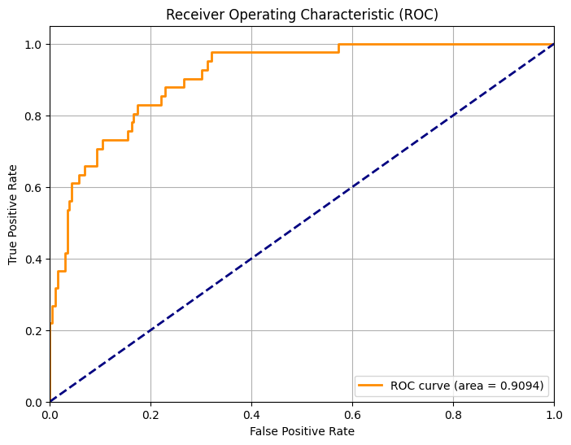
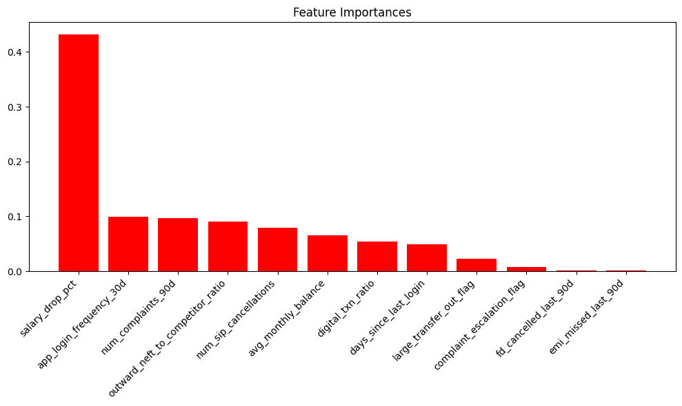

# TrustEdge — Churn Model Training & Evaluation
### Hackathon ML Stand-in for Temporal Graph Neural Network (TGN)
This notebook trains a Random Forest Classifier on synthetic customer signals to predict churn probability, maps the risk factors, and extracts the Churn DNA breakdown.


```python
import sys
import os
sys.path.append(os.path.abspath('../ml'))

import numpy as np
import pandas as pd
import matplotlib.pyplot as plt
from sklearn.ensemble import RandomForestClassifier
from sklearn.model_selection import train_test_split
from sklearn.metrics import classification_report, roc_curve, auc, roc_auc_score

from generate_dataset import generate_customer_dataset
from churn_model import FEATURE_COLS
```

## 1. Dataset Generation
We generate synthetic customer signals mapping directly to `CustomerSignal` model signals in the DB.


```python
df = generate_customer_dataset(1500)
print(f"Dataset Shape: {df.shape}")
print(f"Class Distribution:\n{df['churned'].value_counts(normalize=True)}")
df.head()
```

    Dataset Shape: (1500, 15)
    Class Distribution:
    churned
    0    0.864
    1    0.136
    Name: proportion, dtype: float64
    


<div>
<style scoped>
    .dataframe tbody tr th:only-of-type {
        vertical-align: middle;
    }

    .dataframe tbody tr th {
        vertical-align: top;
    }

    .dataframe thead th {
        text-align: right;
    }
</style>
<table border="1" class="dataframe">
  <thead>
    <tr style="text-align: right;">
      <th></th>
      <th>customer_id</th>
      <th>name</th>
      <th>salary_drop_pct</th>
      <th>avg_monthly_balance</th>
      <th>num_sip_cancellations</th>
      <th>app_login_frequency_30d</th>
      <th>digital_txn_ratio</th>
      <th>num_complaints_90d</th>
      <th>complaint_escalation_flag</th>
      <th>large_transfer_out_flag</th>
      <th>outward_neft_to_competitor_ratio</th>
      <th>days_since_last_login</th>
      <th>fd_cancelled_last_90d</th>
      <th>emi_missed_last_90d</th>
      <th>churned</th>
    </tr>
  </thead>
  <tbody>
    <tr>
      <th>0</th>
      <td>1a3f793b-aff5-4556-b4fe-78bd2c9eb22f</td>
      <td>Vardaniya Kunda</td>
      <td>8.84</td>
      <td>32067.00</td>
      <td>0</td>
      <td>7</td>
      <td>0.6822</td>
      <td>3</td>
      <td>0</td>
      <td>0</td>
      <td>0.1762</td>
      <td>3.8</td>
      <td>0</td>
      <td>0</td>
      <td>0</td>
    </tr>
    <tr>
      <th>1</th>
      <td>323d9853-c9e9-469d-a5b6-332ac995da57</td>
      <td>Miraan Seshadri</td>
      <td>41.34</td>
      <td>96370.46</td>
      <td>0</td>
      <td>9</td>
      <td>0.7438</td>
      <td>0</td>
      <td>0</td>
      <td>1</td>
      <td>0.1967</td>
      <td>3.3</td>
      <td>0</td>
      <td>0</td>
      <td>1</td>
    </tr>
    <tr>
      <th>2</th>
      <td>410b6610-1746-4715-b22a-870da5e2231f</td>
      <td>Azad Lala</td>
      <td>36.71</td>
      <td>37499.27</td>
      <td>1</td>
      <td>6</td>
      <td>0.9275</td>
      <td>0</td>
      <td>1</td>
      <td>0</td>
      <td>0.0976</td>
      <td>15.7</td>
      <td>0</td>
      <td>0</td>
      <td>1</td>
    </tr>
    <tr>
      <th>3</th>
      <td>5cd0664a-6e2a-4b5a-8d3d-fde144a30736</td>
      <td>Eva Agate</td>
      <td>44.84</td>
      <td>3373.71</td>
      <td>1</td>
      <td>8</td>
      <td>0.8398</td>
      <td>0</td>
      <td>0</td>
      <td>0</td>
      <td>0.0100</td>
      <td>0.7</td>
      <td>0</td>
      <td>0</td>
      <td>0</td>
    </tr>
    <tr>
      <th>4</th>
      <td>e158afd2-442a-4215-abe0-db824e54651d</td>
      <td>Anika Shan</td>
      <td>18.69</td>
      <td>44711.36</td>
      <td>0</td>
      <td>6</td>
      <td>0.6091</td>
      <td>0</td>
      <td>0</td>
      <td>0</td>
      <td>0.1854</td>
      <td>6.6</td>
      <td>0</td>
      <td>0</td>
      <td>0</td>
    </tr>
  </tbody>
</table>
</div>


## 2. Model Training


```python
X = df[FEATURE_COLS]
y = df['churned']

X_train, X_test, y_train, y_test = train_test_split(X, y, test_size=0.2, random_state=42, stratify=y)

clf = RandomForestClassifier(n_estimators=150, max_depth=8, min_samples_leaf=5, class_weight='balanced', random_state=42)
clf.fit(X_train, y_train)
```


<style>#sk-container-id-1 {
  /* Definition of color scheme common for light and dark mode */
  --sklearn-color-text: black;
  --sklearn-color-line: gray;
  /* Definition of color scheme for unfitted estimators */
  --sklearn-color-unfitted-level-0: #fff5e6;
  --sklearn-color-unfitted-level-1: #f6e4d2;
  --sklearn-color-unfitted-level-2: #ffe0b3;
  --sklearn-color-unfitted-level-3: chocolate;
  /* Definition of color scheme for fitted estimators */
  --sklearn-color-fitted-level-0: #f0f8ff;
  --sklearn-color-fitted-level-1: #d4ebff;
  --sklearn-color-fitted-level-2: #b3dbfd;
  --sklearn-color-fitted-level-3: cornflowerblue;

  /* Specific color for light theme */
  --sklearn-color-text-on-default-background: var(--sg-text-color, var(--theme-code-foreground, var(--jp-content-font-color1, black)));
  --sklearn-color-background: var(--sg-background-color, var(--theme-background, var(--jp-layout-color0, white)));
  --sklearn-color-border-box: var(--sg-text-color, var(--theme-code-foreground, var(--jp-content-font-color1, black)));
  --sklearn-color-icon: #696969;

  @media (prefers-color-scheme: dark) {
    /* Redefinition of color scheme for dark theme */
    --sklearn-color-text-on-default-background: var(--sg-text-color, var(--theme-code-foreground, var(--jp-content-font-color1, white)));
    --sklearn-color-background: var(--sg-background-color, var(--theme-background, var(--jp-layout-color0, #111)));
    --sklearn-color-border-box: var(--sg-text-color, var(--theme-code-foreground, var(--jp-content-font-color1, white)));
    --sklearn-color-icon: #878787;
  }
}

#sk-container-id-1 {
  color: var(--sklearn-color-text);
}

#sk-container-id-1 pre {
  padding: 0;
}

#sk-container-id-1 input.sk-hidden--visually {
  border: 0;
  clip: rect(1px 1px 1px 1px);
  clip: rect(1px, 1px, 1px, 1px);
  height: 1px;
  margin: -1px;
  overflow: hidden;
  padding: 0;
  position: absolute;
  width: 1px;
}

#sk-container-id-1 div.sk-dashed-wrapped {
  border: 1px dashed var(--sklearn-color-line);
  margin: 0 0.4em 0.5em 0.4em;
  box-sizing: border-box;
  padding-bottom: 0.4em;
  background-color: var(--sklearn-color-background);
}

#sk-container-id-1 div.sk-container {
  /* jupyter's `normalize.less` sets `[hidden] { display: none; }`
     but bootstrap.min.css set `[hidden] { display: none !important; }`
     so we also need the `!important` here to be able to override the
     default hidden behavior on the sphinx rendered scikit-learn.org.
     See: https://github.com/scikit-learn/scikit-learn/issues/21755 */
  display: inline-block !important;
  position: relative;
}

#sk-container-id-1 div.sk-text-repr-fallback {
  display: none;
}

div.sk-parallel-item,
div.sk-serial,
div.sk-item {
  /* draw centered vertical line to link estimators */
  background-image: linear-gradient(var(--sklearn-color-text-on-default-background), var(--sklearn-color-text-on-default-background));
  background-size: 2px 100%;
  background-repeat: no-repeat;
  background-position: center center;
}

/* Parallel-specific style estimator block */

#sk-container-id-1 div.sk-parallel-item::after {
  content: "";
  width: 100%;
  border-bottom: 2px solid var(--sklearn-color-text-on-default-background);
  flex-grow: 1;
}

#sk-container-id-1 div.sk-parallel {
  display: flex;
  align-items: stretch;
  justify-content: center;
  background-color: var(--sklearn-color-background);
  position: relative;
}

#sk-container-id-1 div.sk-parallel-item {
  display: flex;
  flex-direction: column;
}

#sk-container-id-1 div.sk-parallel-item:first-child::after {
  align-self: flex-end;
  width: 50%;
}

#sk-container-id-1 div.sk-parallel-item:last-child::after {
  align-self: flex-start;
  width: 50%;
}

#sk-container-id-1 div.sk-parallel-item:only-child::after {
  width: 0;
}

/* Serial-specific style estimator block */

#sk-container-id-1 div.sk-serial {
  display: flex;
  flex-direction: column;
  align-items: center;
  background-color: var(--sklearn-color-background);
  padding-right: 1em;
  padding-left: 1em;
}


/* Toggleable style: style used for estimator/Pipeline/ColumnTransformer box that is
clickable and can be expanded/collapsed.
- Pipeline and ColumnTransformer use this feature and define the default style
- Estimators will overwrite some part of the style using the `sk-estimator` class
*/

/* Pipeline and ColumnTransformer style (default) */

#sk-container-id-1 div.sk-toggleable {
  /* Default theme specific background. It is overwritten whether we have a
  specific estimator or a Pipeline/ColumnTransformer */
  background-color: var(--sklearn-color-background);
}

/* Toggleable label */
#sk-container-id-1 label.sk-toggleable__label {
  cursor: pointer;
  display: block;
  width: 100%;
  margin-bottom: 0;
  padding: 0.5em;
  box-sizing: border-box;
  text-align: center;
}

#sk-container-id-1 label.sk-toggleable__label-arrow:before {
  /* Arrow on the left of the label */
  content: "▸";
  float: left;
  margin-right: 0.25em;
  color: var(--sklearn-color-icon);
}

#sk-container-id-1 label.sk-toggleable__label-arrow:hover:before {
  color: var(--sklearn-color-text);
}

/* Toggleable content - dropdown */

#sk-container-id-1 div.sk-toggleable__content {
  max-height: 0;
  max-width: 0;
  overflow: hidden;
  text-align: left;
  /* unfitted */
  background-color: var(--sklearn-color-unfitted-level-0);
}

#sk-container-id-1 div.sk-toggleable__content.fitted {
  /* fitted */
  background-color: var(--sklearn-color-fitted-level-0);
}

#sk-container-id-1 div.sk-toggleable__content pre {
  margin: 0.2em;
  border-radius: 0.25em;
  color: var(--sklearn-color-text);
  /* unfitted */
  background-color: var(--sklearn-color-unfitted-level-0);
}

#sk-container-id-1 div.sk-toggleable__content.fitted pre {
  /* unfitted */
  background-color: var(--sklearn-color-fitted-level-0);
}

#sk-container-id-1 input.sk-toggleable__control:checked~div.sk-toggleable__content {
  /* Expand drop-down */
  max-height: 200px;
  max-width: 100%;
  overflow: auto;
}

#sk-container-id-1 input.sk-toggleable__control:checked~label.sk-toggleable__label-arrow:before {
  content: "▾";
}

/* Pipeline/ColumnTransformer-specific style */

#sk-container-id-1 div.sk-label input.sk-toggleable__control:checked~label.sk-toggleable__label {
  color: var(--sklearn-color-text);
  background-color: var(--sklearn-color-unfitted-level-2);
}

#sk-container-id-1 div.sk-label.fitted input.sk-toggleable__control:checked~label.sk-toggleable__label {
  background-color: var(--sklearn-color-fitted-level-2);
}

/* Estimator-specific style */

/* Colorize estimator box */
#sk-container-id-1 div.sk-estimator input.sk-toggleable__control:checked~label.sk-toggleable__label {
  /* unfitted */
  background-color: var(--sklearn-color-unfitted-level-2);
}

#sk-container-id-1 div.sk-estimator.fitted input.sk-toggleable__control:checked~label.sk-toggleable__label {
  /* fitted */
  background-color: var(--sklearn-color-fitted-level-2);
}

#sk-container-id-1 div.sk-label label.sk-toggleable__label,
#sk-container-id-1 div.sk-label label {
  /* The background is the default theme color */
  color: var(--sklearn-color-text-on-default-background);
}

/* On hover, darken the color of the background */
#sk-container-id-1 div.sk-label:hover label.sk-toggleable__label {
  color: var(--sklearn-color-text);
  background-color: var(--sklearn-color-unfitted-level-2);
}

/* Label box, darken color on hover, fitted */
#sk-container-id-1 div.sk-label.fitted:hover label.sk-toggleable__label.fitted {
  color: var(--sklearn-color-text);
  background-color: var(--sklearn-color-fitted-level-2);
}

/* Estimator label */

#sk-container-id-1 div.sk-label label {
  font-family: monospace;
  font-weight: bold;
  display: inline-block;
  line-height: 1.2em;
}

#sk-container-id-1 div.sk-label-container {
  text-align: center;
}

/* Estimator-specific */
#sk-container-id-1 div.sk-estimator {
  font-family: monospace;
  border: 1px dotted var(--sklearn-color-border-box);
  border-radius: 0.25em;
  box-sizing: border-box;
  margin-bottom: 0.5em;
  /* unfitted */
  background-color: var(--sklearn-color-unfitted-level-0);
}

#sk-container-id-1 div.sk-estimator.fitted {
  /* fitted */
  background-color: var(--sklearn-color-fitted-level-0);
}

/* on hover */
#sk-container-id-1 div.sk-estimator:hover {
  /* unfitted */
  background-color: var(--sklearn-color-unfitted-level-2);
}

#sk-container-id-1 div.sk-estimator.fitted:hover {
  /* fitted */
  background-color: var(--sklearn-color-fitted-level-2);
}

/* Specification for estimator info (e.g. "i" and "?") */

/* Common style for "i" and "?" */

.sk-estimator-doc-link,
a:link.sk-estimator-doc-link,
a:visited.sk-estimator-doc-link {
  float: right;
  font-size: smaller;
  line-height: 1em;
  font-family: monospace;
  background-color: var(--sklearn-color-background);
  border-radius: 1em;
  height: 1em;
  width: 1em;
  text-decoration: none !important;
  margin-left: 1ex;
  /* unfitted */
  border: var(--sklearn-color-unfitted-level-1) 1pt solid;
  color: var(--sklearn-color-unfitted-level-1);
}

.sk-estimator-doc-link.fitted,
a:link.sk-estimator-doc-link.fitted,
a:visited.sk-estimator-doc-link.fitted {
  /* fitted */
  border: var(--sklearn-color-fitted-level-1) 1pt solid;
  color: var(--sklearn-color-fitted-level-1);
}

/* On hover */
div.sk-estimator:hover .sk-estimator-doc-link:hover,
.sk-estimator-doc-link:hover,
div.sk-label-container:hover .sk-estimator-doc-link:hover,
.sk-estimator-doc-link:hover {
  /* unfitted */
  background-color: var(--sklearn-color-unfitted-level-3);
  color: var(--sklearn-color-background);
  text-decoration: none;
}

div.sk-estimator.fitted:hover .sk-estimator-doc-link.fitted:hover,
.sk-estimator-doc-link.fitted:hover,
div.sk-label-container:hover .sk-estimator-doc-link.fitted:hover,
.sk-estimator-doc-link.fitted:hover {
  /* fitted */
  background-color: var(--sklearn-color-fitted-level-3);
  color: var(--sklearn-color-background);
  text-decoration: none;
}

/* Span, style for the box shown on hovering the info icon */
.sk-estimator-doc-link span {
  display: none;
  z-index: 9999;
  position: relative;
  font-weight: normal;
  right: .2ex;
  padding: .5ex;
  margin: .5ex;
  width: min-content;
  min-width: 20ex;
  max-width: 50ex;
  color: var(--sklearn-color-text);
  box-shadow: 2pt 2pt 4pt #999;
  /* unfitted */
  background: var(--sklearn-color-unfitted-level-0);
  border: .5pt solid var(--sklearn-color-unfitted-level-3);
}

.sk-estimator-doc-link.fitted span {
  /* fitted */
  background: var(--sklearn-color-fitted-level-0);
  border: var(--sklearn-color-fitted-level-3);
}

.sk-estimator-doc-link:hover span {
  display: block;
}

/* "?"-specific style due to the `<a>` HTML tag */

#sk-container-id-1 a.estimator_doc_link {
  float: right;
  font-size: 1rem;
  line-height: 1em;
  font-family: monospace;
  background-color: var(--sklearn-color-background);
  border-radius: 1rem;
  height: 1rem;
  width: 1rem;
  text-decoration: none;
  /* unfitted */
  color: var(--sklearn-color-unfitted-level-1);
  border: var(--sklearn-color-unfitted-level-1) 1pt solid;
}

#sk-container-id-1 a.estimator_doc_link.fitted {
  /* fitted */
  border: var(--sklearn-color-fitted-level-1) 1pt solid;
  color: var(--sklearn-color-fitted-level-1);
}

/* On hover */
#sk-container-id-1 a.estimator_doc_link:hover {
  /* unfitted */
  background-color: var(--sklearn-color-unfitted-level-3);
  color: var(--sklearn-color-background);
  text-decoration: none;
}

#sk-container-id-1 a.estimator_doc_link.fitted:hover {
  /* fitted */
  background-color: var(--sklearn-color-fitted-level-3);
}
</style><div id="sk-container-id-1" class="sk-top-container"><div class="sk-text-repr-fallback"><pre>RandomForestClassifier(class_weight=&#x27;balanced&#x27;, max_depth=8, min_samples_leaf=5,
                       n_estimators=150, random_state=42)</pre><b>In a Jupyter environment, please rerun this cell to show the HTML representation or trust the notebook. <br />On GitHub, the HTML representation is unable to render, please try loading this page with nbviewer.org.</b></div><div class="sk-container" hidden><div class="sk-item"><div class="sk-estimator fitted sk-toggleable"><input class="sk-toggleable__control sk-hidden--visually" id="sk-estimator-id-1" type="checkbox" checked><label for="sk-estimator-id-1" class="sk-toggleable__label fitted sk-toggleable__label-arrow fitted">&nbsp;&nbsp;RandomForestClassifier<a class="sk-estimator-doc-link fitted" rel="noreferrer" target="_blank" href="https://scikit-learn.org/1.4/modules/generated/sklearn.ensemble.RandomForestClassifier.html">?<span>Documentation for RandomForestClassifier</span></a><span class="sk-estimator-doc-link fitted">i<span>Fitted</span></span></label><div class="sk-toggleable__content fitted"><pre>RandomForestClassifier(class_weight=&#x27;balanced&#x27;, max_depth=8, min_samples_leaf=5,
                       n_estimators=150, random_state=42)</pre></div> </div></div></div></div>


## 3. Evaluation


```python
y_pred = clf.predict(X_test)
y_proba = clf.predict_proba(X_test)[:, 1]

print("=== CLASSIFICATION REPORT ===")
print(classification_report(y_test, y_pred, target_names=['STABLE', 'AT_RISK']))
print(f"ROC-AUC Score: {roc_auc_score(y_test, y_proba):.4f}")
```

    === CLASSIFICATION REPORT ===
                  precision    recall  f1-score   support
    
          STABLE       0.94      0.93      0.94       259
         AT_RISK       0.59      0.63      0.61        41
    
        accuracy                           0.89       300
       macro avg       0.77      0.78      0.77       300
    weighted avg       0.89      0.89      0.89       300
    
    ROC-AUC Score: 0.9094
    

## 4. Visualizations


```python
# Plot ROC Curve
fpr, tpr, _ = roc_curve(y_test, y_proba)
roc_auc = auc(fpr, tpr)

plt.figure(figsize=(8, 6))
plt.plot(fpr, tpr, color='darkorange', lw=2, label=f'ROC curve (area = {roc_auc:.4f})')
plt.plot([0, 1], [0, 1], color='navy', lw=2, linestyle='--')
plt.xlim([0.0, 1.0])
plt.ylim([0.0, 1.05])
plt.xlabel('False Positive Rate')
plt.ylabel('True Positive Rate')
plt.title('Receiver Operating Characteristic (ROC)')
plt.legend(loc="lower right")
plt.grid(True)
plt.show()
```


    

    


```python
# Feature Importance
importances = clf.feature_importances_
indices = np.argsort(importances)[::-1]

plt.figure(figsize=(10, 6))
plt.title("Feature Importances")
plt.bar(range(X.shape[1]), importances[indices], color="r", align="center")
plt.xticks(range(X.shape[1]), [FEATURE_COLS[i] for i in indices], rotation=45, ha='right')
plt.xlim([-1, X.shape[1]])
plt.tight_layout()
plt.show()
```


    

    

