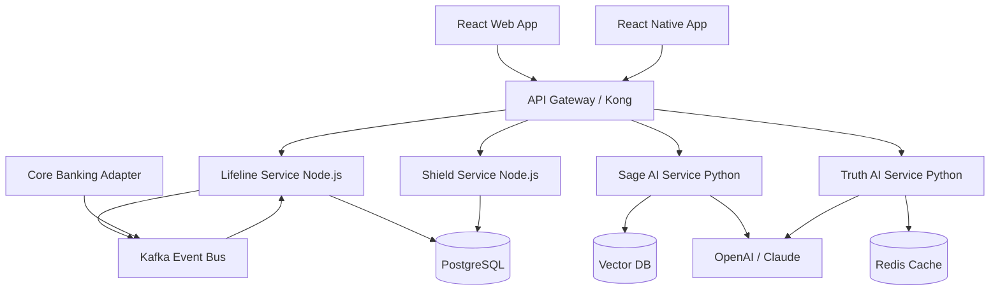
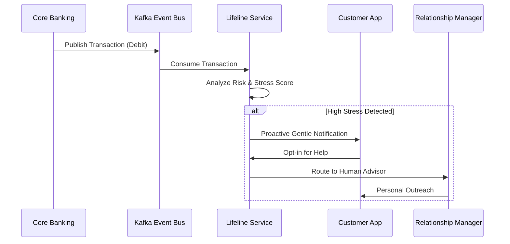

# LIFELINE: The Human Banking Platform
**Comprehensive Project Overview & Technical Report**

---

## 1. Project Introduction

### 1.1 Project Title
**Lifeline: The Human Banking Platform**

### 1.2 Problem Statement
The modern banking system prioritizes profits and rigid targets over people. Customers are frequently pushed into poor financial decisions, facing punitive measures when struggling, which perpetuates a cycle of debt. Simultaneously, bank employees—such as Relationship Managers and Customer Support teams—suffer from severe burnout due to the emotional labor of handling distressed customers and meeting strict sales quotas. This results in a mutual loss of trust between the institution and the individual.

### 1.3 Objectives
- To build a human-first banking ecosystem where AI acts as a protective layer rather than a replacement for human connection.
- To proactively identify and support customers facing financial stress before they default.
- To protect the mental health and emotional well-being of bank employees through continuous monitoring and peer support routing.
- To democratize financial literacy through personalized, jargon-free AI companionship.
- To provide brutally honest, unbiased financial product analysis to prevent predatory lending.

### 1.4 Motivation
The motivation stems from the urgent need to reshape fintech. Instead of using data to extract maximum lifetime value from users through fees, Lifeline uses data to foster financial resilience. The platform aims to prove that ethical banking is not only socially responsible but also viable by reducing default rates and employee turnover.

### 1.5 Scope of the Project
The project encompasses the development of a full-stack, AI-integrated banking interface catering to two main user groups: Customers and Employees. It includes a core banking integration layer, advanced AI analysis pipelines (NLP and predictive analytics), and multiple frontend platforms (Web and Mobile).

---

## 2. System Architecture & Workflow

### 2.1 End-to-End Workflow Explanation
The system operates asynchronously to ensure a seamless user experience. Transaction data streams continuously into the backend via Kafka. The Lifeline Service analyzes this data for stress indicators. If a threshold is breached, the user is notified, and a human handoff to a Relationship Manager is triggered. In parallel, employees logging off shifts submit emotional check-ins to the Shield Service, which dynamically routes them to peer support if needed.

### 2.2 System Pipeline

1. **Ingestion Layer**: Transactions pulled from Core Banking via API Gateway.
2. **Event Bus**: Kafka distributes events to respective microservices.
3. **AI Processing Layer**: Python/FastAPI services process data (stress scoring, NLP chat).
4. **Data Persistence**: Relational data in PostgreSQL, unstructured/vector data in Vector DB.
5. **Presentation Layer**: React/React Native UIs consume REST/GraphQL APIs.

### 2.3 Architecture Diagrams



### 2.4 Data Flow Diagrams



### 2.5 Workflow Illustrations
*(Refer to UI/UX Section for visual dashboard workflows).*

---

## 3. Technical Stack

### 3.1 Frontend Technologies
- **Web App**: React.js, Tailwind CSS (for rapid, responsive, and maintainable UI design).
- **Mobile App**: React Native (enabling cross-platform iOS and Android deployment from a single codebase).

### 3.2 Backend Technologies
- **Core Framework**: Node.js with NestJS (enterprise-grade architecture, TypeScript).
- **AI Microservices**: Python with FastAPI (high performance, native data science libraries).

### 3.3 Database Used
- **Primary Relational DB**: PostgreSQL (ACID compliance, robust financial data handling).
- **Caching**: Redis (API rate limiting, session management, caching AI responses).
- **AI Context**: Vector DB (e.g., Pinecone or Milvus for RAG architectures).

### 3.4 APIs and Integrations
- **Financial Data Aggregation**: Plaid / MX.
- **Communications**: Twilio (SMS/WhatsApp outreach).
- **Large Language Models**: OpenAI API / Anthropic Claude.
- **Identity & Access Management**: Auth0 / Okta.

### 3.5 Development Tools and Platforms
- **Containerization**: Docker, Docker Compose.
- **Version Control**: Git, GitHub/GitLab Monorepo setup.
- **Infrastructure**: AWS (EKS for Kubernetes, RDS for Postgres, MSK for Kafka).

---

## 4. Project Modules

### 4.1 LIFELINE CORE (Early Intervention)
- **Functionality**: Continuously monitors transaction data to identify early signs of financial stress (e.g., rapid balance drops, missed payments).
- **Input/Output**: Input stream of transactions. Output is a calculated risk score and potential triggers for proactive outreach.
- **Internal Working**: Utilizes rule-based algorithms combined with anomaly detection models. Triggers Kafka events when thresholds are met.

### 4.2 SHIELD (Employee Protection)
- **Functionality**: Tracks the emotional weight of an employee's shift and provides a secure check-in mechanism.
- **Input/Output**: Shift metrics and self-reported stress levels. Output is an anonymous routing to peer support or counselors.
- **Internal Working**: Uses highly encrypted (`AES-256`) logs to maintain absolute privacy. Matches employees based on availability and required support type.

### 4.3 SAGE (AI Educator)
- **Functionality**: An empathetic AI companion offering jargon-free financial education.
- **Input/Output**: User chat queries. Output is context-aware, educational responses.
- **Internal Working**: Powered by an LLM integrated with a Vector DB via RAG to fetch accurate, up-to-date financial literacy modules.

### 4.4 TRUTH (Unbiased Advisor)
- **Functionality**: Analyzes financial products (loans, credit cards) and presents clear pros, cons, and hidden fees.
- **Input/Output**: Product ID or description. Output is a transparent breakdown and competitor alternatives.
- **Internal Working**: Scrapes or queries product details, parses terms and conditions using LLM, and formats the output into a digestible "verdict."

---

## 5. Dataset / Data Handling

### 5.1 Dataset Description
The system relies on high-velocity transactional financial data. For the development and AI training phases, synthetic transactional datasets (mirroring real-world distributions of income, expenses, and stress events) are utilized to ensure privacy compliance.

### 5.2 Data Preprocessing Steps
- **Categorization**: Transaction strings are mapped to standard categories (Groceries, Utilities, Debt Repayment).
- **Normalization**: Amounts are scaled to compare users across different income brackets.
- **Time-Series Aggregation**: Daily transactions are rolled up into weekly and monthly velocity metrics.

### 5.3 Feature Engineering
Key features engineered for the stress-detection model include:
- `Income_Volatility_Index`: Standard deviation of monthly inflows.
- `Essential_to_Discretionary_Ratio`: Proportion of spending on basic needs.
- `Overdraft_Frequency`: Number of days spent in negative balance.

### 5.4 Data Visualization Summaries
Data summaries are provided to users via charts (e.g., Cashflow trends, Spending by category) in the Customer Dashboard, ensuring users can visually interpret their financial health instantly.

---

## 6. Implementation Details

### 6.1 Algorithms Used
- **Anomaly Detection**: Isolation Forests or Autoencoders for detecting unusual spending patterns.
- **NLP**: Transformer-based architectures (GPT-4/Claude 3) for SAGE and TRUTH modules.

### 6.2 Model Architecture
The NLP models utilize a Retrieval-Augmented Generation (RAG) architecture to prevent hallucinations, pulling ground-truth financial documents from the Vector DB before generating responses.

### 6.3 Security in Processing
PII (Personally Identifiable Information) is scrubbed before any data is sent to external LLM APIs to maintain strict compliance (SOC2/GDPR).

---

## 7. Workflow Execution

### 7.1 User Interaction Flow
1. User logs into the Web or Mobile app (Auth0).
2. The dashboard fetches the current financial profile via the API Gateway.
3. User interacts with the SAGE chat interface.
4. The React frontend sends the query to the Python FastAPI backend, which streams back the LLM response.

### 7.2 Backend Processing Flow
1. Core Banking pushes a batch of transactions to the Kafka broker.
2. The Node.js Lifeline worker consumes the topic, updates the PostgreSQL database, and recalculates the user's `stress_indicator_level`.
3. If the level upgrades to `HIGH`, an event is emitted to the Notification Service (Twilio integration).

### 7.3 Deployment Workflow
- CI/CD pipelines (GitHub Actions) run tests and linting.
- Docker images are built and pushed to a container registry (ECR).
- Kubernetes (EKS) performs rolling updates to ensure zero downtime.

---

## 8. UI/UX Section

The user interface employs a modern, premium "glassmorphism" aesthetic with vibrant colors and dark mode variants to create a calming, professional atmosphere.

### 8.1 Customer Dashboard
This dashboard centralizes the user's financial health, integrating the SAGE chat and TRUTH analysis organically.


### 8.2 Employee Dashboard (SHIELD)
Designed for Relationship Managers, this interface minimizes cognitive load while prioritizing emotional well-being check-ins and peer support networks.


---

## 9. Results & Performance Analysis

*(Note: As the project is in the development phase, these represent target metrics based on architecture design).*

### 9.1 Performance Metrics
- **API Response Time**: < 150ms for core banking queries (via Redis caching).
- **Event Processing**: Kafka capable of handling 10,000+ transactions/second.
- **LLM Latency**: SAGE responses streamed within 800ms of First Byte.

### 9.2 Scalability Targets
- Designed to handle Phase 1 (10k users) via monolithic NestJS, scaling horizontally via Kubernetes to support millions in Phase 3.

---

## 10. Security & Optimization

### 10.1 Authentication & Security Implementations
- **Auth**: JWT with short expirations; refresh tokens in HttpOnly secure cookies. MFA enforced.
- **Encryption**: TLS 1.3 in transit. AES-256 for data at rest (PostgreSQL/S3).
- **Privacy**: SHIELD logs are uniquely salted and encrypted at the application level to prevent even DB admins from reading employee stress data.

### 10.2 Performance Optimization
- Segregation of synchronous user-facing API calls from asynchronous heavy-lifting (Kafka workers) prevents UI blocking.
- Redis caching layer prevents redundant external API calls to Core Banking and Plaid.

---

## 11. Future Enhancements

- **Voice AI**: Integrating voice-to-text models to allow users to speak to SAGE natively in the app.
- **Open Banking Expansion**: Deepening Plaid/MX integrations for real-time portfolio balancing.
- **Predictive Analytics**: Transitioning from reactive stress detection to predictive 3-month forecasting of user cash flows.

---

## 12. Conclusion

### 12.1 Final Summary
Lifeline represents a paradigm shift in financial technology. By architecting a platform that prioritizes human well-being over punitive fee extraction, it solves a critical flaw in modern banking. 

### 12.2 Impact
The project not only supports vulnerable customers through proactive AI intervention (LIFELINE CORE and SAGE) but also establishes a necessary safety net for the employees driving the institution (SHIELD). The robust microservices architecture ensures that this ethical approach scales securely and efficiently.

---

## 13. Appendices

### 13.1 Folder Structure
```text
/lifeline-monorepo
├── /apps
│   ├── /web-client       # React frontend
│   ├── /mobile-client    # React Native app
│   └── /api-gateway      # NestJS backend
├── /services
│   ├── /ai-engine        # Python/FastAPI for SAGE & TRUTH
│   └── /core-banking     # Core banking API adapter
├── /packages
│   ├── /ui-components    # Shared UI library (Tailwind)
│   ├── /database         # Prisma schemas
│   └── /config           # Shared configs
```

### 13.2 Source Code Snippet Example (API Contract)
```json
// GET /api/v1/lifeline/status
{
  "stressLevel": "MODERATE",
  "recommendedAction": "talk_to_advisor",
  "advisorAvailable": true
}
```

### 13.3 Installation / Setup Guide
1. `git clone <repository_url>`
2. `npm install` (in root directory for monorepo dependencies).
3. Copy `.env.example` to `.env` and populate keys (OpenAI, PostgreSQL URL).
4. `docker-compose up -d` to start Postgres, Redis, and Kafka.
5. `npm run dev` to start all services via Turborepo/Nx.
