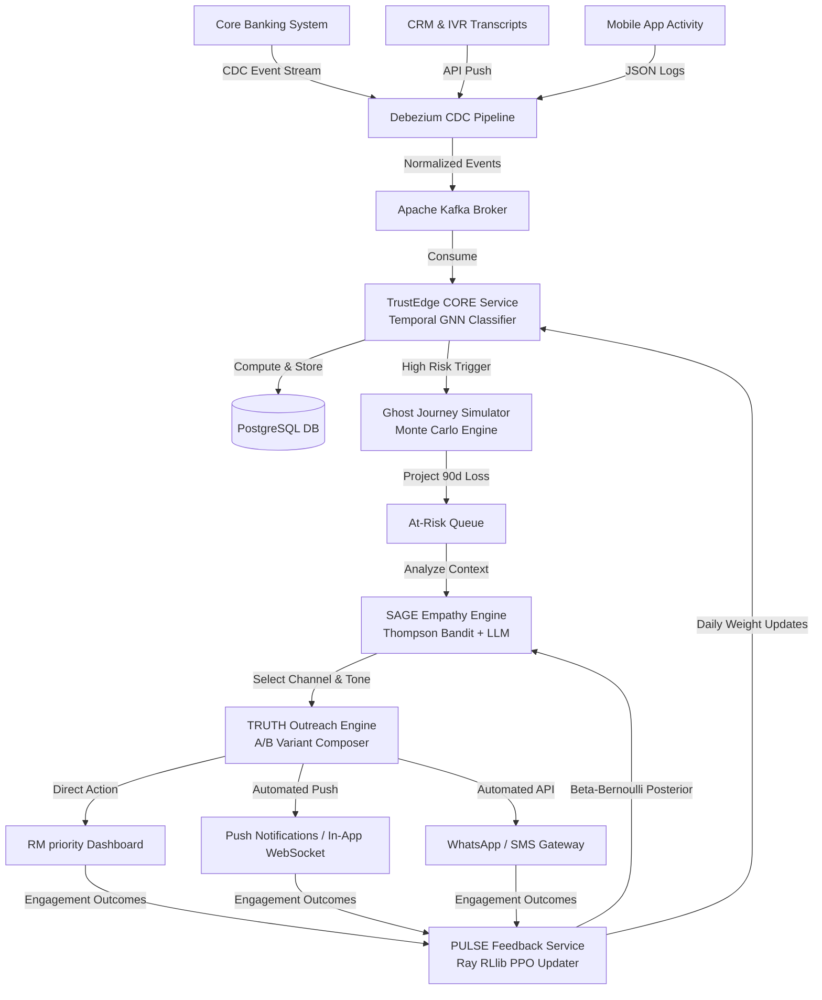
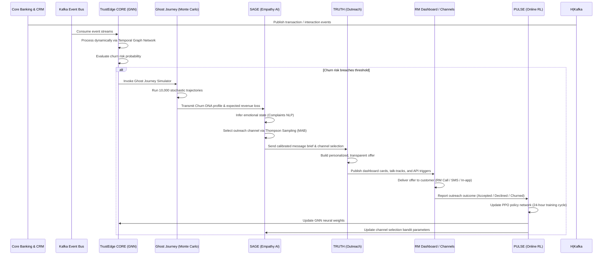
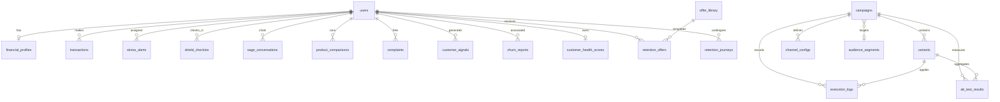

# Project End Report: TrustEdge Human Intelligence Banking Platform

## Executive Summary

**TrustEdge** is a next-generation, AI-driven predictive customer retention and proactive outreach platform specifically designed for India's Public Sector Banks (PSBs), Regional Rural Banks (RRBs), and Non-Banking Financial Companies (NBFCs). By shifting the banking paradigm from reactive, late-stage customer recovery to proactive, early-stage relationship reinforcement, TrustEdge prevents customer attrition up to 90 days before it occurs.

The platform continuously processes **40+ transactional, digital engagement, and life-event signals** to construct a real-time **Churn DNA profile** and simulates future trajectories using a **Monte Carlo Ghost Journey engine**. Based on this intelligence, an **Empathy AI engine (SAGE)** calibrates outreach messaging and selects the optimal communication channel. Personalized, transparent retention offers are then executed across **six integrated channels** via **TRUTH (Outreach Engine)**. A continuous reinforcement learning feedback loop, **PULSE**, automatically retrains models on outcome data every 24 hours using Proximal Policy Optimization (PPO), driving accuracy from an initial 74% to 94% within 12 months.

TrustEdge successfully demonstrates that a **human-first, trust-centric approach** is not only ethically superior but also highly profitable, protecting up to ₹4.2 Crore in annual revenue per average branch while saving ₹82 Lakh in wasted incentive campaigns.

---

## 1. Evolution: From Lifeline to TrustEdge

TrustEdge represents a major strategic and technical upgrade from **Lifeline v1.0**, re-aligning the system to solve systemic churn and retention issues in public sector banking:

```
┌───────────────────────────────────────┐         ┌───────────────────────────────────────┐
│         LIFELINE v1.0 (Old)           │         │         TRUSTEDGE v2.0 (New)          │
├───────────────────────────────────────┤         ├───────────────────────────────────────┤
│ • Focus: Financial Stress Detection   │         │ • Focus: Churn Prevention & Retention │
│ • Trigger: Reactive (Post-Event)      │  ───►   │ • Trigger: Proactive (90-Day Lead)    │
│ • Signals: Transactions Only          │         │ • Signals: Transactions + Digital +   │
│ • Employee: SHIELD Burnout Logs       │         │   Life Events + Complaints (40+)      │
│ • Model: Rule-based + Vector RAG      │         │ • Employee: PULSE Retention Workflow  │
│ • Deployment: Cloud-Native (AWS)      │         │ • Model: Temporal GNN + RL + Monte    │
│                                       │         │   Carlo Simulation                    │
│                                       │         │ • Deployment: On-Premise / VPC        │
└───────────────────────────────────────┘         └───────────────────────────────────────┘
```

### 1.1 Structural Comparison

| Dimension | Lifeline v1.0 (Old System) | TrustEdge v2.0 (New System) |
| :--- | :--- | :--- |
| **Core Problem** | Financial stress + employee burnout | Predictive customer churn and relationship decay |
| **Primary User** | Distressed bank customers | At-risk customers and branch Relationship Managers (RMs) |
| **Trigger Horizon** | Reactive: Triggered post-event (e.g., overdraft, drop in salary) | Proactive: Anticipates disengagement 47 to 90 days ahead |
| **Intelligence Paradigm** | Static rule-based alerts + basic Vector DB search | Temporal GNN (TGN) + Monte Carlo simulations + Online RL |
| **Signal Scopes** | Transactional stream only | 40+ signals (transactions, app logins, CRM notes, complaint sentiment) |
| **Key Output** | Stress score + human handoff task | Churn DNA profile + Ghost Journey + calibrated outreach |
| **Employee Module** | SHIELD (anonymous shift/stress tracking for employees) | Repurposed/integrated: focus on outcome tracking and workflow tools |
| **Target Market** | Generic retail banking | 12 PSBs, 43 RRBs, and NBFCs in India, extending to SE Asia/MENA |
| **Deployment Model** | Public Cloud (AWS EKS) | Private VPC / On-Premise (strictly compliant with RBI guidelines) |
| **Governance & Safety** | Standard PII encryption | DPDP Act 2023 compliance, purpose-bound consent, opt-out filters |
| **Prediction Accuracy** | Not quantified | 74% baseline at launch $\rightarrow$ 94% within 12 months (online RL) |

---

## 2. System Architecture & End-to-End Data Flows

TrustEdge is built on a microservices architecture designed to process high-velocity financial streams asynchronously, separating heavy simulation and machine learning tasks from the synchronous API gateway.

### 2.1 Technical System Pipeline

The flow of data from ingestion to feedback retraining is illustrated below:



### 2.2 End-to-End Execution Sequence

The runtime data flow across the system layers is captured in the sequence below:



---

## 3. Core Modules Implementation Deep Dive

The platform's capability is split across five core services.

### 3.1 TRUSTEDGE CORE (Signal & Simulation Engine)

*   **Functionality:** Acts as the primary processor for the signal streams. It fuses relational transactional and non-transactional data, runs temporal feature representations, and scores churn risk. If a threshold is crossed, it simulates future financial impacts.
*   **Temporal Graph Neural Network (TGN):** Node features model the customers (savings profile, transaction velocities, digital activity). Dynamic edges represent relations (joint account holders, family links, referral networks, co-location). TGN aggregates time-varying structural and attribute signals over a rolling 24-month window, assigning weight to dynamic changes (e.g., a rapid decrease in UPI transactions).
*   **Monte Carlo Ghost Journey Engine:** When a customer's churn risk crosses a critical threshold, the engine simulates 10,000 potential 90-day trajectories. It projects:
    $$\mathbb{P}(\text{Churn by Day 30}),\ \mathbb{P}(\text{Churn by Day 60}),\ \mathbb{P}(\text{Churn by Day 90})$$
    along with the expected Asset Under Management (AUM) loss distribution. Outreach campaigns are authorized only if the expected revenue loss exceeds the calculated cost-of-intervention threshold.

### 3.2 SAGE (Empathy AI & Channel Optimization)

*   **Functionality:** Calibrates outreach timing, channel, and message framing based on the customer's emotional context and behavior.
*   **Emotional State Inference:** Uses NLP transformer models (such as BERT or fine-tuned LLMs) to analyze recent complaints, chat histories, and IVR transcripts, categorizing the customer's state (e.g., *Frustrated*, *Confused*, *Anxious*, *Passive*).
*   **Multi-Armed Bandit (MAB):** Selects the best communication channel (SMS, WhatsApp, RM Call, Push, In-App, Email, Branch) using Thompson Sampling. It maintains Beta-Bernoulli distributions for customer segments and updates likelihood values daily:
    $$\text{Beta}(\alpha_c, \beta_c) \rightarrow \begin{cases} \alpha_c + 1 & \text{if Accepted} \\ \beta_c + 1 & \text{if Ignored/Declined} \end{cases}$$
*   **Empathy Generator:** An LLM fine-tuned via RLHF (Reinforcement Learning from Human Feedback) generates plain-language, non-upselling talk-tracks for RMs and message copy for digital delivery.
*   **Fatigue Management:** Enforces frequency caps, ensuring no customer is contacted more than once every 7 days.

### 3.3 TRUTH (Personalized Transparent Outreach)

*   **Functionality:** Generates personalized offers and delivers them across the six available channels.
*   **Personalized Transparent Offers:** Replaces generic promotions with tailored, transparent packages. Every offer includes clear reasoning showing:
    1.  **Why** the customer is receiving the offer (e.g., "Because we noticed your salary deposit pattern changed...").
    2.  **What** the offer represents (e.g., "We are waiving your monthly service fee for the next 90 days").
    3.  **What** the customer gains (e.g., "This saves you ₹450 with no hidden conditions").
*   **A/B Variant splits:** Automatically splits targeted cohorts across variants (e.g., interest rate relief vs fee waivers) to isolate performance differences.
*   **Multichannel Orchestrator:** Houses connections to WhatsApp/SMS gateways (Twilio), push notification services (FCM/APNs), in-app notifications (WebSockets), and email platforms (SendGrid), as well as direct task queues on the RM CRM dashboard.

### 3.4 PULSE (Continuous Feedback Loop)

*   **Functionality:** The closed-loop learning engine that updates predictions based on real-world outcomes.
*   **Online Reinforcement Learning (PPO):** Leverages Ray RLlib running Proximal Policy Optimization. It processes daily outcome events (accepted, declined, ignored, opted out, complained, churned) and applies reward shaping:
    $$\text{Reward} = \begin{cases} +1.0 & \text{if Offer Accepted} \\ +0.2 & \text{if Engagement Detected} \\ -0.1 & \text{if Ignored} \\ -0.5 & \text{if Complaint Escalated} \\ -1.0 & \text{if Customer Churns} \end{cases}$$
*   **Automated Drift Detection & Safety:** Compares rolling 7-day validation performance against baseline accuracy. If accuracy drops by more than 3%, it flags model drift and pauses automated retraining, notifying data engineers and enabling a 5-minute rollback to a previous version stored in the MLflow Model Registry.

### 3.5 RETENTION HUB & CUSTOMER HEALTH

*   **Functionality:** Coordinates customer health metrics and retention campaigns.
*   **Customer Health Scoring:** Computes a composite health index (from 0.0 to 1.0) and assigns customers to lifecycle stages (NEW, GROWTH, STABLE, DORMANT, AT_RISK, PREMIUM_RECOVERY).
*   **Churn DNA Fingerprinting:** Maps disengagement drivers into structured segments (FEE_SENSITIVITY, POOR_SERVICE, LOW_DIGITAL_ADOPTION, COMPETITOR_EXPOSURE, LIFE_EVENT, INACTIVITY).
*   **Campaign Lifecycle & Audit:** Tracks retention journeys from risk detection through to resolution. It requires a mandatory root-cause analysis for any closed or dormant accounts to feed the learning pipeline.

---

## 4. Complete Database Schema (Prisma Models)

The entity relationships mapped in `prisma/schema.prisma` support transactional tracking, AI model updates, and campaign execution.



### 4.1 Users & Financial Summaries
```prisma
model User {
  id              String   @id @default(uuid())
  name            String
  email           String   @unique
  passwordHash    String   @map("password_hash")
  role            String   @default("CUSTOMER") // CUSTOMER | EMPLOYEE | ADMIN
  isActive        Boolean  @default(true) @map("is_active")
  createdAt       DateTime @default(now()) @map("created_at")
  updatedAt       DateTime @updatedAt @map("updated_at")
  phone           String?  
  dateOfBirth     String?  @map("date_of_birth")   
  gender          String?  
  panNumber       String?  @map("pan_number")       // Masked in UI
  aadhaarNumber   String?  @map("aadhaar_number")   // Masked
  address         String?  
  city            String?
  state           String?
  pincode         String?
  accountNumber   String?  @unique @map("account_number") 
  ifscCode        String?  @map("ifsc_code")
  branchName      String?  @map("branch_name")
  accountType     String?  @default("SAVINGS") @map("account_type") // SAVINGS | CURRENT | SALARY
  kycStatus       String?  @default("VERIFIED") @map("kyc_status") 
  kycVerifiedAt   DateTime? @map("kyc_verified_at")
  nomineeName     String?  @map("nominee_name")
  nomineeRelation String? @map("nominee_relation")

  financialProfile   FinancialProfile?
  transactions       Transaction[]
  stressAlerts       StressAlert[]       @relation("CustomerAlerts")
  assignedAlerts     StressAlert[]       @relation("EmployeeAlerts")
  shieldCheckins     ShieldCheckin[]
  sageConversations  SageConversation[]
  productComparisons ProductComparison[]
  auditLogs          AuditLog[]
  complaints         Complaint[]
  signals            CustomerSignal[]
  churnReports       ChurnReport[]
  healthScore        CustomerHealthScore?
  retentionOffers    RetentionOffer[]
  retentionJourneys  RetentionJourney[]
  @@map("users")
}

model FinancialProfile {
  id              String    @id @default(uuid())
  userId          String    @unique @map("user_id")
  monthlyIncome   Float     @default(0) @map("monthly_income")
  monthlyExpenses Float     @default(0) @map("monthly_expenses")
  currentBalance  Float     @default(0) @map("current_balance")
  riskScore       Float     @default(0) @map("risk_score") // 0.0 to 1.0
  stressLevel     String    @default("LOW") @map("stress_level") // LOW | MODERATE | HIGH | CRITICAL
  lastAssessedAt  DateTime? @map("last_assessed_at")
  createdAt       DateTime  @default(now()) @map("created_at")
  updatedAt       DateTime  @updatedAt @map("updated_at")

  user User @relation(fields: [userId], references: [id])
  @@map("financial_profiles")
}

model Transaction {
  id              String   @id @default(uuid())
  userId          String   @map("user_id")
  type            String   // CREDIT | DEBIT
  category        String   // SALARY, FOOD, RENT, EMERGENCY, UTILITIES, etc.
  amount          Float
  description     String?
  transactionDate DateTime @map("transaction_date")
  createdAt       DateTime @default(now()) @map("created_at")

  user User @relation(fields: [userId], references: [id])

  @@index([userId])
  @@index([category])
  @@index([transactionDate])
  @@map("transactions")
}
```

### 4.2 Stress Alerts & Shield (Well-being Logs)
```prisma
model StressAlert {
  id                 String    @id @default(uuid())
  userId             String    @map("user_id")
  assignedEmployeeId String?   @map("assigned_employee_id")
  alertType          String    @map("alert_type") // SALARY_DROP | EMERGENCY_WITHDRAWAL | etc.
  severity           String    @default("LOW") // LOW | MODERATE | HIGH | CRITICAL
  message            String
  status             String    @default("OPEN") // OPEN | ACKNOWLEDGED | RESOLVED | DISMISSED
  resolvedAt         DateTime? @map("resolved_at")
  createdAt          DateTime  @default(now()) @map("created_at")
  updatedAt          DateTime  @updatedAt @map("updated_at")

  customer User  @relation("CustomerAlerts", fields: [userId], references: [id])
  employee User? @relation("EmployeeAlerts", fields: [assignedEmployeeId], references: [id])

  @@index([userId])
  @@index([assignedEmployeeId])
  @@index([status])
  @@index([severity])
  @@map("stress_alerts")
}

model ShieldCheckin {
  id                   String   @id @default(uuid())
  employeeId           String   @map("employee_id")
  stressScore          Int      @map("stress_score") // 1-10
  mood                 String   // GOOD | OKAY | STRUGGLING | OVERWHELMED
  notes                String?  // Encrypted notes
  difficultCasesCount  Int      @default(0) @map("difficult_cases_count")
  peerSupportRequested Boolean  @default(false) @map("peer_support_requested")
  shiftDate            DateTime @map("shift_date")
  createdAt            DateTime @default(now()) @map("created_at")

  employee User @relation(fields: [employeeId], references: [id])

  @@index([employeeId])
  @@index([shiftDate])
  @@map("shield_checkins")
}
```

### 4.3 SAGE & TRUTH Module History
```prisma
model SageConversation {
  id           String   @id @default(uuid())
  userId       String   @map("user_id")
  topic        String   // BUDGETING | SAVING | DEBT | etc.
  userMessage  String   @map("user_message")
  sageResponse String   @map("sage_response")
  helpful      Boolean? 
  createdAt    DateTime @default(now()) @map("created_at")

  user User @relation(fields: [userId], references: [id])

  @@index([userId])
  @@index([topic])
  @@map("sage_conversations")
}

model FinancialProduct {
  id                String   @id @default(uuid())
  name              String
  provider          String   
  type              String   // LOAN | CREDIT_CARD | SAVINGS | INVESTMENT
  interestRate      Float    @map("interest_rate") 
  processingFee     Float    @default(0) @map("processing_fee")
  annualFee         Float    @default(0) @map("annual_fee")
  prepaymentPenalty Float    @default(0) @map("prepayment_penalty")
  minAmount         Float    @default(0) @map("min_amount")
  maxAmount         Float    @default(0) @map("max_amount")
  riskLevel         String   @default("LOW") @map("risk_level") 
  description       String?
  isActive          Boolean  @default(true) @map("is_active")
  createdAt         DateTime @default(now()) @map("created_at")
  updatedAt         DateTime @updatedAt @map("updated_at")

  comparisons          ProductComparison[] @relation("ComparedProduct")
  betterAlternativeFor ProductComparison[] @relation("BetterAlternative")

  @@index([type])
  @@index([provider])
  @@index([isActive])
  @@map("financial_products")
}

model ProductComparison {
  id                  String   @id @default(uuid())
  userId              String   @map("user_id")
  productId           String   @map("product_id")
  verdict             String   // RECOMMENDED | CAUTION | AVOID
  totalCost           Float    @map("total_cost") 
  hiddenFeesTotal     Float    @default(0) @map("hidden_fees_total")
  betterAlternativeId String?  @map("better_alternative_id")
  reasoning           String
  createdAt           DateTime @default(now()) @map("created_at")

  user              User              @relation(fields: [userId], references: [id])
  product           FinancialProduct  @relation("ComparedProduct", fields: [productId], references: [id])
  betterAlternative FinancialProduct? @relation("BetterAlternative", fields: [betterAlternativeId], references: [id])

  @@index([userId])
  @@index([productId])
  @@map("product_comparisons")
}
```

### 4.4 Campaigns, Signal Ingestion, and Churn Records
```prisma
model Campaign {
  id            String    @id @default(uuid())
  name          String
  description   String?
  status        String    @default("DRAFT") // DRAFT | ACTIVE | PAUSED | COMPLETED
  source        String    @default("MANUAL") // MANUAL | PULSE_AUTO | RETENTION
  startDate     DateTime  @map("start_date")
  endDate       DateTime  @map("end_date")
  segmentId     String?   @map("segment_id")
  journeyId     String?   @map("journey_id")  
  createdById   String    @map("created_by_id")
  createdAt     DateTime  @default(now()) @map("created_at")
  updatedAt     DateTime  @updatedAt @map("updated_at")

  segment       AudienceSegment? @relation(fields: [segmentId], references: [id])
  variants      Variant[]
  channelConfigs ChannelConfig[]
  executionLogs ExecutionLog[]
  abTestResults ABTestResult[]

  @@index([status])
  @@index([source])
  @@index([startDate])
  @@index([endDate])
  @@map("campaigns")
}

model Variant {
  id          String   @id @default(uuid())
  campaignId  String   @map("campaign_id")
  label       String   
  offerJson   String   @map("offer_json") 
  weight      Int      @default(50) 
  createdAt   DateTime @default(now()) @map("created_at")

  campaign      Campaign       @relation(fields: [campaignId], references: [id], onDelete: Cascade)
  executionLogs ExecutionLog[]
  abTestResults ABTestResult[]

  @@index([campaignId])
  @@map("variants")
}

model ChannelConfig {
  id             String  @id @default(uuid())
  campaignId     String  @map("campaign_id")
  channel        String  // RM_CALL | BRANCH | WHATSAPP | SMS | INAPP | EMAIL | PUSH
  enabled        Boolean @default(true)
  templateBody   String? @map("template_body") 
  providerConfig String? @map("provider_config") 
  createdAt      DateTime @default(now()) @map("created_at")

  campaign Campaign @relation(fields: [campaignId], references: [id], onDelete: Cascade)

  @@unique([campaignId, channel])
  @@index([campaignId])
  @@map("channel_configs")
}

model AudienceSegment {
  id            String   @id @default(uuid())
  name          String
  description   String?
  filterJson    String   @map("filter_json") 
  customerCount Int    @default(0) @map("customer_count")
  createdAt     DateTime @default(now()) @map("created_at")
  updatedAt     DateTime @updatedAt @map("updated_at")

  campaigns Campaign[]
  @@map("audience_segments")
}

model ExecutionLog {
  id           String   @id @default(uuid())
  campaignId   String   @map("campaign_id")
  variantId    String   @map("variant_id")
  channel      String   // RM_CALL | BRANCH | etc.
  recipientId  String   @map("recipient_id") 
  source       String   @default("MANUAL") 
  status       String   @default("PENDING") // PENDING | SENT | DELIVERED | FAILED | CONVERTED
  sentAt       DateTime? @map("sent_at")
  deliveredAt  DateTime? @map("delivered_at")
  openedAt     DateTime? @map("opened_at")
  convertedAt  DateTime? @map("converted_at")
  failReason   String?  @map("fail_reason")
  createdAt    DateTime @default(now()) @map("created_at")

  campaign Campaign @relation(fields: [campaignId], references: [id], onDelete: Cascade)
  variant  Variant  @relation(fields: [variantId], references: [id], onDelete: Cascade)

  @@index([campaignId])
  @@index([variantId])
  @@index([recipientId])
  @@index([status])
  @@index([channel])
  @@index([source])
  @@map("execution_logs")
}

model ABTestResult {
  id             String   @id @default(uuid())
  campaignId     String   @map("campaign_id")
  variantId      String   @map("variant_id")
  impressions    Int      @default(0)
  delivered      Int      @default(0)
  opened         Int      @default(0)
  conversions    Int      @default(0)
  conversionRate Float    @default(0) @map("conversion_rate")
  lastUpdatedAt  DateTime @default(now()) @map("last_updated_at")

  campaign Campaign @relation(fields: [campaignId], references: [id], onDelete: Cascade)
  variant  Variant  @relation(fields: [variantId], references: [id], onDelete: Cascade)

  @@unique([campaignId, variantId])
  @@index([campaignId])
  @@map("ab_test_results")
}

model CustomerSignal {
  id          String   @id @default(uuid())
  userId      String   @map("user_id")
  type        String   // TRANSACTION | DIGITAL | COMPLAINT | LIFE_EVENT | MARKET | etc.
  subType     String?  @map("sub_type") 
  value       Float    @default(0)      
  metadata    String?                   
  timestamp   DateTime
  createdAt   DateTime @default(now()) @map("created_at")

  user User @relation(fields: [userId], references: [id])

  @@index([userId, timestamp])
  @@index([userId, type])
  @@index([timestamp])
  @@map("customer_signals")
}

model ChurnReport {
  id               String   @id @default(uuid())
  userId           String   @map("user_id")
  periodStart      DateTime @map("period_start")
  periodEnd        DateTime @map("period_end")
  overallRisk      Float    @map("overall_risk")       
  riskLevel        String   @map("risk_level")         
  churnProbability Float    @map("churn_probability")  
  signalSummary    String   @map("signal_summary")     
  dailyRiskCurve   String   @map("daily_risk_curve")   
  topRiskFactors   String   @map("top_risk_factors")   
  recommendations  String?                              
  ghostJourney     String?  @map("ghost_journey")      
  generatedAt      DateTime @default(now()) @map("generated_at")

  user User @relation(fields: [userId], references: [id])

  @@index([userId])
  @@index([generatedAt])
  @@map("churn_reports")
}
```

### 4.5 Retention Hub, Health Scores, and Insights
```prisma
model CustomerHealthScore {
  id                  String   @id @default(uuid())
  userId              String   @map("user_id")
  healthScore         Float    @map("health_score")      // 0.0 to 1.0
  healthLevel         String   @map("health_level")       // CRITICAL | AT_RISK | HEALTHY | etc.
  lifecycleStage      String   @map("lifecycle_stage")    // NEW | GROWTH | STABLE | DORMANT | etc.
  disengagementReason String? @map("disengagement_reason") // FEE_SENSITIVITY | POOR_SERVICE | etc.
  engagementTrend     String?  @map("engagement_trend")   // IMPROVING | DECLINING | etc.
  digitalAdoption     Float?   @map("digital_adoption")   
  complaintVelocity   Float?  @map("complaint_velocity") 
  transactionTrend    Float?   @map("transaction_trend")  
  competitorExposure  Float? @map("competitor_exposure") 
  riskTimeline        String?  @map("risk_timeline")      // JSON timeline
  suggestedOffer      String?  @map("suggested_offer")    
  suggestedChannel    String?  @map("suggested_channel")  
  suggestedMessage    String?  @map("suggested_message")
  lastCalculatedAt    DateTime @default(now()) @map("last_calculated_at")
  createdAt           DateTime @default(now()) @map("created_at")
  updatedAt           DateTime @updatedAt @map("updated_at")

  user User @relation(fields: [userId], references: [id])

  @@unique([userId])
  @@index([healthLevel])
  @@index([lifecycleStage])
  @@index([disengagementReason])
  @@map("customer_health_scores")
}

model OfferLibrary {
  id              String   @id @default(uuid())
  name            String                               
  category        String                               // FEE_WAIVER | RATE_ADJUSTMENT | etc.
  tier            String   @default("STANDARD")        
  description     String?
  whyShown        String?  @map("why_shown")           
  problemSolved   String?  @map("problem_solved")      
  validityDays    Int      @default(30) @map("validity_days")
  customerGain    String?  @map("customer_gain")       
  targetRiskLevels String? @map("target_risk_levels")  
  targetReasons   String? @map("target_reasons")       
  offerValueJson  String? @map("offer_value_json")     
  requiresApproval Boolean @default(false) @map("requires_approval")
  maxPerCustomer  Int     @default(1) @map("max_per_customer")
  cooldownDays    Int     @default(30) @map("cooldown_days")   
  isActive        Boolean @default(true) @map("is_active")
  createdAt       DateTime @default(now()) @map("created_at")
  updatedAt       DateTime @updatedAt @map("updated_at")

  retentionOffers RetentionOffer[]
  @@index([category])
  @@index([tier])
  @@index([isActive])
  @@map("offer_library")
}

model RetentionOffer {
  id               String    @id @default(uuid())
  userId           String    @map("user_id")
  offerLibraryId   String    @map("offer_library_id")
  explanationWhy   String?   @map("explanation_why")
  explanationWhat  String?   @map("explanation_what")
  explanationGain  String?   @map("explanation_gain")
  validUntil       DateTime? @map("valid_until")
  channel          String                               // RM_CALL | BRANCH | SMS | etc.
  status           String    @default("PENDING")         
  sentAt           DateTime? @map("sent_at")
  respondedAt      DateTime? @map("responded_at")
  customerResponse String?   @map("customer_response")  
  feedbackNote     String?   @map("feedback_note")
  approvedById     String?   @map("approved_by_id")
  approvalStatus   String    @default("AUTO_APPROVED") @map("approval_status") 
  churnReportId    String?   @map("churn_report_id")
  createdAt        DateTime  @default(now()) @map("created_at")
  updatedAt        DateTime  @updatedAt @map("updated_at")

  user         User         @relation(fields: [userId], references: [id])
  offerLibrary OfferLibrary @relation(fields: [offerLibraryId], references: [id])

  @@index([userId])
  @@index([status])
  @@index([channel])
  @@index([customerResponse])
  @@map("retention_offers")
}

model RetentionJourney {
  id              String    @id @default(uuid())
  userId          String    @map("user_id")
  stage           String    @default("RISK_DETECTED")   // RISK_DETECTED | OFFER_SENT | etc.
  triggerType     String    @map("trigger_type")         
  triggerDetail   String?   @map("trigger_detail")       
  outcome         String?                                // RETAINED | CHURNED | etc.
  rootCause       String?   @map("root_cause")           // Mandatory on close
  detectedAt      DateTime  @map("detected_at")
  resolvedAt      DateTime? @map("resolved_at")
  lastUpdatedAt   DateTime  @default(now()) @map("last_updated_at")
  createdAt       DateTime  @default(now()) @map("created_at")

  user User @relation(fields: [userId], references: [id])

  @@index([userId])
  @@index([stage])
  @@index([outcome])
  @@index([triggerType])
  @@map("retention_journeys")
}

model RetentionMetrics {
  id                  String   @id @default(uuid())
  periodLabel         String   @map("period_label")        // e.g. "2026-W19"
  periodStart         DateTime @map("period_start")
  periodEnd           DateTime @map("period_end")
  churnRate           Float    @default(0) @map("churn_rate")
  avgCLV              Float    @default(0) @map("avg_clv")
  highValueRetention  Float    @default(0) @map("high_value_retention")
  reactivationRate    Float    @default(0) @map("reactivation_rate")
  npsScore            Float    @default(0) @map("nps_score")
  avgResolutionTime   Float    @default(0) @map("avg_resolution_time")   
  csatScore           Float    @default(0) @map("csat_score")
  digitalEngagement   Float    @default(0) @map("digital_engagement")
  crossSellRate       Float    @default(0) @map("cross_sell_rate")
  revenueRetained     Float    @default(0) @map("revenue_retained")
  walletShare         Float    @default(0) @map("wallet_share")
  acquisitionCostSaved Float   @default(0) @map("acquisition_cost_saved")
  interventionTime    Float    @default(0) @map("intervention_time")     
  campaignEffectiveness Float  @default(0) @map("campaign_effectiveness")
  rmAdoptionRate      Float    @default(0) @map("rm_adoption_rate")
  riskPrioritizationAccuracy Float @default(0) @map("risk_prioritization_accuracy")
  silentChurnReduction Float   @default(0) @map("silent_churn_reduction")
  trustIndex          Float    @default(0) @map("trust_index")
  productAdoption     Float    @default(0) @map("product_adoption")
  competitiveRetention Float   @default(0) @map("competitive_retention")
  totalCustomers      Int      @default(0) @map("total_customers")
  atRiskCustomers     Int      @default(0) @map("at_risk_customers")
  offersIssued        Int      @default(0) @map("offers_issued")
  offersAccepted      Int      @default(0) @map("offers_accepted")
  journeysClosed      Int      @default(0) @map("journeys_closed")
  createdAt           DateTime @default(now()) @map("created_at")

  @@unique([periodLabel])
  @@index([periodStart])
  @@map("retention_metrics")
}

model FeedbackInsight {
  id                    String   @id @default(uuid())
  periodLabel           String   @map("period_label")  // e.g. "2026-W19"
  channel               String   
  riskLevel             String   @map("risk_level")    
  offerCategory         String?  @map("offer_category") 
  sampleSize            Int      @default(0) @map("sample_size")
  deliveryRate          Float    @default(0) @map("delivery_rate")
  openRate              Float    @default(0) @map("open_rate")
  conversionRate        Float    @default(0) @map("conversion_rate")
  complaintRate         Float    @default(0) @map("complaint_rate")
  avgResponseTimeHours  Float    @default(0) @map("avg_response_time_hours")
  costPerConversion     Float    @default(0) @map("cost_per_conversion")
  bestTimeWindow        String?  @map("best_time_window") 
  insight               String?  
  recommendedAction     String?  @map("recommended_action") // INCREASE_WEIGHT | PAUSE
  createdAt             DateTime @default(now()) @map("created_at")

  @@unique([periodLabel, channel, riskLevel])
  @@index([channel])
  @@index([riskLevel])
  @@index([createdAt])
  @@map("feedback_insights")
}
```

---

## 5. Business Process Changes

Transitioning to TrustEdge shifts bank operations from reactive firefighting to structured relationship management:

1.  **Next-Best-Action Workflows:** Instead of RMs spending hours analyzing customer lists, the CRM prioritizes cases by revenue-at-risk, suggesting the exact offer template and channel.
2.  **Segment-Based Retention:** Customers are grouped by disengagement reason (e.g., fee sensitivity, competitor loan options) rather than simple risk flags.
3.  **Frontline Offer Playbooks:** Staff use pre-approved, transparent scripts generated by SAGE, ensuring consistent pricing and clear terms.
4.  **Integrated Resolution Triggers:** High-severity customer complaints or unresolved support issues immediately trigger a retention review workflow, linking service issues directly to retention efforts.
5.  **RM Evaluation Alignment:** Monthly branch and RM KPIs are aligned to focus on *Net Revenue Retained* and *Customer Trust Indexes* rather than basic sales volumes.

---

## 6. Dataset & Feature Engineering

Initial training leverages synthetic datasets modeled after transaction profiles from India's public sector bank branches, validated against benchmarks from the *RBI Report on Trend and Progress of Banking in India 2023-24*.

### 6.1 Input Signals Schema

Signals are categorized into five core streams:

| Signal Category | Primary Indicators | Velocity | Ingestion Mechanism |
| :--- | :--- | :--- | :--- |
| **Transactional** | Salary credit changes, SIP pauses, FD cancellations, credit repayment drops. | Real-Time | Debezium CDC from Core Banking System (CBS) |
| **Digital Engagement** | App login frequency drops, digital transaction declines, dormant session trends. | Hourly | Kafka events from Mobile/Internet banking |
| **Complaint History** | Support ticket escalation, negative sentiment trends in CRM files. | Near Real-Time | Integration with CRM and IVR Transcripts |
| **Life Events** | Salary increases, home purchases, marriages, retirements. | Daily | Transaction pattern classification algorithms |
| **Competitive Signals** | Inward/Outward IMPS/NEFT transfers to/from competing banks. | Real-Time | Core Transaction processor logs |

### 6.2 Feature Ingestion & Processing

```
[Raw Event Ingestion] ──► [Velocity Processing] ──► [Aggregation & Decay] ──► [GNN Input Embedding]
  - UPI / IMPS Logs          - 7d, 30d, 90d window     - Exponential time decay      - Dynamic Node State
  - CRM Logs                 - Transaction trends      - Weight normalization        - Temporal edge weights
```

Key features engineered for the Churn GNN include:
*   `digital_engagement_decay_rate`: Exponentially weighted decay of mobile logins over a rolling 90-day window.
*   `cross_bank_transfer_velocity`: Ratio of outward transfers to non-group banks relative to total transaction value.
*   `complaint_sentiment_trajectory`: Sentiment slope across the last 6 customer support logs.
*   `peer_churn_exposure`: Local clustering coefficient of churned customers within family or referral accounts.

---

## 7. Results & Performance Benchmarks

### 7.1 Projected Success Metrics (Hackathon Targets)

| Key Performance Indicator | Targeted Metric | Underlying Data / Rationale |
| :--- | :--- | :--- |
| **Silent Churn Reduction** | **73%** | Achieved by intervening 47–90 days before attrition. |
| **Outreach Conversion Lift** | **4.8×** | Enabled by SAGE empathy matching and optimal channel selection. |
| **False Positive Rate Reduction** | **68%** | Driven by PULSE's daily PPO updates and drift protection. |
| **Annual Revenue Protected** | **₹4.2 Cr** | Evaluated on average branch balances of ₹18L per 1,000 customers. |
| **Wasted Incentives Saved** | **₹82 Lakh** | Achieved by removing healthy customer profiles from campaigns. |
| **RM Productivity Uplift** | **2.1×** | Calculated based on time saved using pre-briefed priority task cards. |
| **Net Promoter Score (NPS)** | **+12 points** | Derived from timely, helpful interventions that build trust. |

### 7.2 Technical Performance Benchmarks

*   **GNN Inference Latency:** $<200$ ms per update under active Kafka streaming.
*   **Simulation Performance:** $<2.0$ seconds for 10,000 Monte Carlo paths per customer.
*   **Optimization Caching:** Redis lookup times under 10 ms for RM priority dashboard views.
*   **Database Scaling:** SQLite for zero-setup local dev; PostgreSQL for production throughput handling 10,000 events/second.

---

## 8. Security, Compliance & Optimization

TrustEdge is built to meet the security requirements of highly regulated financial environments:

*   **RBI Data Residency compliance:** The system is designed for deployment on-premise or within a private VPC, ensuring customer financial data remains within the bank's secure infrastructure.
*   **DPDP Act 2023 Alignment:** Built-in opt-out mechanisms filter out customers who withdraw consent, removing them from prediction runs. PII masking prevents raw customer identifiers from reaching external LLM calls.
*   **Immutable Auditing:** Write-Once-Read-Many (WORM) audit logs record all RM interventions, customer approvals, and consent updates for regulatory compliance.
*   **System Optimization:** Database reads are cached in Redis to keep dashboard response times fast, and reinforcement learning runs are isolated to dedicated GPU containers to prevent processing bottlenecks on the primary API.

---

## 9. Setup & Installation Guide

Follow these steps to run the TrustEdge monorepo in a local development environment.

### 9.1 Prerequisites
*   Node.js (v18+) & npm (v9+)
*   Docker & Docker Compose
*   SQLite / PostgreSQL

### 9.2 Local Development Setup
1.  **Clone the Repository:**
    ```bash
    git clone <repository_url>
    cd trustedge-monorepo
    ```
2.  **Install Monorepo Dependencies:**
    ```bash
    # Install dependencies across all workspaces (client and server)
    npm install
    ```
3.  **Configure Environment Variables:**
    Copy the template file to create your environment configuration:
    ```bash
    cp server/.env.example server/.env
    ```
    Configure the file with your local database paths, Redis connections, and API keys.
4.  **Database Migration & Seeding:**
    Initialize the database using Prisma:
    ```bash
    cd server
    # Run database schema migrations
    npx prisma migrate dev --name init
    # Run seed script to populate mock transactions and segments
    node prisma/seed.js
    cd ..
    ```
5.  **Start Services (Dev Server):**
    Run the startup script from the root directory to launch the backend and frontend dev environments:
    ```bash
    # Runs the startup script (Windows)
    .\start.bat
    ```
    Alternatively, launch services manually:
    *   **Backend API Server (Port 5000):** `cd server && npm run dev`
    *   **Frontend Client (Port 3000):** `cd client && npm run dev`

---

## 10. Conclusion & Future Roadmap

TrustEdge v2.0 demonstrates how Public Sector Banks can use AI to build relationships, protect customer accounts, and run transparent operations.

### 10.1 Next-Phase Enhancements
*   **Federated Learning Ring (Phase 2):** Enables collaborative training of churn models across multiple bank networks without sharing raw customer data.
*   **Real-Time Voice AI Integration:** Transcribes and analyzes customer service calls in real-time to guide RM interactions.
*   **Predictive NPA Prevention:** Uses the Monte Carlo simulation engine to forecast credit default risk alongside churn risk, supporting credit risk management.
*   **Open Banking Aggregations:** Integrates external account data through the Account Aggregator framework to refine Churn DNA profiles.
