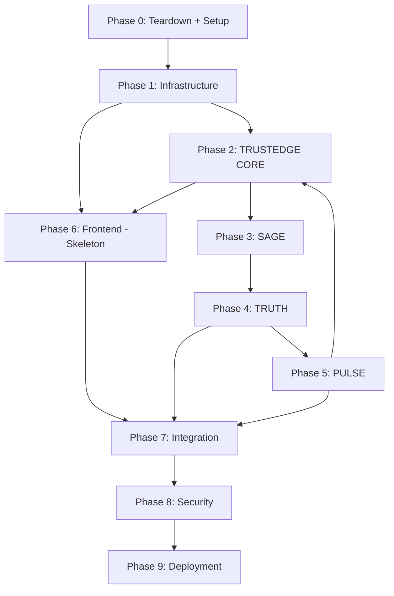

User: fileNode TrustEdge_Updated_Project_Report.md
User: “Based on the newly analyzed report and proposed project modifications, create a fully detailed, professionally structured, and implementation-ready development plan for AntiGravity to execute the project updates efficiently.
The plan should act as a complete technical blueprint for modifying the existing project according to the new proposed idea while maintaining clean architecture, scalability, and proper workflow management.
The output should include the following in a highly structured format:

Project Understanding & Objective
Brief understanding of the existing project
Summary of the newly proposed idea
Key goals of the upgraded system
Expected improvements after modification
Gap Analysis
Compare old vs new project
Identify outdated modules
Missing functionalities
Required architecture changes
Required UI/UX improvements
Backend/database modifications
AI/ML model changes (if applicable)
Complete Development Roadmap
Phase-by-phase execution strategy
Priority-based implementation order
Development milestones
Estimated dependency flow between modules
Integration sequence
Updated System Architecture
New architecture design
Updated workflow pipeline
Module communication flow
Frontend-backend interaction
Database relationships
API flow and integration structure
Security layer implementation
Folder & File Structure Plan
Recommended folder hierarchy
Component organization
Backend service structure
API organization
Database schema placement
Assets/documentation structure
Frontend Modification Plan
Pages/components to update
Newly required dashboards/features
UI redesign suggestions
Responsive design improvements
Navigation flow updates
Data visualization requirements
Backend Modification Plan
APIs to add/update/remove
Business logic changes
Authentication/authorization updates
Data processing workflow
Performance optimization plan
Database & Storage Plan
Schema modifications
New tables/collections required
Relationship mapping
Migration strategy
Backup considerations
AI/ML Integration Plan (if applicable)
Model workflow updates
Training pipeline modifications
Feature engineering changes
Explainability integration
Evaluation metrics
Deployment strategy
Workflow Execution Plan

End-to-end process flow
User interaction workflow
Admin workflow
Real-time system operations
Automation logic

UI/UX Enhancement Strategy

Modernization suggestions
Dashboard improvements
Accessibility improvements
User experience optimization
Theme/layout consistency

Security & Optimization Strategy

Authentication security
Data protection methods
API security
Scalability improvements
Performance optimization
Error handling strategy

Testing & Validation Plan

Unit testing strategy
Integration testing
System testing
Performance testing
Validation workflow
Bug tracking process

Deployment & DevOps Plan

Hosting/deployment workflow
CI/CD suggestions
Environment setup
Monitoring/logging
Backup and recovery strategy

Documentation Update Plan

Report sections to update
Diagrams to regenerate
Workflow visuals required
Presentation assets needed
Research/publication formatting suggestions

Final Deliverables

Complete updated project
Updated documentation/report
Architecture diagrams
API documentation
Deployment-ready structure
Final presentation assets
Additional Instructions:

Make the plan highly detailed and implementation-oriented.
Use professional software engineering standards.
Ensure scalability, modularity, and maintainability.
Clearly explain every modification step.
Provide structured headings, tables, workflows, and execution order.
Make the output suitable for direct execution by AntiGravity developers without additional clarification.
Focus on clean architecture, optimized workflow, and production-level organization.”
Model: # TrustEdge: Complete Development Plan for AntiGravity
## Technical Blueprint for Implementation

---

## Table of Contents

1. [Project Understanding & Objective](#1-project-understanding--objective)
2. [Gap Analysis](#2-gap-analysis)
3. [Complete Development Roadmap](#3-complete-development-roadmap)
4. [Updated System Architecture](#4-updated-system-architecture)
5. [Folder & File Structure Plan](#5-folder--file-structure-plan)
6. [Frontend Modification Plan](#6-frontend-modification-plan)
7. [Backend Modification Plan](#7-backend-modification-plan)
8. [Database & Storage Plan](#8-database--storage-plan)
9. [AI/ML Integration Plan](#9-aiml-integration-plan)
10. [Workflow Execution Plan](#10-workflow-execution-plan)
11. [UI/UX Enhancement Strategy](#11-uiux-enhancement-strategy)
12. [Security & Optimization Strategy](#12-security--optimization-strategy)
13. [Testing & Validation Plan](#13-testing--validation-plan)
14. [Deployment & DevOps Plan](#14-deployment--devops-plan)
15. [Documentation Update Plan](#15-documentation-update-plan)
16. [Final Deliverables](#16-final-deliverables)

---

## 1. Project Understanding & Objective

### 1.1 Understanding the Existing Project (LIFELINE)

The existing LIFELINE system was a reactive financial stress detection platform with the following characteristics:

| Aspect | Current State |
|--------|--------------|
| **Core Function** | Detects financial stress in customers post-event using rule-based anomaly detection |
| **AI Approach** | Isolation Forest / Autoencoder for stress scoring + RAG-based LLM for financial literacy |
| **Signal Sources** | Single-source: transaction stream (debit/credit patterns only) |
| **Employee Module** | SHIELD — employee burnout detection using encrypted shift logs |
| **Education Module** | SAGE — financial literacy chatbot using LLM + RAG |
| **Analysis Module** | TRUTH — unbiased product analysis (pros/cons/hidden fees) |
| **Trigger Type** | Reactive: detects anomalies after they occur |
| **Deployment** | Cloud-native on AWS EKS |
| **Output** | Stress score (LOW/MODERATE/HIGH) + human handoff |
| **Business Model** | Undefined |

### 1.2 Summary of the Newly Proposed Idea (TRUSTEDGE)

TrustEdge transforms the platform from a reactive stress detector into a **proactive predictive customer outreach system** for Indian Public Sector Banks. The system predicts customer churn 90 days in advance, simulates revenue impact, calibrates empathetic outreach, and self-improves through online reinforcement learning.

**Core Innovation:**
- **Churn DNA Fingerprinting** — 40+ signal fusion via Temporal Graph Neural Networks
- **Ghost Journey Simulation** — Monte Carlo projection of 90-day disengagement trajectories
- **Empathy Calibration** — AI-driven tone and channel selection per individual customer
- **Self-Improving Loop** — 24-hour online RL retraining from live outreach outcomes

### 1.3 Key Goals of the Upgraded System

| # | Goal | Success Metric |
|---|------|----------------|
| 1 | Predict churn 90 days before disengagement | 74% accuracy at launch → 94% by Month 12 |
| 2 | Reduce customer attrition | 73% churn reduction in outreach cohort |
| 3 | Optimize outreach channel and timing | 4.8× conversion lift vs generic campaigns |
| 4 | Eliminate wasted interventions | 68% reduction in false positives by Month 12 |
| 5 | Protect measurable revenue | ₹4.2 Cr/year per 1,000-customer base |
| 6 | Comply with RBI data localization | On-premise / Private VPC deployment |
| 7 | Enable consortium learning | Federated learning across PSBs without data sharing |
| 8 | Embed human values | Empathy, Trust, Empowerment, Inclusion, Forgiveness |

### 1.4 Expected Improvements After Modification

| Dimension | Before (LIFELINE) | After (TRUSTEDGE) | Improvement |
|-----------|--------------------|--------------------|-------------|
| Detection timing | Post-event (reactive) | 47–90 days before attrition | Shift from reactive to proactive |
| Signal breadth | 1 category (transactions) | 5 categories (40+ signals) | 40× signal coverage |
| AI sophistication | Rule-based anomaly | Temporal GNN + Monte Carlo + PPO | 3 generations ahead |
| Business impact | Unmeasured | ₹4.2 Cr/year/1000 customers | Quantified ROI |
| Self-improvement | None | 24-hour RL retraining cycle | Compounding accuracy |
| Outreach channels | 1 (Twilio SMS) | 6 (orchestrated) | 6× reach capability |
| Regulatory compliance | SOC2/GDPR (generic) | RBI + DPDP Act 2023 (India-specific) | Market-specific compliance |
| Deployment model | Public cloud (AWS) | On-premise / Private VPC | Sovereignty-compliant |
| Scalability | Single bank | 12 PSBs + 43 RRBs + International | 55× market expansion |

---

## 2. Gap Analysis

### 2.1 Old vs New Project Comparison

```
┌─────────────────────────────────────────────────────────────────────────┐
│                        TRANSFORMATION MAP                                │
├─────────────────────────────────────────────────────────────────────────┤
│                                                                          │
│  LIFELINE CORE ──────────────────────→ TRUSTEDGE CORE                   │
│  (Isolation Forest)                    (Temporal GNN + Monte Carlo)       │
│                                                                          │
│  SHIELD ─────────────────────────────→ PULSE                            │
│  (Employee burnout)                    (Online RL feedback loop)          │
│                                                                          │
│  SAGE ───────────────────────────────→ SAGE (Repurposed)                │
│  (Financial literacy chat)             (Empathy Calibration Engine)       │
│                                                                          │
│  TRUTH ──────────────────────────────→ TRUTH (Repurposed)               │
│  (Product analysis)                    (Multi-channel Outreach Engine)    │
│                                                                          │
│  [NOT PRESENT] ──────────────────────→ CDC Pipeline                     │
│                                        (Change Data Capture)             │
│                                                                          │
│  [NOT PRESENT] ──────────────────────→ Ghost Journey Engine             │
│                                        (Monte Carlo Simulation)           │
│                                                                          │
│  [NOT PRESENT] ──────────────────────→ Federated Learning Layer         │
│                                        (McMahan et al. framework)         │
│                                                                          │
└─────────────────────────────────────────────────────────────────────────┘
```

### 2.2 Outdated Modules (To Remove)

| Module | Reason for Removal | Replacement |
|--------|-------------------|-------------|
| SHIELD (Employee Burnout) | Out of scope for PSB churn prediction problem | PULSE (Feedback Loop) |
| LIFELINE CORE (Stress Detection) | Reactive, single-signal, rule-based | TRUSTEDGE CORE (Proactive, 40+ signals, GNN) |
| Old SAGE (Financial Literacy Chat) | Purpose completely changed | New SAGE (Empathy Calibration) |
| Old TRUTH (Product Analysis) | Purpose completely changed | New TRUTH (Outreach Execution) |
| Employee Dashboard (SHIELD UI) | No longer relevant | RM Priority Dashboard |
| Plaid/MX Integration | India PSBs don't use Plaid | CBS/CRM/Mobile CDC pipeline |

### 2.3 Missing Functionalities (To Build New)

| # | Missing Functionality | Priority | Complexity | Module |
|---|----------------------|----------|------------|--------|
| 1 | Temporal Graph Neural Network | P0 — Critical | High | CORE |
| 2 | CDC Pipeline (Debezium) | P0 — Critical | Medium | Infrastructure |
| 3 | Monte Carlo Ghost Journey Engine | P0 — Critical | High | CORE |
| 4 | Multi-Armed Bandit (Channel Selection) | P1 — High | Medium | SAGE |
| 5 | Online RL (PPO) Retraining Loop | P1 — High | High | PULSE |
| 6 | 6-Channel Outreach Orchestrator | P1 — High | Medium | TRUTH |
| 7 | A/B Variant Management | P2 — Medium | Low | TRUTH |
| 8 | Frequency Capping System | P2 — Medium | Low | SAGE/TRUTH |
| 9 | Federated Learning Framework | P3 — Future | Very High | Infrastructure |
| 10 | Model Drift Detection | P2 — Medium | Medium | PULSE |
| 11 | Immutable Audit Log | P1 — High | Low | Security |
| 12 | Customer Opt-out Mechanism | P1 — High | Low | CDC Pipeline |
| 13 | RM Talk Track Generation | P1 — High | Medium | SAGE |
| 14 | Ghost Journey Visualization | P2 — Medium | Medium | Frontend |
| 15 | Churn DNA Radar Chart | P2 — Medium | Low | Frontend |

### 2.4 Required Architecture Changes

| Layer | Change Required | Scope |
|-------|----------------|-------|
| **Data Ingestion** | Replace Plaid/MX with Debezium CDC pipeline | New build |
| **Event Processing** | Add CDC normalization layer to Kafka | Modification |
| **AI Core** | Replace Isolation Forest with Temporal GNN (PyTorch + DGL) | Complete rewrite |
| **Simulation** | Add Monte Carlo Ghost Journey engine | New build |
| **Decision Engine** | Add multi-armed bandit + RLHF LLM pipeline | New build |
| **Outreach** | Build 6-channel orchestrator with frequency capping | New build |
| **Feedback** | Build online RL (PPO) retraining service | New build |
| **Deployment** | Migrate from AWS EKS to on-premise/private VPC | Re-architecture |
| **Consortium** | Add federated learning layer (Phase 2) | New build |
| **Monitoring** | Add MLflow model registry + drift detection | New build |

### 2.5 Required UI/UX Improvements

| Current UI | Required Change | Priority |
|------------|----------------|----------|
| Employee burnout dashboard | Remove entirely | P0 |
| Financial literacy chat interface | Remove; replace with RM talk track panel | P0 |
| Product analysis page | Remove; replace with outreach history view | P0 |
| Generic customer list | Replace with AI-ranked priority contact list | P0 |
| No visualization | Add Ghost Journey 90-day trajectory chart | P1 |
| No customer profiling UI | Add Churn DNA radar chart + profile card | P1 |
| No analytics dashboard | Add PULSE analytics (accuracy, revenue, conversions) | P1 |
| No admin controls | Add model version control + rollback UI | P2 |

### 2.6 Backend/Database Modifications

**New Tables Required:**
- `churn_dna_profiles` — Churn DNA vector + scores per customer
- `ghost_journey_results` — Monte Carlo simulation outputs
- `outreach_events` — Channel, variant, timing, outcome
- `pulse_outcomes` — RL reward signals
- `model_versions` — MLflow model artifacts metadata
- `frequency_caps` — Per-customer outreach throttling
- `customer_consent` — DPDP Act opt-in/opt-out tracking
- `audit_log` — Immutable outreach audit trail

**Removed Tables:**
- `employee_shift_logs` (SHIELD)
- `burnout_scores` (SHIELD)
- `product_analyses` (Old TRUTH)
- `financial_literacy_sessions` (Old SAGE)

### 2.7 AI/ML Model Changes

| Old Model | New Model | Change Type |
|-----------|-----------|-------------|
| Isolation Forest (stress detection) | Temporal GNN (churn prediction) | Complete replacement |
| Autoencoder (anomaly detection) | Monte Carlo simulation engine | Complete replacement |
| RAG LLM (financial literacy) | RLHF fine-tuned LLM (empathy calibration) | Major upgrade |
| None | Multi-armed bandit (Thompson Sampling) | New addition |
| None | Online RL PPO (Ray RLlib) | New addition |
| None | Federated Learning (McMahan et al.) | New addition (Phase 2) |

---

## 3. Complete Development Roadmap

### 3.1 Phase-by-Phase Execution Strategy

```
┌──────────────────────────────────────────────────────────────────────────────────┐
│                         TRUSTEDGE DEVELOPMENT TIMELINE                             │
├──────────────────────────────────────────────────────────────────────────────────┤
│                                                                                   │
│  Phase 0: Foundation & Teardown              [Weeks 1–2]   ████                   │
│  Phase 1: Core Infrastructure                [Weeks 3–6]   ████████               │
│  Phase 2: TRUSTEDGE CORE (GNN + Monte Carlo) [Weeks 4–10]  ██████████████         │
│  Phase 3: SAGE (Empathy AI)                  [Weeks 7–11]  ██████████             │
│  Phase 4: TRUTH (Outreach Engine)            [Weeks 9–13]  ██████████             │
│  Phase 5: PULSE (Online RL)                  [Weeks 11–15] ██████████             │
│  Phase 6: Frontend & Dashboard               [Weeks 6–14]  ██████████████████     │
│  Phase 7: Integration & Testing              [Weeks 14–17] ████████               │
│  Phase 8: Security & Compliance              [Weeks 15–18] ████████               │
│  Phase 9: Deployment & Pilot                 [Weeks 18–20] ██████                 │
│                                                                                   │
│  Total Duration: 20 weeks (5 months)                                              │
└──────────────────────────────────────────────────────────────────────────────────┘
```

### 3.2 Detailed Phase Breakdown

#### Phase 0: Foundation & Teardown [Weeks 1–2]

**Objective:** Remove deprecated modules, set up new project structure, configure development environment.

| Task | Owner | Duration | Deliverable |
|------|-------|----------|-------------|
| Remove SHIELD module (code + DB + tests) | Backend | 2 days | Clean codebase |
| Remove old SAGE financial literacy module | Backend | 1 day | Clean codebase |
| Remove old TRUTH product analysis module | Backend | 1 day | Clean codebase |
| Remove employee dashboard frontend | Frontend | 1 day | Clean codebase |
| Set up new monorepo structure (Turborepo/Nx) | DevOps | 2 days | Working monorepo |
| Configure new Docker Compose (Kafka + CDC) | DevOps | 2 days | Local dev environment |
| Set up MLflow model registry | ML Eng | 1 day | Model versioning ready |
| Set up private container registry | DevOps | 1 day | Image storage ready |
| Create synthetic training dataset (PSB patterns) | Data Eng | 3 days | Training data ready |
| Define TypeScript shared types (Churn DNA contracts) | Full Stack | 1 day | Type definitions |

#### Phase 1: Core Infrastructure [Weeks 3–6]

**Objective:** Build the data ingestion pipeline, event bus configuration, and database schema.

| Task | Owner | Duration | Deliverable |
|------|-------|----------|-------------|
| Design & implement CDC pipeline (Debezium) | Data Eng | 5 days | CBS/CRM/Mobile capture |
| Configure Kafka topics + partitioning strategy | Data Eng | 2 days | Event bus ready |
| Create CDC normalization layer | Backend | 3 days | Standardized events |
| Design PostgreSQL schema (all new tables) | Backend | 3 days | Migration scripts |
| Implement Redis caching layer for Churn DNA | Backend | 2 days | Cache infrastructure |
| Set up Vector DB (Pinecone/Milvus) for complaint embeddings | ML Eng | 2 days | Embedding store |
| Configure TimescaleDB for signal time-series | Data Eng | 2 days | High-velocity storage |
| Build API Gateway scaffolding (NestJS) | Backend | 3 days | Gateway skeleton |
| Implement Auth0 integration + RBAC | Backend | 2 days | Auth layer |
| Build immutable audit log service | Backend | 2 days | Compliance infrastructure |
| Customer opt-out mechanism (DPDP Act) | Backend | 2 days | Privacy filter in CDC |

#### Phase 2: TRUSTEDGE CORE [Weeks 4–10]

**Objective:** Build the Temporal GNN churn prediction engine and Monte Carlo Ghost Journey simulator.

| Task | Owner | Duration | Deliverable |
|------|-------|----------|-------------|
| Design TGN architecture (Rossi et al. 2020) | ML Eng | 3 days | Architecture document |
| Implement TGN in PyTorch + DGL | ML Eng | 10 days | Training-ready model |
| Build signal fusion layer (40+ signals) | ML Eng | 5 days | Feature pipeline |
| Implement behavioral velocity features | ML Eng | 3 days | Feature engineering |
| Implement life event inference | ML Eng | 3 days | Pattern detection |
| Implement network contagion features | ML Eng | 3 days | Graph features |
| Train TGN on synthetic PSB dataset | ML Eng | 5 days | Baseline model (74% acc) |
| Build Kafka consumer for real-time GNN updates | Backend | 3 days | Streaming inference |
| Design Monte Carlo Ghost Journey engine | ML Eng | 2 days | Simulation design |
| Implement Monte Carlo simulator (10K samples) | ML Eng | 5 days | Trajectory engine |
| Parallelize Monte Carlo execution (multi-worker) | ML Eng | 2 days | <2s latency target |
| Build Churn DNA API endpoint | Backend | 2 days | REST API |
| Build Ghost Journey API endpoint | Backend | 2 days | REST API |
| Integration testing CORE → Kafka → DB | QA | 3 days | Validated pipeline |

#### Phase 3: SAGE (Empathy AI) [Weeks 7–11]

**Objective:** Build the empathy calibration engine with RLHF LLM and multi-armed bandit channel selection.

| Task | Owner | Duration | Deliverable |
|------|-------|----------|-------------|
| Design SAGE service architecture | ML Eng | 2 days | Architecture document |
| Implement complaint NLP sentiment engine | ML Eng | 4 days | Sentiment scoring |
| Implement life event context inference | ML Eng | 3 days | Context enrichment |
| Implement emotional state classification | ML Eng | 3 days | State inference |
| Fine-tune LLM with RLHF (banking empathy domain) | ML Eng | 8 days | Calibrated LLM |
| Implement Thompson Sampling bandit (6 arms) | ML Eng | 3 days | Channel selector |
| Build talk track generation pipeline | ML Eng | 4 days | RM talk tracks |
| Implement frequency capping logic | Backend | 2 days | Fatigue prevention |
| Build SAGE calibrate API endpoint | Backend | 2 days | REST API |
| Build fatigue clearance check | Backend | 1 day | Throttle logic |
| Integration testing CORE → SAGE pipeline | QA | 2 days | Validated flow |

#### Phase 4: TRUTH (Outreach Engine) [Weeks 9–13]

**Objective:** Build the 6-channel outreach orchestrator with A/B variant management and honest offer framing.

| Task | Owner | Duration | Deliverable |
|------|-------|----------|-------------|
| Design TRUTH service architecture | Backend | 2 days | Architecture document |
| Implement offer construction engine (honest framing) | Backend | 4 days | Offer builder |
| Implement channel router (6-channel orchestrator) | Backend | 5 days | Routing engine |
| Integrate Twilio (SMS/WhatsApp) | Backend | 2 days | SMS/WA channel |
| Integrate FCM/APNs (push notifications) | Backend | 2 days | Push channel |
| Integrate SendGrid (email) | Backend | 2 days | Email channel |
| Build WebSocket in-app nudge system | Backend | 3 days | In-app channel |
| Build RM CRM integration (call briefs) | Backend | 3 days | RM call channel |
| Build branch scheduling API integration | Backend | 2 days | Branch visit channel |
| Implement A/B variant manager | Backend | 3 days | Variant testing |
| Implement delivery metadata logging | Backend | 1 day | PULSE event capture |
| Build TRUTH execute API endpoint | Backend | 2 days | REST API |
| Integration testing SAGE → TRUTH → Channels | QA | 3 days | End-to-end outreach |

#### Phase 5: PULSE (Online RL Feedback Loop) [Weeks 11–15]

**Objective:** Build the self-improving reinforcement learning engine that retrains models every 24 hours.

| Task | Owner | Duration | Deliverable |
|------|-------|----------|-------------|
| Design PULSE service architecture | ML Eng | 2 days | Architecture document |
| Implement outcome capture event ingestion | Backend | 3 days | Real-time outcomes |
| Design reward signal schema | ML Eng | 1 day | Reward shaping |
| Implement PPO policy network (two-head) | ML Eng | 5 days | RL policy |
| Configure Ray RLlib PPO training | ML Eng | 4 days | Training pipeline |
| Implement 24-hour retraining scheduler | DevOps | 2 days | Cron + orchestrator |
| Build GNN weight update pipeline (from PPO) | ML Eng | 3 days | Model update flow |
| Build channel policy update pipeline (to SAGE) | ML Eng | 2 days | Policy propagation |
| Implement model drift detection | ML Eng | 3 days | Drift alerts |
| Integrate MLflow for model versioning | ML Eng | 2 days | Version control |
| Build rollback mechanism (<5 min) | DevOps | 2 days | Safety net |
| Build PULSE outcome API endpoint | Backend | 2 days | REST API |
| Integration testing PULSE → CORE/SAGE update cycle | QA | 3 days | Validated loop |

#### Phase 6: Frontend & Dashboard [Weeks 6–14]

**Objective:** Build the RM Priority Dashboard, Churn DNA Profile Cards, Ghost Journey visualizations, and PULSE Analytics.

| Task | Owner | Duration | Deliverable |
|------|-------|----------|-------------|
| Design RM Dashboard wireframes (Figma) | UI/UX | 3 days | Design specs |
| Implement AI-ranked priority contact list | Frontend | 4 days | Main dashboard view |
| Implement Churn DNA profile card component | Frontend | 3 days | Customer detail view |
| Implement radar chart (5-category signal strength) | Frontend | 2 days | Data visualization |
| Implement Ghost Journey 90-day trajectory chart | Frontend | 4 days | Projection visualization |
| Implement emotional state badge component | Frontend | 1 day | Status indicator |
| Implement life event timeline component | Frontend | 2 days | Context timeline |
| Implement outreach history panel | Frontend | 2 days | History view |
| Implement AI talk track preview (expandable) | Frontend | 2 days | RM guidance |
| Build PULSE Analytics dashboard (admin) | Frontend | 5 days | Analytics view |
| Implement accuracy trajectory chart | Frontend | 2 days | Model performance |
| Implement revenue protected metrics | Frontend | 2 days | Business impact |
| Build React Native mobile screens (field RM) | Mobile | 5 days | Mobile access |
| Responsive design implementation | Frontend | 3 days | Multi-device support |
| Auth0 SSO integration (frontend) | Frontend | 2 days | Login flow |
| Real-time WebSocket updates (priority list) | Frontend | 2 days | Live updates |

#### Phase 7: Integration & Testing [Weeks 14–17]

**Objective:** End-to-end integration testing, load testing, and system validation.

| Task | Owner | Duration | Deliverable |
|------|-------|----------|-------------|
| End-to-end pipeline integration (CDC → CORE → SAGE → TRUTH → PULSE) | Full Team | 5 days | Working pipeline |
| API contract validation (all endpoints) | QA | 3 days | API compliance |
| Load testing (10,000 events/sec Kafka throughput) | QA | 3 days | Performance validated |
| GNN inference latency validation (<200ms) | ML Eng | 2 days | Latency confirmed |
| Monte Carlo simulation latency (<2s) | ML Eng | 2 days | Latency confirmed |
| SAGE channel selection latency (<100ms) | ML Eng | 1 day | Latency confirmed |
| RM Dashboard usability testing | UI/UX | 3 days | UX validated |
| PULSE 24-hour retraining cycle validation | ML Eng | 3 days | RL loop confirmed |
| Security penetration testing | Security | 4 days | Vulnerabilities patched |
| Data privacy audit (DPDP Act compliance) | Security | 3 days | Compliance certified |
| Synthetic data end-to-end scenario testing | QA | 3 days | Scenarios validated |

#### Phase 8: Security & Compliance [Weeks 15–18]

**Objective:** Implement full security stack, RBI compliance, and audit infrastructure.

| Task | Owner | Duration | Deliverable |
|------|-------|----------|-------------|
| TLS 1.3 configuration (all inter-service comms) | DevOps | 2 days | Encrypted transit |
| AES-256 encryption at rest (PostgreSQL + Redis) | DevOps | 2 days | Encrypted storage |
| PII masking pipeline (before LLM calls) | Backend | 3 days | Privacy protection |
| Immutable audit log implementation (WORM) | Backend | 2 days | Regulatory compliance |
| Customer opt-out workflow (end-to-end) | Full Stack | 2 days | DPDP compliance |
| JWT short-expiry + refresh token implementation | Backend | 2 days | Token security |
| MFA enforcement (RM + Admin roles) | Backend | 1 day | Access security |
| Rate limiting (API Gateway) | Backend | 1 day | DDoS protection |
| RBAC validation (RM vs Admin vs Analyst) | Backend | 2 days | Role enforcement |
| RBI data localization certification | DevOps | 3 days | Regulatory approval |
| Security documentation for audit | Security | 2 days | Audit package |

#### Phase 9: Deployment & Pilot [Weeks 18–20]

**Objective:** Deploy to on-premise/private VPC and launch 90-day pilot with 1 PSB branch.

| Task | Owner | Duration | Deliverable |
|------|-------|----------|-------------|
| Build Helm charts (all services) | DevOps | 3 days | K8s deployment ready |
| Configure private Kubernetes cluster | DevOps | 3 days | Infrastructure ready |
| Deploy all services to staging | DevOps | 2 days | Staging environment |
| Run full staging validation | QA | 3 days | Staging certified |
| Production deployment | DevOps | 2 days | Production live |
| Configure monitoring (Prometheus + Grafana) | DevOps | 2 days | Observability |
| Configure alerting (PagerDuty/OpsGenie) | DevOps | 1 day | Incident management |
| Pilot onboarding: 1 PSB branch (1,000 customers) | Full Team | 3 days | Pilot launched |
| RM training on dashboard usage | Product | 2 days | User onboarding |
| 90-day pilot monitoring plan | Product | 1 day | Success metrics tracked |

### 3.3 Priority-Based Implementation Order

```
Priority 0 (Foundation — Blocks Everything):
├── CDC Pipeline (Debezium)
├── Kafka Configuration
├── PostgreSQL Schema
├── Monorepo Setup
└── Synthetic Training Data

Priority 1 (Core Intelligence — Primary Value):
├── Temporal GNN (TRUSTEDGE CORE)
├── Monte Carlo Ghost Journey
├── Signal Fusion Layer (40+ signals)
├── Feature Engineering Pipeline
└── Churn DNA API

Priority 2 (Decision Layer — Enables Outreach):
├── SAGE Empathy AI (Emotional State + Channel)
├── RLHF LLM (Talk Track Generation)
├── Multi-Armed Bandit (Channel Selection)
└── SAGE Calibrate API

Priority 3 (Execution Layer — Customer-Facing):
├── TRUTH Outreach Engine (6 Channels)
├── A/B Variant Manager
├── Frequency Capping
└── Channel Integrations (Twilio, FCM, SendGrid)

Priority 4 (Self-Improvement — Compounding Value):
├── PULSE Outcome Capture
├── PPO Online RL Training
├── 24-Hour Retraining Scheduler
├── Drift Detection
└── MLflow Model Registry

Priority 5 (User Experience — Adoption):
├── RM Priority Dashboard
├── Churn DNA Profile Cards
├── Ghost Journey Visualization
├── PULSE Analytics Dashboard
└── Mobile App (React Native)

Priority 6 (Compliance & Operations):
├── Security Implementation
├── RBI Compliance
├── On-Premise Deployment
├── Monitoring & Alerting
└── Pilot Launch
```

### 3.4 Dependency Flow Between Modules



**Critical Path:** Phase 0 → Phase 1 → Phase 2 → Phase 3 → Phase 4 → Phase 5 → Phase 7 → Phase 8 → Phase 9

**Parallel Tracks:**
- Frontend (Phase 6) can proceed in parallel with backend from Week 6
- Security (Phase 8) begins overlapping with Integration (Phase 7) at Week 15

### 3.5 Integration Sequence

| # | Integration Point | Services Connected | Week |
|---|---|---|---|
| 1 | CDC → Kafka | Debezium → Apache Kafka | Week 4 |
| 2 | Kafka → CORE | Kafka → TGN FastAPI service | Week 6 |
| 3 | CORE → PostgreSQL | TGN → Churn DNA store | Week 7 |
| 4 | CORE → Redis | TGN → Churn DNA cache | Week 7 |
| 5 | CORE → Ghost Journey | TGN → Monte Carlo engine | Week 8 |
| 6 | CORE → SAGE | At-risk queue → Empathy AI | Week 9 |
| 7 | SAGE → Vector DB | Emotion engine → Complaint embeddings | Week 9 |
| 8 | SAGE → TRUTH | Calibrated brief → Outreach engine | Week 11 |
| 9 | TRUTH → Twilio/FCM/SendGrid | Channel execution | Week 12 |
| 10 | Channels → PULSE | Outcome events → RL trainer | Week 13 |
| 11 | PULSE → CORE/SAGE | Policy updates → GNN + Bandit | Week 14 |
| 12 | API Gateway → All Services | Dashboard → Backend | Week 14 |
| 13 | Frontend → API Gateway | React → NestJS | Week 14 |

---

## 4. Updated System Architecture

### 4.1 High-Level Architecture Design

```
┌─────────────────────────────────────────────────────────────────────────────────┐
│                           TRUSTEDGE SYSTEM ARCHITECTURE                           │
├─────────────────────────────────────────────────────────────────────────────────┤
│                                                                                  │
│  ┌──────────────────── DATA LAYER ────────────────────┐                         │
│  │                                                     │                         │
│  │  ┌─────────┐  ┌─────────┐  ┌─────────────────┐   │                         │
│  │  │   CBS   │  │   CRM   │  │  Mobile Banking  │   │                         │
│  │  └────┬────┘  └────┬────┘  └────────┬────────┘   │                         │
│  │       │             │                │             │                         │
│  │       ▼             ▼                ▼             │                         │
│  │  ┌──────────────────────────────────────────┐     │                         │
│  │  │     Debezium CDC Pipeline (Normalized)    │     │                         │
│  │  └──────────────────┬───────────────────────┘     │                         │
│  │                     │                              │                         │
│  └─────────────────────┼──────────────────────────────┘                         │
│                        ▼                                                         │
│  ┌──────────────────── EVENT LAYER ───────────────────┐                         │
│  │  ┌──────────────────────────────────────────┐      │                         │
│  │  │          Apache Kafka Event Bus           │      │                         │
│  │  │  Topics: transactions, engagement,        │      │                         │
│  │  │          complaints, life_events,         │      │                         │
│  │  │          competitive_signals              │      │                         │
│  │  └──────────────────┬───────────────────────┘      │                         │
│  └─────────────────────┼──────────────────────────────┘                         │
│                        ▼                                                         │
│  ┌──────────────────── INTELLIGENCE LAYER ────────────┐                         │
│  │                                                     │                         │
│  │  ┌──────────────────────────────────────────┐      │                         │
│  │  │         TRUSTEDGE CORE (FastAPI)          │      │                         │
│  │  │  ┌────────────┐  ┌──────────────────┐   │      │                         │
│  │  │  │ Temporal GNN│  │ Monte Carlo Ghost│   │      │                         │
│  │  │  │ (PyTorch+DGL│  │ Journey Engine   │   │      │                         │
│  │  │  └──────┬─────┘  └────────┬─────────┘   │      │                         │
│  │  │         │                  │              │      │                         │
│  │  │         ▼                  ▼              │      │                         │
│  │  │  ┌─────────────────────────────────┐     │      │                         │
│  │  │  │  Churn DNA Profile (per customer)│     │      │                         │
│  │  │  └──────────────┬──────────────────┘     │      │                         │
│  │  └─────────────────┼────────────────────────┘      │                         │
│  │                    ▼                                 │                         │
│  │  ┌──────────────────────────────────────────┐      │                         │
│  │  │            SAGE (FastAPI)                  │      │                         │
│  │  │  ┌────────────┐  ┌──────────────────┐   │      │                         │
│  │  │  │ RLHF LLM   │  │  Multi-Armed     │   │      │                         │
│  │  │  │ (Empathy)   │  │  Bandit (Channel)│   │      │                         │
│  │  │  └──────┬─────┘  └────────┬─────────┘   │      │                         │
│  │  │         │                  │              │      │                         │
│  │  │         ▼                  ▼              │      │                         │
│  │  │  ┌─────────────────────────────────┐     │      │                         │
│  │  │  │   Calibrated Outreach Brief      │     │      │                         │
│  │  │  └──────────────┬──────────────────┘     │      │                         │
│  │  └─────────────────┼────────────────────────┘      │                         │
│  │                    ▼                                 │                         │
│  │  ┌──────────────────────────────────────────┐      │                         │
│  │  │            TRUTH (FastAPI)                 │      │                         │
│  │  │  ┌────────────┐  ┌──────────────────┐   │      │                         │
│  │  │  │ Offer      │  │  6-Channel       │   │      │                         │
│  │  │  │ Builder    │  │  Orchestrator    │   │      │                         │
│  │  │  └──────┬─────┘  └────────┬─────────┘   │      │                         │
│  │  │         │     ┌──────┐    │              │      │                         │
│  │  │         │     │ A/B  │    │              │      │                         │
│  │  │         │     │ Mgr  │    │              │      │                         │
│  │  │         │     └──┬───┘    │              │      │                         │
│  │  └─────────┼────────┼────────┼──────────────┘      │                         │
│  └────────────┼────────┼────────┼──────────────────────┘                         │
│               ▼        ▼        ▼                                                │
│  ┌──────────────────── EXECUTION LAYER ───────────────┐                         │
│  │  ┌──────┐ ┌──────┐ ┌──────┐ ┌──────┐ ┌──────┐ ┌──────┐                    │
│  │  │  RM  │ │Branch│ │ WA/  │ │In-App│ │Email │ │ Push │                    │
│  │  │ Call │ │Visit │ │ SMS  │ │Nudge │ │      │ │Notif │                    │
│  │  └──┬───┘ └──┬───┘ └──┬───┘ └──┬───┘ └──┬───┘ └──┬───┘                    │
│  └─────┼────────┼────────┼────────┼────────┼────────┼───────┘                  │
│        │        │        │        │        │        │                            │
│        ▼        ▼        ▼        ▼        ▼        ▼                            │
│  ┌──────────────────── FEEDBACK LAYER ────────────────┐                         │
│  │  ┌──────────────────────────────────────────┐      │                         │
│  │  │            PULSE (Ray RLlib)               │      │                         │
│  │  │  ┌────────────┐  ┌──────────────────┐   │      │                         │
│  │  │  │  Outcome   │  │   PPO Online RL   │   │      │                         │
│  │  │  │  Capture   │  │   (24h cycle)     │   │      │                         │
│  │  │  └──────┬─────┘  └────────┬─────────┘   │      │                         │
│  │  │         │    ┌────────┐   │              │      │                         │
│  │  │         │    │  Drift │   │              │      │                         │
│  │  │         │    │ Detect │   │              │      │                         │
│  │  │         │    └────┬───┘   │              │      │                         │
│  │  └─────────┼─────────┼──────┼──────────────┘      │                         │
│  └────────────┼─────────┼──────┼──────────────────────┘                         │
│               │         │      │                                                 │
│               ▼         ▼      ▼                                                 │
│        [Updates GNN weights] [Updates Channel Policy] [Alerts on drift]          │
│                                                                                  │
├─────────────────────────────────────────────────────────────────────────────────┤
│                           PRESENTATION LAYER                                     │
│  ┌──────────────────────────────────────────────────────────┐                   │
│  │  ┌────────────────┐  ┌────────────────┐  ┌───────────┐  │                   │
│  │  │  RM Dashboard  │  │ PULSE Analytics│  │  Mobile   │  │                   │
│  │  │  (React+Tailwind)│  │  (Admin)      │  │  (RN)    │  │                   │
│  │  └────────┬───────┘  └────────┬───────┘  └─────┬─────┘  │                   │
│  │           │                   │                 │         │                   │
│  │           ▼                   ▼                 ▼         │                   │
│  │  ┌─────────────────────────────────────────────────┐     │                   │
│  │  │         API Gateway (NestJS — REST/GraphQL)      │     │                   │
│  │  │         Auth0 SSO + MFA + RBAC + Rate Limiting   │     │                   │
│  │  └─────────────────────────────────────────────────┘     │                   │
│  └──────────────────────────────────────────────────────────┘                   │
│                                                                                  │
├─────────────────────────────────────────────────────────────────────────────────┤
│                           STORAGE LAYER                                           │
│  ┌───────────┐  ┌───────────┐  ┌───────────┐  ┌───────────┐  ┌───────────┐   │
│  │PostgreSQL │  │   Redis   │  │ Vector DB │  │TimescaleDB│  │  MLflow   │   │
│  │(Churn DNA,│  │  (Cache,  │  │(Complaint │  │ (Signal   │  │  (Model   │   │
│  │ Outreach, │  │  Rate Lim)│  │ Embeddings│  │  Streams) │  │  Registry)│   │
│  │ Audit Log)│  │           │  │           │  │           │  │           │   │
│  └───────────┘  └───────────┘  └───────────┘  └───────────┘  └───────────┘   │
│                                                                                  │
└─────────────────────────────────────────────────────────────────────────────────┘
```

### 4.2 Module Communication Flow

| Source | Destination | Protocol | Data | Latency Target |
|--------|-------------|----------|------|----------------|
| CDC → Kafka | Event publish | Kafka protocol | Normalized events | <50ms |
| Kafka → CORE | Event consume | Kafka consumer | Transaction/engagement events | <100ms |
| CORE → PostgreSQL | Churn DNA write | TCP/SQL | Churn DNA profile | <50ms |
| CORE → Redis | Cache update | Redis protocol | Churn DNA snapshot | <10ms |
| CORE → SAGE | HTTP POST | REST (internal) | Churn DNA + risk profile | <50ms |
| SAGE → Vector DB | Query | gRPC | Complaint embeddings | <30ms |
| SAGE → TRUTH | HTTP POST | REST (internal) | Calibrated outreach brief | <50ms |
| TRUTH → Twilio | HTTP POST | REST (external) | SMS/WhatsApp message | <500ms |
| TRUTH → FCM | HTTP POST | REST (external) | Push notification | <300ms |
| TRUTH → WebSocket | WS message | WebSocket | In-app nudge | <100ms |
| Channels → PULSE | Event | Kafka | Outcome event | <100ms |
| PULSE → CORE | Model update | gRPC/file | Updated GNN weights | Async (24h) |
| PULSE → SAGE | Policy update | gRPC/file | Updated bandit params | Async (24h) |
| Frontend → Gateway | HTTP | REST/GraphQL | Dashboard queries | <150ms |
| Gateway → Services | HTTP | REST (internal) | Forwarded requests | <50ms |

### 4.3 Frontend-Backend Interaction

```
┌─────────────────────────────────────────────────────────────────────┐
│                    FRONTEND-BACKEND INTERACTION                       │
├─────────────────────────────────────────────────────────────────────┤
│                                                                      │
│  RM Dashboard (React)                                                │
│  ├── GET /api/v1/rm/priority-list                                   │
│  │   └── Returns: AI-ranked customer list (from Redis cache)         │
│  ├── GET /api/v1/core/churn-dna/{customer_id}                       │
│  │   └── Returns: Full Churn DNA profile + Ghost Journey             │
│  ├── POST /api/v1/sage/calibrate                                    │
│  │   └── Returns: Channel + tone + talk track + timing               │
│  ├── POST /api/v1/truth/execute                                     │
│  │   └── Returns: Outreach execution confirmation                    │
│  ├── POST /api/v1/pulse/outcome                                     │
│  │   └── Records: Outreach outcome                                   │
│  ├── WS /ws/v1/realtime-updates                                     │
│  │   └── Streams: Priority list changes, new at-risk customers       │
│  │                                                                   │
│  PULSE Analytics (Admin React)                                       │
│  ├── GET /api/v1/pulse/accuracy-trajectory                          │
│  │   └── Returns: Model accuracy over time                           │
│  ├── GET /api/v1/pulse/channel-conversions                          │
│  │   └── Returns: Channel performance metrics                        │
│  ├── GET /api/v1/pulse/revenue-protected                            │
│  │   └── Returns: Revenue impact metrics                             │
│  ├── GET /api/v1/pulse/model-versions                               │
│  │   └── Returns: MLflow model version list                          │
│  └── POST /api/v1/pulse/rollback/{version_id}                       │
│      └── Triggers: Model rollback                                    │
│                                                                      │
│  Mobile (React Native)                                               │
│  ├── GET /api/v1/rm/priority-list (mobile-optimized)                │
│  ├── GET /api/v1/core/churn-dna/{customer_id} (summary)             │
│  └── POST /api/v1/pulse/outcome (field outcome recording)            │
│                                                                      │
└─────────────────────────────────────────────────────────────────────┘
```

### 4.4 Database Relationships

```
┌─────────────────────────────────────────────────────────────────────┐
│                    DATABASE ENTITY RELATIONSHIPS                      │
├─────────────────────────────────────────────────────────────────────┤
│                                                                      │
│  customers (1) ──────────< churn_dna_profiles (1)                   │
│       │                          │                                   │
│       │                          ├── ghost_journey_results (many)    │
│       │                          │                                   │
│       ├──────────< outreach_events (many)                           │
│       │                    │                                         │
│       │                    ├── pulse_outcomes (1:1 per outreach)     │
│       │                    │                                         │
│       │                    └── ab_variants (1:1 per outreach)        │
│       │                                                              │
│       ├──────────< complaint_history (many)                          │
│       │                                                              │
│       ├──────────< life_events (many)                                │
│       │                                                              │
│       ├──────────< frequency_caps (1)                                │
│       │                                                              │
│       └──────────< customer_consent (1)                              │
│                                                                      │
│  model_versions (many) ──── model_metrics (many)                    │
│                                                                      │
│  audit_log (append-only, immutable)                                  │
│       └── Links to: outreach_events, customers, rm_users             │
│                                                                      │
│  rm_users (1) ──────────< outreach_events (many)                    │
│       │                                                              │
│       └──────────< customer_assignments (many) ──> customers         │
│                                                                      │
└─────────────────────────────────────────────────────────────────────┘
```

### 4.5 Security Layer Implementation

```
┌─────────────────────────────────────────────────────────────────────┐
│                    SECURITY ARCHITECTURE                              │
├─────────────────────────────────────────────────────────────────────┤
│                                                                      │
│  Layer 1: Network Security                                           │
│  ├── Private VPC / On-premise isolated network                      │
│  ├── No external internet access for data services                  │
│  ├── TLS 1.3 for all inter-service communication                   │
│  └── Network segmentation (DMZ for API Gateway only)                │
│                                                                      │
│  Layer 2: Authentication & Authorization                             │
│  ├── Auth0 SSO with MFA enforcement                                │
│  ├── JWT (short-lived: 15 min) + Refresh tokens (HttpOnly cookies) │
│  ├── RBAC: RM | Branch Manager | Admin | Analyst | System           │
│  └── API key rotation for inter-service auth                        │
│                                                                      │
│  Layer 3: Data Protection                                            │
│  ├── AES-256 encryption at rest (PostgreSQL, Redis, Vector DB)      │
│  ├── PII masking before LLM inference (irreversible tokenization)   │
│  ├── Customer consent tracking (DPDP Act 2023)                      │
│  └── Opt-out filter in CDC pipeline (pre-processing exclusion)      │
│                                                                      │
│  Layer 4: Audit & Compliance                                         │
│  ├── Immutable audit log (WORM storage)                             │
│  ├── Every outreach: RM ID, customer ID, consent, timestamp         │
│  ├── RBI data localization attestation                               │
│  └── 7-year retention for regulatory inspection                     │
│                                                                      │
│  Layer 5: Application Security                                       │
│  ├── Rate limiting (API Gateway: 100 req/min/user)                  │
│  ├── Input validation (Zod schemas on all endpoints)                │
│  ├── SQL injection prevention (Prisma ORM parameterized queries)    │
│  ├── CORS policy (whitelist RM dashboard domain only)               │
│  └── Dependency vulnerability scanning (Snyk/Dependabot)            │
│                                                                      │
│  Layer 6: Model Security                                             │
│  ├── MLflow model signatures (integrity verification)               │
│  ├── Adversarial robustness testing for GNN                         │
│  ├── Gradient privacy (federated learning: secure aggregation)      │
│  └── Model access restricted to PULSE service only                  │
│                                                                      │
└─────────────────────────────────────────────────────────────────────┘
```

---

## 5. Folder & File Structure Plan

### 5.1 Complete Recommended Folder Hierarchy

```
/trustedge-monorepo
│
├── /README.md                          # Project overview, setup instructions
├── /CONTRIBUTING.md                    # Development guidelines
├── /CHANGELOG.md                       # Version history
├── /.env.example                       # Environment variable template
├── /package.json                       # Root workspace config (Turborepo)
├── /turbo.json                         # Turborepo pipeline config
├── /docker-compose.yml                 # Local development infrastructure
├── /docker-compose.prod.yml            # Production-like local testing
│
├── /apps                               # ═══════ APPLICATION LAYER ═══════
│   │
│   ├── /web-client                     # RM Dashboard (React + Tailwind)
│   │   ├── /public
│   │   │   ├── favicon.ico
│   │   │   └── manifest.json
│   │   ├── /src
│   │   │   ├── /app                    # App-level setup
│   │   │   │   ├── App.tsx
│   │   │   │   ├── routes.tsx          # React Router v6 route definitions
│   │   │   │   └── providers.tsx       # Context providers (Auth, Theme, WS)
│   │   │   │
│   │   │   ├── /pages                  # Page-level components
│   │   │   │   ├── /dashboard
│   │   │   │   │   ├── PriorityListPage.tsx        # Main RM view
│   │   │   │   │   ├── CustomerDetailPage.tsx      # Churn DNA profile
│   │   │   │   │   └── GhostJourneyPage.tsx        # 90-day trajectory
│   │   │   │   ├── /outreach
│   │   │   │   │   ├── OutreachHistoryPage.tsx     # Past outreach log
│   │   │   │   │   └── OutreachExecutePage.tsx     # Trigger outreach
│   │   │   │   ├── /analytics
│   │   │   │   │   ├── PulseAnalyticsPage.tsx      # Admin analytics
│   │   │   │   │   ├── AccuracyTrajectoryPage.tsx  # Model performance
│   │   │   │   │   └── RevenueProtectedPage.tsx    # Business impact
│   │   │   │   ├── /admin
│   │   │   │   │   ├── ModelVersionsPage.tsx       # MLflow versions
│   │   │   │   │   └── SystemHealthPage.tsx        # Infrastructure status
│   │   │   │   └── /auth
│   │   │   │       ├── LoginPage.tsx               # Auth0 SSO login
│   │   │   │       └── CallbackPage.tsx            # OAuth callback
│   │   │   │
│   │   │   ├── /components             # Reusable UI components
│   │   │   │   ├── /common
│   │   │   │   │   ├── Header.tsx
│   │   │   │   │   ├── Sidebar.tsx
│   │   │   │   │   ├── LoadingSpinner.tsx
│   │   │   │   │   ├── ErrorBoundary.tsx
│   │   │   │   │   └── NotificationToast.tsx
│   │   │   │   ├── /dashboard
│   │   │   │   │   ├── PriorityContactCard.tsx     # Individual customer row
│   │   │   │   │   ├── ChurnDNARadarChart.tsx      # 5-category radar
│   │   │   │   │   ├── GhostJourneyChart.tsx       # 90-day line chart
│   │   │   │   │   ├── EmotionalStateBadge.tsx     # Sentiment indicator
│   │   │   │   │   ├── LifeEventTimeline.tsx       # Event timeline
│   │   │   │   │   ├── TalkTrackPanel.tsx          # AI talk track
│   │   │   │   │   ├── RevenueAtRiskBadge.tsx      # ₹ value display
│   │   │   │   │   └── RiskScoreGauge.tsx          # Color-coded gauge
│   │   │   │   ├── /outreach
│   │   │   │   │   ├── ChannelSelector.tsx         # 6-channel picker
│   │   │   │   │   ├── OfferPreview.tsx            # Offer copy preview
│   │   │   │   │   ├── OutcomeRecorder.tsx         # Outcome capture form
│   │   │   │   │   └── FrequencyCapIndicator.tsx   # Fatigue status
│   │   │   │   └── /analytics
│   │   │   │       ├── AccuracyLineChart.tsx       # 74% → 94% chart
│   │   │   │       ├── ChannelConversionBar.tsx    # Channel performance
│   │   │   │       ├── RevenueProtectedCounter.tsx # Revenue metric
│   │   │   │       └── FalsePositiveChart.tsx      # FP rate trending
│   │   │   │
│   │   │   ├── /hooks                  # Custom React hooks
│   │   │   │   ├── useChurnDNA.ts              # Fetch Churn DNA
│   │   │   │   ├── usePriorityList.ts          # Fetch priority list
│   │   │   │   ├── useWebSocket.ts             # Real-time WS connection
│   │   │   │   ├── useOutreach.ts              # Outreach operations
│   │   │   │   ├── usePulseAnalytics.ts        # Analytics data
│   │   │   │   └── useAuth.ts                  # Auth0 hook wrapper
│   │   │   │
│   │   │   ├── /services               # API client layer
│   │   │   │   ├── apiClient.ts                # Axios instance + interceptors
│   │   │   │   ├── coreService.ts              # CORE API calls
│   │   │   │   ├── sageService.ts              # SAGE API calls
│   │   │   │   ├── truthService.ts             # TRUTH API calls
│   │   │   │   ├── pulseService.ts             # PULSE API calls
│   │   │   │   └── authService.ts              # Auth API calls
│   │   │   │
│   │   │   ├── /store                  # State management (Zustand/Redux)
│   │   │   │   ├── customerStore.ts            # Customer state
│   │   │   │   ├── outreachStore.ts            # Outreach state
│   │   │   │   ├── analyticsStore.ts           # Analytics state
│   │   │   │   └── uiStore.ts                  # UI state (sidebar, theme)
│   │   │   │
│   │   │   ├── /utils                  # Utility functions
│   │   │   │   ├── formatters.ts               # Currency, date formatting
│   │   │   │   ├── validators.ts               # Input validation
│   │   │   │   └── constants.ts                # App constants
│   │   │   │
│   │   │   ├── /types                  # TypeScript type definitions
│   │   │   │   ├── churnDNA.types.ts
│   │   │   │   ├── outreach.types.ts
│   │   │   │   ├── analytics.types.ts
│   │   │   │   └── common.types.ts
│   │   │   │
│   │   │   └── /styles                 # Global styles
│   │   │       ├── globals.css                 # Tailwind directives
│   │   │       └── theme.ts                    # Design tokens
│   │   │
│   │   ├── /tests
│   │   │   ├── /unit                   # Component unit tests
│   │   │   ├── /integration            # Page-level integration tests
│   │   │   └── /e2e                    # Playwright E2E tests
│   │   │
│   │   ├── package.json
│   │   ├── tsconfig.json
│   │   ├── tailwind.config.ts
│   │   ├── vite.config.ts              # Vite bundler config
│   │   └── Dockerfile
│   │
│   ├── /mobile-client                  # Field RM Mobile App (React Native)
│   │   ├── /src
│   │   │   ├── /screens
│   │   │   │   ├── PriorityListScreen.tsx
│   │   │   │   ├── CustomerBriefScreen.tsx
│   │   │   │   ├── OutcomeRecordScreen.tsx
│   │   │   │   └── LoginScreen.tsx
│   │   │   ├── /components
│   │   │   │   ├── CustomerCard.tsx
│   │   │   │   ├── RiskBadge.tsx
│   │   │   │   └── TalkTrackView.tsx
│   │   │   ├── /navigation
│   │   │   │   └── AppNavigator.tsx
│   │   │   ├── /services
│   │   │   │   └── apiClient.ts
│   │   │   └── /hooks
│   │   │       └── useOfflineSync.ts   # Offline capability
│   │   ├── package.json
│   │   ├── app.json
│   │   └── Dockerfile
│   │
│   └── /api-gateway                    # NestJS API Gateway
│       ├── /src
│       │   ├── /modules
│       │   │   ├── /auth
│       │   │   │   ├── auth.module.ts
│       │   │   │   ├── auth.controller.ts
│       │   │   │   ├── auth.service.ts
│       │   │   │   ├── auth.guard.ts           # JWT + RBAC guard
│       │   │   │   ├── roles.decorator.ts      # @Roles() decorator
│       │   │   │   └── strategies/
│       │   │   │       ├── jwt.strategy.ts
│       │   │   │       └── auth0.strategy.ts
│       │   │   │
│       │   │   ├── /core-proxy
│       │   │   │   ├── core-proxy.module.ts
│       │   │   │   ├── core-proxy.controller.ts    # /api/v1/core/*
│       │   │   │   └── core-proxy.service.ts       # Forward to CORE service
│       │   │   │
│       │   │   ├── /sage-proxy
│       │   │   │   ├── sage-proxy.module.ts
│       │   │   │   ├── sage-proxy.controller.ts    # /api/v1/sage/*
│       │   │   │   └── sage-proxy.service.ts
│       │   │   │
│       │   │   ├── /truth-proxy
│       │   │   │   ├── truth-proxy.module.ts
│       │   │   │   ├── truth-proxy.controller.ts   # /api/v1/truth/*
│       │   │   │   └── truth-proxy.service.ts
│       │   │   │
│       │   │   ├── /pulse-proxy
│       │   │   │   ├── pulse-proxy.module.ts
│       │   │   │   ├── pulse-proxy.controller.ts   # /api/v1/pulse/*
│       │   │   │   └── pulse-proxy.service.ts
│       │   │   │
│       │   │   ├── /rm
│       │   │   │   ├── rm.module.ts
│       │   │   │   ├── rm.controller.ts            # /api/v1/rm/*
│       │   │   │   └── rm.service.ts               # Aggregates data for RM
│       │   │   │
│       │   │   └── /websocket
│       │   │       ├── ws.module.ts
│       │   │       ├── ws.gateway.ts               # Real-time updates
│       │   │       └── ws.service.ts
│       │   │
│       │   ├── /common
│       │   │   ├── /filters
│       │   │   │   └── http-exception.filter.ts
│       │   │   ├── /interceptors
│       │   │   │   ├── logging.interceptor.ts
│       │   │   │   └── timeout.interceptor.ts
│       │   │   ├── /pipes
│       │   │   │   └── validation.pipe.ts
│       │   │   └── /middleware
│       │   │       ├── rate-limit.middleware.ts
│       │   │       └── audit-log.middleware.ts
│       │   │
│       │   ├── app.module.ts
│       │   └── main.ts
│       │
│       ├── /tests
│       │   ├── /unit
│       │   └── /e2e
│       │
│       ├── package.json
│       ├── tsconfig.json
│       ├── nest-cli.json
│       └── Dockerfile
│
├── /services                           # ═══════ AI/ML MICROSERVICES ═══════
│   │
│   ├── /core-engine                    # TRUSTEDGE CORE (Python/FastAPI)
│   │   ├── /app
│   │   │   ├── __init__.py
│   │   │   ├── main.py                         # FastAPI app entry
│   │   │   ├── config.py                       # Configuration
│   │   │   │
│   │   │   ├── /api
│   │   │   │   ├── __init__.py
│   │   │   │   ├── routes.py                   # API route definitions
│   │   │   │   ├── /schemas
│   │   │   │   │   ├── churn_dna.py            # Pydantic schemas
│   │   │   │   │   ├── ghost_journey.py
│   │   │   │   │   └── signals.py
│   │   │   │   └── /dependencies.py            # Dependency injection
│   │   │   │
│   │   │   ├── /gnn                            # Temporal Graph Neural Network
│   │   │   │   ├── __init__.py
│   │   │   │   ├── model.py                    # TGN model definition (PyTorch+DGL)
│   │   │   │   ├── temporal_encoder.py         # Temporal encoding layer
│   │   │   │   ├── memory_module.py            # Node memory (Rossi et al.)
│   │   │   │   ├── graph_attention.py          # Graph attention mechanism
│   │   │   │   ├── embedding_updater.py        # Embedding update logic
│   │   │   │   ├── inference.py                # Real-time inference pipeline
│   │   │   │   └── config.py                   # GNN hyperparameters
│   │   │   │
│   │   │   ├── /monte_carlo                    # Ghost Journey Engine
│   │   │   │   ├── __init__.py
│   │   │   │   ├── simulator.py                # Monte Carlo core (10K samples)
│   │   │   │   ├── trajectory.py               # Trajectory modeling
│   │   │   │   ├── revenue_projector.py        # Revenue impact calculation
│   │   │   │   ├── seasonality.py              # Seasonal adjustment factors
│   │   │   │   └── parallel_executor.py        # Multi-worker parallelization
│   │   │   │
│   │   │   ├── /signal_fusion                  # 40+ Signal Processing
│   │   │   │   ├── __init__.py
│   │   │   │   ├── pipeline.py                 # Signal fusion orchestrator
│   │   │   │   ├── /signals
│   │   │   │   │   ├── transactional.py        # Salary, SIP, FD, CC signals
│   │   │   │   │   ├── digital_engagement.py   # Login, session, feature usage
│   │   │   │   │   ├── complaint_history.py    # NLP sentiment trajectory
│   │   │   │   │   ├── life_events.py          # Pattern-inferred life events
│   │   │   │   │   └── competitive.py          # External transfer patterns
│   │   │   │   ├── /features
│   │   │   │   │   ├── behavioral_velocity.py  # Engagement decay rate
│   │   │   │   │   ├── product_utilization.py  # Product breadth reduction
│   │   │   │   │   ├── network_contagion.py    # Peer churn exposure
│   │   │   │   │   └── income_disruption.py    # Salary absence detection
│   │   │   │   └── normalizer.py               # Feature normalization
│   │   │   │
│   │   │   ├── /kafka_consumer                 # Kafka Event Consumer
│   │   │   │   ├── __init__.py
│   │   │   │   ├── consumer.py                 # Kafka consumer group
│   │   │   │   ├── event_handler.py            # Event routing
│   │   │   │   └── schema_registry.py          # Avro/JSON schema validation
│   │   │   │
│   │   │   └── /db
│   │   │       ├── __init__.py
│   │   │       ├── models.py                   # SQLAlchemy ORM models
│   │   │       ├── repository.py               # Data access layer
│   │   │       └── redis_cache.py              # Redis cache operations
│   │   │
│   │   ├── /tests
│   │   │   ├── /unit
│   │   │   │   ├── test_gnn_model.py
│   │   │   │   ├── test_monte_carlo.py
│   │   │   │   └── test_signal_fusion.py
│   │   │   └── /integration
│   │   │       ├── test_kafka_pipeline.py
│   │   │       └── test_api_endpoints.py
│   │   │
│   │   ├── requirements.txt
│   │   ├── Dockerfile
│   │   └── pyproject.toml
│   │
│   ├── /sage-service                   # SAGE Empathy AI (Python/FastAPI)
│   │   ├── /app
│   │   │   ├── __init__.py
│   │   │   ├── main.py
│   │   │   ├── config.py
│   │   │   │
│   │   │   ├── /api
│   │   │   │   ├── __init__.py
│   │   │   │   ├── routes.py
│   │   │   │   └── /schemas
│   │   │   │       ├── calibration.py          # Calibrate request/response
│   │   │   │       └── emotional_state.py
│   │   │   │
│   │   │   ├── /emotion_engine                 # Emotional State Inference
│   │   │   │   ├── __init__.py
│   │   │   │   ├── sentiment_analyzer.py       # NLP complaint sentiment
│   │   │   │   ├── life_event_context.py       # Life event overlay
│   │   │   │   ├── state_classifier.py         # calm/anxious/frustrated/disengaged
│   │   │   │   └── embedding_store.py          # Vector DB interface
│   │   │   │
│   │   │   ├── /bandit                         # Multi-Armed Bandit
│   │   │   │   ├── __init__.py
│   │   │   │   ├── thompson_sampling.py        # Thompson Sampling implementation
│   │   │   │   ├── channel_arms.py             # 6-arm definition
│   │   │   │   ├── posterior_updater.py        # Beta-Bernoulli update
│   │   │   │   └── fatigue_constraint.py       # 7-day frequency cap
│   │   │   │
│   │   │   ├── /llm_interface                  # RLHF LLM Talk Track Gen
│   │   │   │   ├── __init__.py
│   │   │   │   ├── talk_track_generator.py     # RM talk track pipeline
│   │   │   │   ├── offer_copy_writer.py        # Personalized offer copy
│   │   │   │   ├── tone_calibrator.py          # Tone framing logic
│   │   │   │   ├── pii_masker.py               # PII removal before LLM
│   │   │   │   └── model_client.py             # LLM API client
│   │   │   │
│   │   │   └── /db
│   │   │       ├── models.py
│   │   │       └── repository.py
│   │   │
│   │   ├── /tests
│   │   ├── requirements.txt
│   │   ├── Dockerfile
│   │   └── pyproject.toml
│   │
│   ├── /truth-service                  # TRUTH Outreach Engine (Python/FastAPI)
│   │   ├── /app
│   │   │   ├── __init__.py
│   │   │   ├── main.py
│   │   │   ├── config.py
│   │   │   │
│   │   │   ├── /api
│   │   │   │   ├── __init__.py
│   │   │   │   ├── routes.py
│   │   │   │   └── /schemas
│   │   │   │       ├── outreach.py
│   │   │   │       └── offer.py
│   │   │   │
│   │   │   ├── /offer_builder                  # Personalized Offer Construction
│   │   │   │   ├── __init__.py
│   │   │   │   ├── builder.py                  # Offer construction logic
│   │   │   │   ├── honest_framing.py           # Transparent terms engine
│   │   │   │   ├── competitor_benchmark.py     # Rate comparison logic
│   │   │   │   └── tier_rules.py               # Customer tier offer rules
│   │   │   │
│   │   │   ├── /channel_router                 # 6-Channel Orchestrator
│   │   │   │   ├── __init__.py
│   │   │   │   ├── router.py                   # Channel routing orchestrator
│   │   │   │   ├── /channels
│   │   │   │   │   ├── rm_call.py              # CRM integration (call brief)
│   │   │   │   │   ├── branch_visit.py         # Branch scheduling
│   │   │   │   │   ├── whatsapp_sms.py         # Twilio integration
│   │   │   │   │   ├── in_app_nudge.py         # WebSocket push
│   │   │   │   │   ├── email.py                # SendGrid integration
│   │   │   │   │   └── push_notification.py    # FCM/APNs
│   │   │   │   ├── frequency_capper.py         # Fatigue prevention
│   │   │   │   └── delivery_logger.py          # Delivery metadata
│   │   │   │
│   │   │   ├── /ab_manager                     # A/B Variant Management
│   │   │   │   ├── __init__.py
│   │   │   │   ├── variant_generator.py        # Create A/B variants
│   │   │   │   ├── assignment.py               # Assign variant to customer
│   │   │   │   └── results_tracker.py          # Track variant performance
│   │   │   │
│   │   │   └── /db
│   │   │       ├── models.py
│   │   │       └── repository.py
│   │   │
│   │   ├── /tests
│   │   ├── requirements.txt
│   │   ├── Dockerfile
│   │   └── pyproject.toml
│   │
│   ├── /pulse-service                  # PULSE Online RL (Python/Ray)
│   │   ├── /app
│   │   │   ├── __init__.py
│   │   │   ├── main.py                         # FastAPI for outcome ingestion
│   │   │   ├── config.py
│   │   │   │
│   │   │   ├── /api
│   │   │   │   ├── __init__.py
│   │   │   │   ├── routes.py
│   │   │   │   └── /schemas
│   │   │   │       ├── outcome.py
│   │   │   │       └── model_version.py
│   │   │   │
│   │   │   ├── /outcome_capture                # Real-time Outcome Ingestion
│   │   │   │   ├── __init__.py
│   │   │   │   ├── event_consumer.py           # Kafka outcome consumer
│   │   │   │   ├── reward_calculator.py        # Reward signal computation
│   │   │   │   └── outcome_store.py            # Store outcomes for training
│   │   │   │
│   │   │   ├── /rl_trainer                     # PPO Policy Training
│   │   │   │   ├── __init__.py
│   │   │   │   ├── ppo_trainer.py              # Ray RLlib PPO config
│   │   │   │   ├── policy_network.py           # Two-head policy (churn + channel)
│   │   │   │   ├── environment.py              # Custom RL environment
│   │   │   │   ├── scheduler.py                # 24-hour training scheduler
│   │   │   │   └── model_updater.py            # Push updates to CORE/SAGE
│   │   │   │
│   │   │   ├── /drift_detector                 # Model Drift Monitoring
│   │   │   │   ├── __init__.py
│   │   │   │   ├── detector.py                 # Statistical drift detection
│   │   │   │   ├── alerter.py                  # Alert on >3% accuracy drop
│   │   │   │   └── recalibration.py            # Trigger recalibration
│   │   │   │
│   │   │   ├── /mlflow_registry               # Model Version Management
│   │   │   │   ├── __init__.py
│   │   │   │   ├── registry.py                 # MLflow interface
│   │   │   │   ├── versioner.py                # Version management
│   │   │   │   └── rollback.py                 # <5 min rollback capability
│   │   │   │
│   │   │   └── /db
│   │   │       ├── models.py
│   │   │       └── repository.py
│   │   │
│   │   ├── /tests
│   │   ├── requirements.txt
│   │   ├── Dockerfile
│   │   └── pyproject.toml
│   │
│   └── /cdc-pipeline                   # Debezium CDC Pipeline
│       ├── /config
│       │   ├── debezium-connector-cbs.json     # CBS connector config
│       │   ├── debezium-connector-crm.json     # CRM connector config
│       │   └── debezium-connector-mobile.json  # Mobile banking config
│       ├── /transformers
│       │   ├── cbs_normalizer.py               # CBS event normalization
│       │   ├── crm_normalizer.py               # CRM event normalization
│       │   ├── mobile_normalizer.py            # Mobile event normalization
│       │   └── consent_filter.py               # DPDP opt-out filter
│       ├── /schemas
│       │   ├── transaction_event.avro          # Avro schema: transactions
│       │   ├── engagement_event.avro           # Avro schema: engagement
│       │   ├── complaint_event.avro            # Avro schema: complaints
│       │   └── life_event.avro                 # Avro schema: life events
│       ├── docker-compose.debezium.yml
│       └── README.md
│
├── /packages                           # ═══════ SHARED PACKAGES ═══════
│   │
│   ├── /ui-components                  # Shared Tailwind UI Library
│   │   ├── /src
│   │   │   ├── /atoms                  # Basic elements
│   │   │   │   ├── Button.tsx
│   │   │   │   ├── Badge.tsx
│   │   │   │   ├── Card.tsx
│   │   │   │   ├── Input.tsx
│   │   │   │   └── Tooltip.tsx
│   │   │   ├── /molecules              # Compound components
│   │   │   │   ├── DataTable.tsx
│   │   │   │   ├── MetricCard.tsx
│   │   │   │   ├── StatusIndicator.tsx
│   │   │   │   └── Timeline.tsx
│   │   │   └── /charts                 # Data visualization
│   │   │       ├── RadarChart.tsx       # Churn DNA 5-category
│   │   │       ├── LineChart.tsx        # Ghost Journey trajectory
│   │   │       ├── GaugeChart.tsx       # Risk score gauge
│   │   │       └── BarChart.tsx         # Channel conversions
│   │   ├── package.json
│   │   └── tsconfig.json
│   │
│   ├── /database                       # Database Schemas (Prisma)
│   │   ├── /prisma
│   │   │   ├── schema.prisma           # Main Prisma schema
│   │   │   ├── /migrations             # Version-controlled migrations
│   │   │   │   ├── 001_initial_schema.sql
│   │   │   │   ├── 002_churn_dna_tables.sql
│   │   │   │   ├── 003_outreach_tables.sql
│   │   │   │   ├── 004_pulse_tables.sql
│   │   │   │   └── 005_audit_tables.sql
│   │   │   └── seed.ts                 # Development seed data
│   │   └── package.json
│   │
│   ├── /churn-dna-types                # Shared TypeScript Types
│   │   ├── /src
│   │   │   ├── churnDNA.ts             # ChurnDNA interface
│   │   │   ├── ghostJourney.ts         # GhostJourney interface
│   │   │   ├── outreach.ts             # Outreach types
│   │   │   ├── sage.ts                 # SAGE calibration types
│   │   │   ├── pulse.ts                # PULSE outcome types
│   │   │   └── common.ts              # Shared enums, constants
│   │   ├── package.json
│   │   └── tsconfig.json
│   │
│   └── /config                         # Shared Configuration
│       ├── kafka-topics.ts             # Kafka topic definitions
│       ├── env-schema.ts               # Environment variable schema (Zod)
│       ├── constants.ts                # System-wide constants
│       └── package.json
│
├── /ml                                 # ═══════ ML TRAINING & EVALUATION ═══════
│   │
│   ├── /training
│   │   ├── train_gnn.py                # Offline TGN training script
│   │   ├── train_sentiment.py          # Complaint sentiment model training
│   │   ├── finetune_llm.py             # RLHF fine-tuning script
│   │   ├── /configs
│   │   │   ├── baseline.yaml           # Baseline GNN config
│   │   │   ├── production.yaml         # Production GNN config
│   │   │   └── llm_finetune.yaml       # LLM fine-tune config
│   │   └── /data
│   │       ├── synthetic_generator.py  # Synthetic PSB data generator
│   │       └── data_validator.py       # Data quality checks
│   │
│   ├── /evaluation
│   │   ├── backtest.py                 # Historical backtesting
│   │   ├── accuracy_benchmark.py       # Accuracy measurement
│   │   ├── latency_benchmark.py        # Inference latency tests
│   │   └── /reports                    # Generated evaluation reports
│   │
│   └── /mlflow
│       ├── mlflow_config.yaml          # MLflow server configuration
│       └── tracking_setup.py           # Experiment tracking setup
│
├── /infra                              # ═══════ INFRASTRUCTURE ═══════
│   │
│   ├── /helm                           # Kubernetes Helm Charts
│   │   ├── /trustedge-core
│   │   │   ├── Chart.yaml
│   │   │   ├── values.yaml
│   │   │   ├── values-prod.yaml
│   │   │   └── /templates
│   │   │       ├── deployment.yaml
│   │   │       ├── service.yaml
│   │   │       ├── hpa.yaml            # Horizontal Pod Autoscaler
│   │   │       └── configmap.yaml
│   │   ├── /sage-service
│   │   │   └── [same structure]
│   │   ├── /truth-service
│   │   │   └── [same structure]
│   │   ├── /pulse-service
│   │   │   └── [same structure]
│   │   ├── /api-gateway
│   │   │   └── [same structure]
│   │   ├── /web-client
│   │   │   └── [same structure]
│   │   └── /infrastructure
│   │       ├── kafka.yaml
│   │       ├── postgresql.yaml
│   │       ├── redis.yaml
│   │       └── mlflow.yaml
│   │
│   ├── /docker                         # Dockerfiles
│   │   ├── Dockerfile.core-engine
│   │   ├── Dockerfile.sage-service
│   │   ├── Dockerfile.truth-service
│   │   ├── Dockerfile.pulse-service
│   │   ├── Dockerfile.api-gateway
│   │   ├── Dockerfile.web-client
│   │   └── Dockerfile.mobile-build
│   │
│   ├── /ci                             # CI/CD Workflows
│   │   ├── /.github/workflows
│   │   │   ├── ci.yml                  # Lint + test + build
│   │   │   ├── cd-staging.yml          # Deploy to staging
│   │   │   ├── cd-production.yml       # Deploy to production
│   │   │   ├── ml-training.yml         # ML model training pipeline
│   │   │   └── security-scan.yml       # Dependency vulnerability scan
│   │   └── /scripts
│   │       ├── setup-local.sh          # Local dev setup script
│   │       ├── run-tests.sh            # Run all test suites
│   │       └── deploy.sh               # Manual deployment helper
│   │
│   ├── /monitoring                     # Observability
│   │   ├── /prometheus
│   │   │   └── prometheus.yml          # Metrics collection config
│   │   ├── /grafana
│   │   │   ├── /dashboards
│   │   │   │   ├── system-health.json
│   │   │   │   ├── ml-performance.json
│   │   │   │   └── business-metrics.json
│   │   │   └── datasources.yml
│   │   └── /alerting
│   │       └── alert-rules.yml         # Alert definitions
│   │
│   └── /terraform                      # Infrastructure as Code (optional)
│       ├── main.tf
│       ├── variables.tf
│       └── outputs.tf
│
├── /docs                               # ═══════ DOCUMENTATION ═══════
│   ├── /architecture
│   │   ├── system-architecture.md
│   │   ├── data-flow.md
│   │   └── /diagrams                   # Mermaid / Draw.io sources
│   │       ├── system-architecture.mmd
│   │       ├── data-flow-sequence.mmd
│   │       └── ghost-journey-flow.mmd
│   ├── /api
│   │   ├── openapi-spec.yaml           # OpenAPI 3.0 specification
│   │   ├── core-api.md
│   │   ├── sage-api.md
│   │   ├── truth-api.md
│   │   └── pulse-api.md
│   ├── /guides
│   │   ├── developer-setup.md
│   │   ├── deployment-guide.md
│   │   ├── rm-user-guide.md
│   │   └── admin-guide.md
│   ├── /research
│   │   ├── references.md
│   │   └── algorithm-details.md
│   └── /presentation
│       ├── hackathon-deck.pptx
│       └── demo-script.md
│
└── /scripts                            # ═══════ UTILITY SCRIPTS ═══════
    ├── generate-synthetic-data.py      # Generate test data
    ├── migrate-from-lifeline.sh        # Migration from old codebase
    ├── health-check.sh                 # System health verification
    └── benchmark.py                    # Performance benchmarking
```

---

## 6. Frontend Modification Plan

### 6.1 Pages/Components to Update

| Current Page | Action | New Page | Priority |
|---|---|---|---|
| Employee Dashboard (SHIELD) | **DELETE** | — | P0 |
| Financial Literacy Chat (Old SAGE) | **DELETE** | — | P0 |
| Product Analysis (Old TRUTH) | **DELETE** | — | P0 |
| Generic Customer List | **REPLACE** | AI-Ranked Priority Contact List | P0 |
| Login Page | **UPDATE** | Auth0 SSO + MFA flow | P1 |
| — | **CREATE NEW** | Customer Detail (Churn DNA Profile) | P0 |
| — | **CREATE NEW** | Ghost Journey Visualization | P1 |
| — | **CREATE NEW** | Outreach History | P1 |
| — | **CREATE NEW** | Outreach Execute | P1 |
| — | **CREATE NEW** | PULSE Analytics (Admin) | P1 |
| — | **CREATE NEW** | Model Versions (Admin) | P2 |
| — | **CREATE NEW** | System Health (Admin) | P2 |

### 6.2 Newly Required Dashboards/Features

#### 6.2.1 RM Priority Dashboard (Primary View)

```
┌─────────────────────────────────────────────────────────────────────────┐
│  TrustEdge  │  🔔 3 │  Ravi Kumar (RM)  │  SBI Branch: Hyderabad Main  │
├─────────────┼────────────────────────────────────────────────────────────┤
│             │                                                            │
│  📊 Dashboard │  PRIORITY CONTACT LIST        Revenue at Risk: ₹47.2L   │
│  👤 Customers│  ═══════════════════════════════════════════════════════   │
│  📤 Outreach │                                                           │
│  📈 Analytics│  1. ██ Priya Sharma          ▓▓▓▓▓▓▓▓░░ 82%              │
│  ⚙️ Settings │     Salary account migration risk                         │
│             │     📞 Call today — high receptivity window                │
│             │     ₹18.4L at risk │ 47 days to attrition                 │
│             │     [View Profile] [Start Outreach]                        │
│             │  ─────────────────────────────────────────────────────     │
│             │                                                            │
│             │  2. ██ Rajesh Patel           ▓▓▓▓▓▓▓░░░ 71%              │
│             │     FD non-renewal + SIP pause                             │
│             │     💬 WhatsApp — digital native, quick response           │
│             │     ₹12.1L at risk │ 63 days to attrition                 │
│             │     [View Profile] [Start Outreach]                        │
│             │  ─────────────────────────────────────────────────────     │
│             │                                                            │
│             │  3. ██ Anjali Desai           ▓▓▓▓▓▓░░░░ 58%              │
│             │     Complaint escalation + engagement decay                │
│             │     🏢 Branch visit — prefers in-person                    │
│             │     ₹8.7L at risk │ 78 days to attrition                  │
│             │     [View Profile] [Start Outreach]                        │
│             │                                                            │
│             │  ... (10 customers ranked by revenue impact)               │
│             │                                                            │
└─────────────┴────────────────────────────────────────────────────────────┘
```

#### 6.2.2 Churn DNA Profile Card

```
┌─────────────────────────────────────────────────────────────────────────┐
│  ← Back to Priority List     Customer: Priya Sharma (CIF-2847391)       │
├─────────────────────────────────────────────────────────────────────────┤
│                                                                          │
│  ┌──────────────────────┐  ┌──────────────────────────────────────────┐ │
│  │  CHURN DNA SCORE     │  │  RADAR CHART (5 categories)              │ │
│  │                      │  │                                          │ │
│  │       82%            │  │         Transactional                    │ │
│  │    ▓▓▓▓▓▓▓▓░░       │  │            ●                             │ │
│  │                      │  │           / \                            │ │
│  │  🔴 HIGH RISK        │  │  Digital /   \ Competitive              │ │
│  │                      │  │       ●───────●                          │ │
│  │  Primary Reason:     │  │       |       |                          │ │
│  │  Salary account      │  │       ●───────●                          │ │
│  │  migration risk      │  │  Complaint   Life Events                │ │
│  │                      │  │                                          │ │
│  │  Days to Attrition:  │  │  [Strong signals: Transactional,        │ │
│  │       47             │  │   Competitive, Digital Engagement]       │ │
│  └──────────────────────┘  └──────────────────────────────────────────┘ │
│                                                                          │
│  ┌──────────────────────────────────────────────────────────────────────┐│
│  │  EMOTIONAL STATE: 😰 Anxious (Financial)                            ││
│  │  Context: Income disruption detected (salary absent 32 days)        ││
│  └──────────────────────────────────────────────────────────────────────┘│
│                                                                          │
│  ┌──────────────────────────────────────────────────────────────────────┐│
│  │  LIFE EVENT TIMELINE                                                 ││
│  │  ───○────────○────────○────────○────────●─── (Now)                  ││
│  │     │        │        │        │        │                            ││
│  │  SIP start  FD renewal  Job    Salary   Large external              ││
│  │  (6mo ago)  (4mo ago)  change  absent   transfer (₹5L)             ││
│  └──────────────────────────────────────────────────────────────────────┘│
│                                                                          │
│  ┌──────────────────────────────────────────────────────────────────────┐│
│  │  AI TALK TRACK                                                       ││
│  │  "Hi Priya, I noticed your investments have been paused recently    ││
│  │   — would you like us to review your plan together? We have a       ││
│  │   special FD renewal rate that might help."                         ││
│  │                                                                      ││
│  │  Recommended Channel: 📞 RM Call                                    ││
│  │  Optimal Timing: Tuesday 10:00 AM                                   ││
│  │  Offer: Waived processing fee + 0.25% rate benefit on FD renewal    ││
│  └──────────────────────────────────────────────────────────────────────┘│
│                                                                          │
│  [🚀 Execute Outreach]  [📋 View Full Ghost Journey]  [📜 History]      │
│                                                                          │
└─────────────────────────────────────────────────────────────────────────┘
```

#### 6.2.3 Ghost Journey Visualization

```
┌─────────────────────────────────────────────────────────────────────────┐
│  GHOST JOURNEY: 90-Day Projected Trajectory                              │
│  Customer: Priya Sharma │ If No Intervention                            │
├─────────────────────────────────────────────────────────────────────────┤
│                                                                          │
│  Engagement Level                                                        │
│  100% ┤                                                                  │
│       │ ●─────●                                                          │
│   80% ┤         \                                                        │
│       │           \    ← Current (Day 0)                                │
│   60% ┤             \                                                    │
│       │               \─ ─ ─ ●                                          │
│   40% ┤                       \    P(churn) = 41%                       │
│       │                         \─ ─ ─ ●                                │
│   20% ┤                                 \    P(churn) = 68%             │
│       │                                   \─ ─ ─ ●                      │
│    0% ┤                                           ↓ P(churn) = 82%      │
│       └───────┬───────────┬────────────┬──────────┬──────────           │
│           -90 days    -30 days     Day 30      Day 60     Day 90        │
│           (History)                (Projected)                           │
│                                                                          │
│  ┌────────────────────────────────────────────────────────────────────┐ │
│  │  REVENUE IMPACT DISTRIBUTION                                       │ │
│  │                                                                    │ │
│  │  Expected Loss (Mean): ₹1,64,000                                  │ │
│  │  Worst Case (95th %ile): ₹2,12,000                                │ │
│  │  AUM at Risk: ₹18,40,000                                          │ │
│  │                                                                    │ │
│  │  Intervention Cost: ₹2,400                                        │ │
│  │  ROI if Retained: 68× intervention cost                           │ │
│  └────────────────────────────────────────────────────────────────────┘ │
│                                                                          │
│  ✅ Outreach Authorized (Revenue impact > threshold)                    │
│                                                                          │
└─────────────────────────────────────────────────────────────────────────┘
```

### 6.3 UI Redesign Specifications

| Element | Specification |
|---------|--------------|
| **Color Palette** | Primary: #1E40AF (Trust Blue), Accent: #10B981 (Success Green), Warning: #F59E0B (Amber), Danger: #EF4444 (Red) |
| **Typography** | Inter (headings), JetBrains Mono (data/numbers) |
| **Risk Color Coding** | Red (>80%), Amber (50–80%), Green (<50%) |
| **Layout** | Fixed sidebar navigation + scrollable main content area |
| **Responsive Breakpoints** | Mobile: 375px, Tablet: 768px, Desktop: 1280px, Wide: 1536px |
| **Charts Library** | Recharts (React) for all data visualizations |
| **Real-Time Updates** | WebSocket for priority list re-ranking (no page refresh) |
| **Loading States** | Skeleton screens (not spinners) for perceived performance |
| **Empty States** | Illustrated empty states with contextual guidance |
| **Accessibility** | WCAG 2.1 AA compliance, keyboard navigation, screen reader labels |

### 6.4 Navigation Flow

```
Login (Auth0 SSO + MFA)
    │
    ▼
RM Dashboard (Priority Contact List) ←─── Default landing page
    │
    ├── Customer Detail (Churn DNA Profile Card)
    │       ├── Ghost Journey Visualization
    │       ├── Talk Track Panel
    │       └── Execute Outreach → Outcome Recording
    │
    ├── Outreach History (All past outreach events)
    │
    ├── PULSE Analytics (Admin only)
    │       ├── Accuracy Trajectory
    │       ├── Channel Conversions
    │       ├── Revenue Protected
    │       └── False Positive Rate
    │
    └── Admin Settings (Admin only)
            ├── Model Versions (MLflow)
            ├── System Health
            └── User Management
```

### 6.5 Data Visualization Requirements

| Visualization | Component | Data Source | Update Frequency |
|---|---|---|---|
| AI-Ranked Priority List | `PriorityContactCard` | `/api/v1/rm/priority-list` | Real-time (WebSocket) |
| Churn DNA Radar Chart | `ChurnDNARadarChart` | `/api/v1/core/churn-dna/{id}` | On demand |
| Ghost Journey Trajectory | `GhostJourneyChart` | `/api/v1/core/churn-dna/{id}` | On demand |
| Risk Score Gauge | `RiskScoreGauge` | `/api/v1/core/churn-dna/{id}` | On demand |
| Emotional State Badge | `EmotionalStateBadge` | `/api/v1/sage/calibrate` | On demand |
| Life Event Timeline | `LifeEventTimeline` | `/api/v1/core/churn-dna/{id}` | On demand |
| Accuracy Trajectory Line | `AccuracyLineChart` | `/api/v1/pulse/accuracy-trajectory` | Daily |
| Channel Conversion Bars | `ChannelConversionBar` | `/api/v1/pulse/channel-conversions` | Daily |
| Revenue Protected Counter | `RevenueProtectedCounter` | `/api/v1/pulse/revenue-protected` | Hourly |
| False Positive Trend | `FalsePositiveChart` | `/api/v1/pulse/metrics` | Daily |

---

## 7. Backend Modification Plan

### 7.1 APIs to Add/Update/Remove

#### APIs to REMOVE (Old System)

| Endpoint | Module | Reason |
|---|---|---|
| `POST /api/v1/shield/log-shift` | SHIELD | Module removed |
| `GET /api/v1/shield/burnout-score/{employee_id}` | SHIELD | Module removed |
| `POST /api/v1/shield/peer-support` | SHIELD | Module removed |
| `POST /api/v1/sage/chat` | Old SAGE | Purpose changed |
| `GET /api/v1/sage/literacy-modules` | Old SAGE | Purpose changed |
| `POST /api/v1/truth/analyze-product` | Old TRUTH | Purpose changed |
| `GET /api/v1/truth/product/{id}` | Old TRUTH | Purpose changed |
| `POST /api/v1/lifeline/stress-score` | LIFELINE CORE | Module replaced |

#### APIs to ADD (New System)

| Endpoint | Method | Module | Purpose | Auth |
|---|---|---|---|---|
| `/api/v1/rm/priority-list` | GET | API Gateway | RM's top-10 at-risk customers | RM, Admin |
| `/api/v1/rm/portfolio-summary` | GET | API Gateway | RM portfolio overview stats | RM, Admin |
| `/api/v1/core/churn-dna/{customer_id}` | GET | CORE | Full Churn DNA profile + Ghost Journey | RM, Admin |
| `/api/v1/core/batch-score` | POST | CORE | Batch churn scoring (scheduled) | System |
| `/api/v1/core/ghost-journey/{customer_id}` | GET | CORE | Detailed Ghost Journey results | RM, Admin |
| `/api/v1/core/signals/{customer_id}` | GET | CORE | Raw signal values for debugging | Admin |
| `/api/v1/sage/calibrate` | POST | SAGE | Get calibrated outreach brief | RM, System |
| `/api/v1/sage/emotional-state/{customer_id}` | GET | SAGE | Customer emotional state | RM, Admin |
| `/api/v1/sage/channel-stats` | GET | SAGE | Channel bandit performance | Admin |
| `/api/v1/truth/execute` | POST | TRUTH | Execute outreach on channel | RM, System |
| `/api/v1/truth/offer-preview/{customer_id}` | GET | TRUTH | Preview personalized offer | RM |
| `/api/v1/truth/outreach-history/{customer_id}` | GET | TRUTH | Customer outreach history | RM, Admin |
| `/api/v1/truth/ab-results` | GET | TRUTH | A/B test results | Admin |
| `/api/v1/pulse/outcome` | POST | PULSE | Record outreach outcome | RM, System |
| `/api/v1/pulse/accuracy-trajectory` | GET | PULSE | Model accuracy over time | Admin |
| `/api/v1/pulse/channel-conversions` | GET | PULSE | Channel conversion metrics | Admin |
| `/api/v1/pulse/revenue-protected` | GET | PULSE | Revenue protected metrics | Admin |
| `/api/v1/pulse/model-versions` | GET | PULSE | MLflow model versions | Admin |
| `/api/v1/pulse/rollback/{version_id}` | POST | PULSE | Rollback to previous model | Admin |
| `/api/v1/pulse/drift-status` | GET | PULSE | Current drift detection status | Admin |
| `/api/v1/consent/opt-out/{customer_id}` | POST | CDC | Customer opt-out (DPDP) | System |
| `/api/v1/consent/status/{customer_id}` | GET | CDC | Check consent status | RM, Admin |
| `/api/v1/audit/log` | GET | Audit | Query audit trail | Admin |
| `/ws/v1/realtime-updates` | WebSocket | Gateway | Real-time priority list updates | RM |

### 7.2 Business Logic Changes

#### 7.2.1 New Business Rules Engine

```python
# Business Rules for TrustEdge

class OutreachAuthorizationRules:
    """
    Determines whether outreach should be authorized for a customer.
    """
    
    # Rule 1: Revenue Impact Threshold
    MIN_REVENUE_IMPACT_INR = 50000  # ₹50,000 minimum to authorize outreach
    
    # Rule 2: Churn Probability Threshold
    MIN_CHURN_PROBABILITY = 0.50  # 50% minimum probability
    
    # Rule 3: Frequency Capping
    MAX_OUTREACH_PER_7_DAYS = 1  # Max 1 outreach per customer per 7 days
    MAX_OUTREACH_PER_30_DAYS = 3  # Max 3 per customer per 30 days
    
    # Rule 4: Consent Check
    REQUIRE_ACTIVE_CONSENT = True  # DPDP Act compliance
    
    # Rule 5: Business Hours
    OUTREACH_HOURS_START = 9  # 9 AM
    OUTREACH_HOURS_END = 18  # 6 PM
    
    # Rule 6: Cool-off Period
    COOL_OFF_AFTER_COMPLAINT_DAYS = 14  # No outreach for 14 days after complaint
    
    # Rule 7: Priority Cap
    MAX_PRIORITY_LIST_SIZE = 10  # Top 10 customers per RM per day

class RewardSignalRules:
    """
    Defines reward signals for PPO training.
    """
    REWARD_ACCEPTED = 1.0
    REWARD_PARTIALLY_ENGAGED = 0.3
    REWARD_IGNORED = -0.1
    REWARD_COMPLAINED = -0.5
    REWARD_CHURNED_DESPITE_OUTREACH = -1.0

class DriftDetectionRules:
    """
    Triggers for model recalibration.
    """
    ACCURACY_DROP_THRESHOLD = 0.03  # 3% drop triggers alert
    FALSE_POSITIVE_SPIKE_THRESHOLD = 0.10  # 10% FP spike triggers recalibration
    RECALIBRATION_COOLDOWN_HOURS = 48  # Min time between recalibrations
```

#### 7.2.2 Service Communication Contracts

```python
# Inter-service communication contracts

# CORE → SAGE (Internal event)
class CoreToSageEvent:
    customer_id: str
    churn_probability: float
    days_to_attrition: int
    primary_reason: str
    churn_dna_vector: List[float]  # Embedding
    aum_at_risk_inr: float
    ghost_journey: GhostJourneyResult
    timestamp: datetime

# SAGE → TRUTH (Internal event)  
class SageToTruthBrief:
    customer_id: str
    selected_channel: ChannelEnum  # rm_call | branch | whatsapp | in_app | email | push
    send_timing: datetime
    talk_track: str
    offer_copy: str
    tone: ToneEnum  # empathetic_supportive | reassuring | professional | urgent
    emotional_state: str
    fatigue_clearance: bool
    churn_dna_context: dict

# TRUTH → PULSE (Outcome event)
class TruthToPulseOutcome:
    outreach_id: str
    customer_id: str
    channel: ChannelEnum
    variant: str  # A or B
    outcome: OutcomeEnum  # accepted | ignored | complained | partially_engaged | churned
    timestamp: datetime
    response_time_seconds: Optional[int]

# PULSE → CORE (Model update)
class PulseToCoreUpdate:
    model_version: str
    gnn_weights_path: str
    accuracy_delta: float
    timestamp: datetime

# PULSE → SAGE (Policy update)
class PulseToSageUpdate:
    bandit_parameters: Dict[str, BetaDistribution]  # Per channel arm
    policy_version: str
    timestamp: datetime
```

### 7.3 Authentication/Authorization Updates

| Role | Accessible Endpoints | Permissions |
|---|---|---|
| **RM (Relationship Manager)** | Priority list, Churn DNA, SAGE calibrate, TRUTH execute, Outcome record | Read customer data, execute outreach, record outcomes |
| **Branch Manager** | All RM permissions + PULSE analytics | Read analytics, view model performance |
| **Admin** | All permissions + model management + audit log | Model rollback, system configuration, user management |
| **Analyst** | PULSE analytics (read-only), A/B results | Read-only analytics access |
| **System** | All internal service-to-service calls | Automated processes (PULSE retraining, batch scoring) |

**Implementation:**
```typescript
// NestJS RBAC Guard
@Injectable()
export class RolesGuard implements CanActivate {
  constructor(private reflector: Reflector) {}
  
  canActivate(context: ExecutionContext): boolean {
    const requiredRoles = this.reflector.getAllAndOverride<Role[]>(
      'roles', [context.getHandler(), context.getClass()]
    );
    if (!requiredRoles) return true;
    
    const { user } = context.switchToHttp().getRequest();
    return requiredRoles.some((role) => user.roles?.includes(role));
  }
}

// Usage in controllers
@Get('priority-list')
@Roles(Role.RM, Role.BRANCH_MANAGER, Role.ADMIN)
async getPriorityList(@CurrentUser() user: UserPayload) {
  return this.rmService.getPriorityList(user.rmId);
}
```

### 7.4 Data Processing Workflow

```
┌─────────────────────────────────────────────────────────────────────────┐
│                    DATA PROCESSING WORKFLOW                               │
├─────────────────────────────────────────────────────────────────────────┤
│                                                                          │
│  Step 1: DATA INGESTION (CDC Pipeline)                                   │
│  ├── Debezium captures change events from CBS/CRM/Mobile databases      │
│  ├── Consent filter: exclude opted-out customers                        │
│  ├── Normalization: convert to standard event schema (Avro)             │
│  └── Publish to Kafka topics (partitioned by customer_id)               │
│                                                                          │
│  Step 2: SIGNAL PROCESSING (CORE Service)                               │
│  ├── Kafka consumer receives events in customer order                   │
│  ├── Route to signal processors:                                        │
│  │   ├── Transactional → salary, SIP, FD, CC features                  │
│  │   ├── Digital → login frequency, session duration, feature decay     │
│  │   ├── Complaints → NLP sentiment scoring                            │
│  │   ├── Life events → pattern inference                                │
│  │   └── Competitive → external transfer analysis                       │
│  ├── Feature normalization (z-score + min-max per category)             │
│  └── Output: 40+ dimensional feature vector per customer                │
│                                                                          │
│  Step 3: CHURN DNA COMPUTATION (GNN Inference)                          │
│  ├── Update customer node in temporal graph                             │
│  ├── TGN forward pass: compute updated embedding                       │
│  ├── Churn probability head: P(churn | features, graph, history)        │
│  ├── Reason classification head: primary churn driver                   │
│  ├── Store Churn DNA to PostgreSQL                                      │
│  └── Update Redis cache                                                  │
│                                                                          │
│  Step 4: RISK ASSESSMENT (Ghost Journey)                                │
│  ├── If P(churn) > threshold (50%):                                     │
│  │   ├── Run Monte Carlo simulation (10,000 samples)                    │
│  │   ├── Compute P(churn) at 30, 60, 90 days                           │
│  │   ├── Compute expected revenue loss distribution                     │
│  │   └── Store Ghost Journey results                                    │
│  └── If expected revenue > ₹50,000: authorize outreach                 │
│                                                                          │
│  Step 5: EMPATHY CALIBRATION (SAGE Service)                             │
│  ├── Receive authorized at-risk customer                                │
│  ├── Query Vector DB for complaint sentiment trajectory                 │
│  ├── Infer emotional state (calm/anxious/frustrated/disengaged)         │
│  ├── Apply life event context overlay                                   │
│  ├── Thompson Sampling: select optimal channel                          │
│  ├── Check frequency cap (max 1 per 7 days)                            │
│  ├── RLHF LLM: generate talk track + offer copy (PII masked)           │
│  └── Output: calibrated outreach brief                                  │
│                                                                          │
│  Step 6: OUTREACH EXECUTION (TRUTH Service)                             │
│  ├── Receive calibrated brief from SAGE                                 │
│  ├── Apply honest framing + competitor benchmark                        │
│  ├── Generate A/B variant (if applicable)                               │
│  ├── Execute on selected channel:                                       │
│  │   ├── RM Call: push brief to CRM + RM dashboard                     │
│  │   ├── WhatsApp/SMS: Twilio API                                       │
│  │   ├── In-App: WebSocket nudge                                        │
│  │   ├── Email: SendGrid                                                │
│  │   ├── Push: FCM/APNs                                                 │
│  │   └── Branch: scheduling system                                      │
│  ├── Record delivery metadata                                           │
│  └── Publish outreach event to Kafka (for PULSE)                        │
│                                                                          │
│  Step 7: FEEDBACK CAPTURE (PULSE Service)                               │
│  ├── Capture outcome: accepted/ignored/complained/churned               │
│  ├── Compute reward signal per outcome                                  │
│  ├── Store in outcome buffer (for 24h training)                         │
│  └── Trigger PPO retraining on 24h schedule                             │
│                                                                          │
│  Step 8: MODEL UPDATE (PULSE Retraining)                                │
│  ├── PPO training on accumulated outcomes                               │
│  ├── Update GNN weights → push to CORE                                  │
│  ├── Update bandit parameters → push to SAGE                            │
│  ├── Run drift detection on validation set                              │
│  ├── Version new model in MLflow                                        │
│  └── If drift >3%: trigger recalibration alert                          │
│                                                                          │
└─────────────────────────────────────────────────────────────────────────┘
```

### 7.5 Performance Optimization Plan

| Component | Optimization Strategy | Target |
|---|---|---|
| **Churn DNA API** | Redis cache (write-through from GNN, read from cache) | <10ms read |
| **Priority List** | Pre-computed + cached per RM (updated on GNN change) | <50ms |
| **GNN Inference** | Batch processing (micro-batches every 100ms) | <200ms per customer |
| **Monte Carlo** | Parallel workers (Python multiprocessing pool) | <2s for 10K samples |
| **SAGE Channel** | Thompson Sampling is O(1) per decision | <100ms total |
| **TRUTH Execution** | Async channel delivery (fire-and-forget with retry) | <500ms initiation |
| **PULSE Retraining** | Isolated GPU worker, non-blocking | <4h training cycle |
| **Kafka** | Partitioning by customer_id, consumer groups | 10K+ events/sec |
| **API Gateway** | Connection pooling, response compression (gzip) | <150ms P95 |
| **Database** | Connection pooling (PgBouncer), read replicas | <50ms P95 |

---

## 8. Database & Storage Plan

### 8.1 Schema Modifications

#### Complete PostgreSQL Schema

```sql
-- ═══════════════════════════════════════════
-- TRUSTEDGE DATABASE SCHEMA
-- Version: 2.0
-- ═══════════════════════════════════════════

-- ───────────────────────────────────────────
-- CUSTOMER MASTER
-- ───────────────────────────────────────────

CREATE TABLE customers (
    id UUID PRIMARY KEY DEFAULT gen_random_uuid(),
    cif_number VARCHAR(20) UNIQUE NOT NULL,        -- Bank CIF number
    name VARCHAR(255),                              -- Encrypted
    phone_hash VARCHAR(64),                         -- SHA-256 hash (for matching)
    email_hash VARCHAR(64),                         -- SHA-256 hash
    branch_code VARCHAR(10) NOT NULL,
    segment VARCHAR(50),                            -- retail, premium, hnw
    relationship_manager_id UUID REFERENCES rm_users(id),
    aum_inr DECIMAL(15,2),                         -- Assets under management
    account_open_date DATE,
    products_active JSONB,                          -- Array of active products
    consent_status VARCHAR(20) DEFAULT 'active',   -- active, opted_out
    consent_updated_at TIMESTAMP,
    created_at TIMESTAMP DEFAULT NOW(),
    updated_at TIMESTAMP DEFAULT NOW()
);

CREATE INDEX idx_customers_branch ON customers(branch_code);
CREATE INDEX idx_customers_rm ON customers(relationship_manager_id);
CREATE INDEX idx_customers_consent ON customers(consent_status);

-- ───────────────────────────────────────────
-- CHURN DNA PROFILES
-- ───────────────────────────────────────────

CREATE TABLE churn_dna_profiles (
    id UUID PRIMARY KEY DEFAULT gen_random_uuid(),
    customer_id UUID UNIQUE REFERENCES customers(id),
    
    -- Core scores
    churn_probability DECIMAL(5,4) NOT NULL,        -- 0.0000 to 1.0000
    days_to_attrition INTEGER,
    primary_reason VARCHAR(100),                     -- e.g., salary_account_migration_risk
    secondary_reasons JSONB,                         -- Array of contributing factors
    
    -- Signal strengths (5 categories, 0-100 scale)
    signal_transactional DECIMAL(5,2),
    signal_digital_engagement DECIMAL(5,2),
    signal_complaint